# Domain 1 — Agentic Architecture & Orchestration (27%)

> **Weight:** Highest-priority domain on the CCA-F exam. Expect ~27% of all scored questions.
> **Core philosophy:** Reliability beats raw capability. Deterministic workflows beat unconstrained autonomy.

---

## Table of Contents

- [[#1 The Agentic Loop Lifecycle]]
- [[#2 stop_reason — The Only Reliable Termination Signal]]
- [[#3 Multi-Agent Orchestration — Coordinator-Subagent Patterns]]
- [[#4 Subagent Invocation Context Passing and Spawning]]
- [[#5 Multi-Step Workflows — Enforcement and Handoff Patterns]]
- [[#6 Agent SDK Hooks — Tool Call Interception and Data Normalization]]
- [[#7 Task Decomposition Strategies]]
- [[#8 Session State Resumption and Forking]]
- [[#9 Anti-Patterns Master Reference]]
- [[#10 Decision Frameworks and Heuristics]]
- [[#11 Exam-Style Questions With Explanations]]
- [[#12 Memory Anchors and Revision Notes]]

---

## 1 The Agentic Loop Lifecycle

### 1.1 Concept Overview

An agentic loop is the fundamental execution pattern for autonomous Claude applications. It is a programmatic control flow — written in your orchestration code (Python, TypeScript, etc.) — that repeatedly sends requests to Claude, inspects the response, executes any requested tool calls, feeds results back, and repeats until Claude signals completion.

The key insight: **Claude does not control the loop. Your code does.** Claude merely signals its intent through structured API responses. Your orchestration code decides whether to continue, stop, retry, or escalate.

### 1.2 The Loop in Detail

The lifecycle follows a strict sequence:

1. Your code sends a message (with system prompt, conversation history, and available tools) to the Claude API.
2. Claude responds. The response includes a `stop_reason` field.
3. Your code inspects `stop_reason`:
   - If `"tool_use"` → Claude wants to call a tool. Your code executes the tool, appends the result to the conversation history, and sends the next request.
   - If `"end_turn"` → Claude considers the task complete. Your loop terminates and returns the final response.
4. Repeat from step 1 until `stop_reason` is `"end_turn"`.

### 1.3 Diagram — Agentic Loop Lifecycle

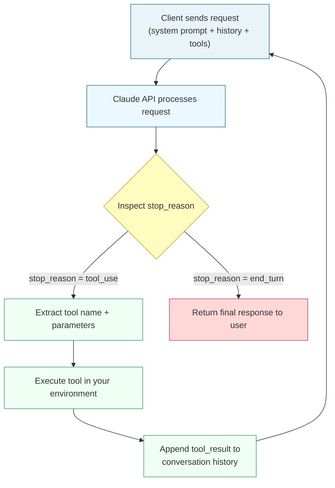

### 1.4 Critical Implementation Detail — Context Accumulation

Every iteration of the loop appends to the conversation history. This means:

- Tool results become part of the context for the next iteration
- Claude can reason about previous tool outputs when deciding the next action
- The conversation history grows with each iteration, consuming tokens

This is **model-driven decision-making**: Claude reasons about which tool to call next based on accumulated context. This is fundamentally different from pre-configured decision trees where your code selects tools based on rules.

```
Iteration 1:  [system] [user_msg] → Claude calls get_customer
Iteration 2:  [system] [user_msg] [get_customer result] → Claude calls lookup_order
Iteration 3:  [system] [user_msg] [get_customer result] [lookup_order result] → Claude calls process_refund
Iteration 4:  [system] [user_msg] [all results] → Claude returns end_turn with summary
```

### 1.5 Why It Matters For The Exam

The exam tests whether you understand:

- That `stop_reason` is the **only** reliable termination signal
- That tool results must be appended to conversation history (not discarded)
- That the model drives tool selection, not pre-configured routing
- That the loop is controlled by your code, not by Claude itself

### 1.6 Production Perspective

In production, the agentic loop is wrapped with:

- **Timeout guards** — prevent runaway execution
- **Iteration caps** — safety nets (not primary termination)
- **Error handling** — what happens when a tool fails mid-loop
- **Observability** — logging every iteration for debugging
- **Cost tracking** — each iteration is an API call

---

## 2 stop_reason — The Only Reliable Termination Signal

### 2.1 The Two Values You Must Know

| stop_reason | Meaning | Your Code Should |
|-------------|---------|------------------|
| `"tool_use"` | Claude wants to call one or more tools | Execute the tool(s), append results, continue loop |
| `"end_turn"` | Claude considers the task complete | Terminate the loop, return the response |

### 2.2 Anti-Patterns — How NOT to Terminate Loops

This is a high-frequency exam topic. The exam presents plausible-sounding but unreliable alternatives to `stop_reason` checking:

**Anti-Pattern 1: Parsing natural language to detect completion**

```
# WRONG — never do this
if "I've completed" in response.text or "Here's the final" in response.text:
    break
```

Why it fails: Claude's phrasing is non-deterministic. It might say "Done!" or "The task is finished" or simply present results without a completion phrase.

**Anti-Pattern 2: Using arbitrary iteration caps as the primary stop mechanism**

```
# WRONG as PRIMARY mechanism
for i in range(5):
    response = call_claude(messages)
    # ... always runs exactly 5 iterations
```

Why it fails: Some tasks need 2 iterations, others need 8. A fixed cap either truncates complex tasks or wastes resources on simple ones. Iteration caps are acceptable as **safety nets** (secondary protection), never as the primary termination strategy.

**Anti-Pattern 3: Checking for assistant text content**

```
# WRONG
if response.content and response.content[0].type == "text":
    break  # Assumes text means completion
```

Why it fails: Claude can return text content alongside tool_use blocks. Text content does not indicate completion.

### 2.3 Correct Implementation Pattern

```python
# CORRECT — the canonical agentic loop
while True:
    response = client.messages.create(
        model="claude-sonnet-4-20250514",
        messages=messages,
        tools=tools,
        system=system_prompt
    )

    if response.stop_reason == "end_turn":
        return response.content  # Task complete

    if response.stop_reason == "tool_use":
        # Extract and execute tool calls
        for block in response.content:
            if block.type == "tool_use":
                result = execute_tool(block.name, block.input)
                messages.append({"role": "assistant", "content": response.content})
                messages.append({
                    "role": "user",
                    "content": [{"type": "tool_result",
                                 "tool_use_id": block.id,
                                 "content": result}]
                })
```

### 2.4 Diagram — Correct vs Incorrect Loop Termination

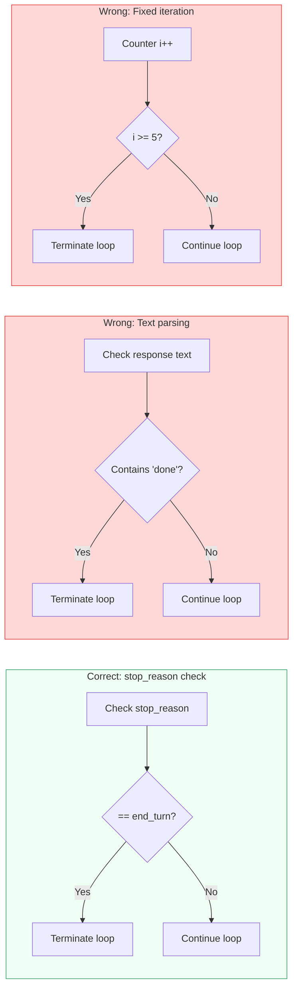

### 2.5 Exam Trap Alert

The exam may present a scenario where an agent "sometimes completes correctly but occasionally runs forever" or "sometimes stops too early." The correct diagnosis almost always involves incorrect loop termination logic — either missing `stop_reason` checks or using unreliable heuristics.

---

## 3 Multi-Agent Orchestration — Coordinator-Subagent Patterns

### 3.1 Concept Overview

When a task is too complex for a single agent, you decompose it across multiple specialized agents. The canonical pattern in the Claude ecosystem is **hub-and-spoke** (also called coordinator-subagent):

- A **coordinator agent** receives the task, decomposes it, delegates subtasks, aggregates results, and produces the final output
- **Subagents** are specialized workers: each receives a focused task, executes it with its own tool set, and returns structured results

### 3.2 Architecture Diagram — Hub-and-Spoke

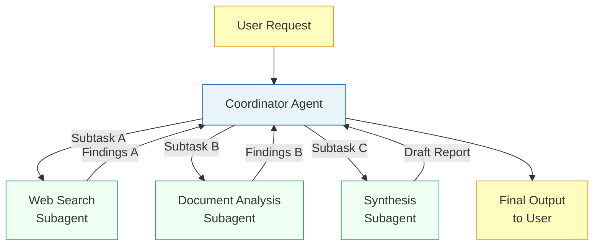

### 3.3 Five Rules of Coordinator-Subagent Architecture

**Rule 1: Subagents have isolated context.**
Subagents do NOT inherit the coordinator's conversation history automatically. Every piece of information a subagent needs must be explicitly passed in its prompt.

**Rule 2: All communication routes through the coordinator.**
Subagents never communicate directly with each other. This ensures observability, consistent error handling, and controlled information flow.

**Rule 3: The coordinator controls task decomposition.**
If the coordinator decomposes the task poorly (too narrow, too broad, overlapping), downstream agents will produce poor results — even if each one executes perfectly within its assigned scope.

**Rule 4: The coordinator decides which subagents to invoke.**
Not every request needs every subagent. The coordinator should dynamically select which subagents to invoke based on the query, rather than always routing through the full pipeline.

**Rule 5: The coordinator handles error aggregation.**
If a subagent fails, the coordinator decides whether to retry, use partial results, or escalate — the subagent does not make this decision.

### 3.4 The Critical Failure Mode — Narrow Task Decomposition

This is one of the most heavily tested concepts in Domain 1.

**Scenario:** A research system is asked about "impact of AI on creative industries." The coordinator decomposes this into: "AI in digital art," "AI in graphic design," "AI in photography." Each subagent executes perfectly. The final report covers only visual arts — completely missing music, writing, film, and gaming.

**Root cause:** The coordinator's decomposition was too narrow. It constrained the research scope to a subset of "creative industries."

**The exam tests this** by describing a scenario where every subagent works correctly but the final output is incomplete. The correct answer points to the coordinator's task decomposition, not downstream agent issues.

### 3.5 Iterative Refinement Loops

A sophisticated coordinator does not just delegate once. It evaluates the synthesis output for coverage gaps and re-delegates:

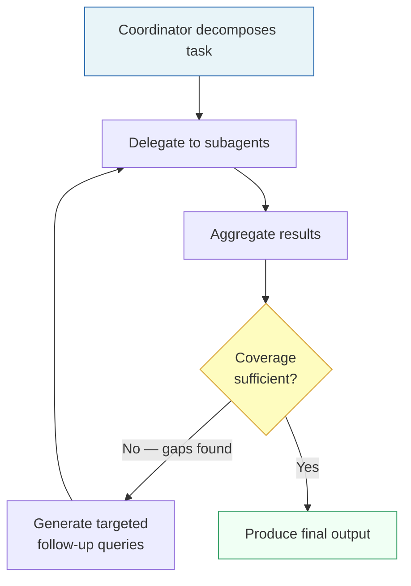

### 3.6 Production Perspective

In production multi-agent systems:

- Scope partitioning prevents duplication (assign distinct subtopics or source types to each subagent)
- Iterative refinement loops must have bounded iterations (prevent infinite gap-filling)
- The coordinator logs all delegation decisions for observability
- Error propagation is structured, not generic (see Section 5)

---

## 4 Subagent Invocation Context Passing and Spawning

### 4.1 The Task Tool

In the Claude Agent SDK, subagents are spawned using the **Task tool**. For a coordinator to spawn subagents, its `allowedTools` must include `"Task"`.

The `AgentDefinition` for each subagent specifies:

- A description of the subagent's role
- A system prompt tailored to the subagent's specialization
- Tool restrictions (`allowedTools`) limiting what the subagent can access

### 4.2 Context Passing — The Critical Rule

> **Subagents do NOT automatically inherit parent context or share memory between invocations.**

This means: if the web search subagent finds 10 articles, and you want the synthesis subagent to process them, you must explicitly include those findings in the synthesis subagent's prompt.

```
# WRONG — assumes context inheritance
coordinator → spawn synthesis_agent("Synthesize the findings")
# synthesis_agent has NO access to web search results

# CORRECT — explicit context passing
coordinator → spawn synthesis_agent(
    "Synthesize the following findings:\n" +
    "<web_search_results>\n" + web_results + "\n</web_search_results>\n" +
    "<document_analysis>\n" + doc_results + "\n</document_analysis>"
)
```

### 4.3 Structured Context Format

When passing context between agents, use structured formats that separate content from metadata:

```json
{
  "claim": "AI art tools grew 340% in 2024",
  "evidence": "Market report Q4 2024 shows...",
  "source_url": "https://example.com/report",
  "source_name": "TechCrunch Market Analysis",
  "publication_date": "2024-12-15",
  "page_number": 12
}
```

This structure preserves attribution through the pipeline. If you pass unstructured prose, the synthesis agent cannot distinguish claims from sources, and provenance is lost.

### 4.4 Parallel Subagent Execution

Subagents can be spawned in parallel by having the coordinator emit **multiple Task tool calls in a single response** (not across separate turns). This reduces latency significantly compared to sequential execution.

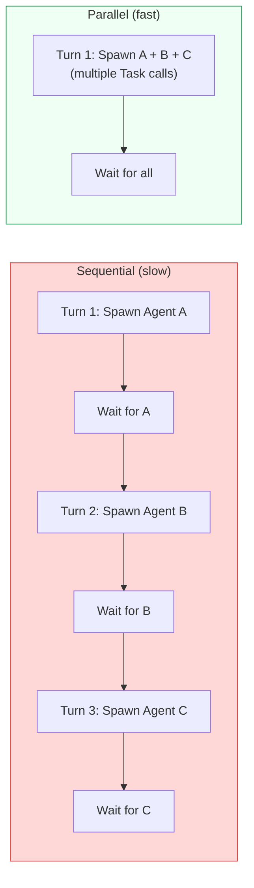

### 4.5 Coordinator Prompt Design

Design coordinator prompts that specify **research goals and quality criteria** rather than step-by-step procedural instructions. This enables subagent adaptability.

```
# WRONG — overly procedural
"Step 1: Search for 'AI art tools'. Step 2: Read the first 3 results.
 Step 3: Extract statistics."

# CORRECT — goal-oriented
"Find comprehensive data on AI's impact across ALL creative industry sectors
 including but not limited to: visual arts, music, writing, film, gaming.
 For each sector, provide market size, growth rate, and key players.
 Include sources with publication dates."
```

---

## 5 Multi-Step Workflows — Enforcement and Handoff Patterns

### 5.1 The Central Tension: Prompts vs Programmatic Enforcement

This is one of the most important distinctions on the entire exam:

| Approach | Guarantee Level | Use When |
|----------|----------------|----------|
| **Prompt-based guidance** | Probabilistic (~90-98%) | Non-critical ordering, stylistic preferences |
| **Programmatic enforcement** (hooks, prerequisite gates) | Deterministic (100%) | Critical business rules, financial operations, identity verification |

> **Exam mantra:** When deterministic compliance is required, prompt instructions alone have a non-zero failure rate.

### 5.2 Prerequisite Gates

A prerequisite gate is a programmatic check in your orchestration code that blocks downstream tool calls until prerequisite steps have completed.

**Example:** Blocking `process_refund` until `get_customer` has returned a verified customer ID.

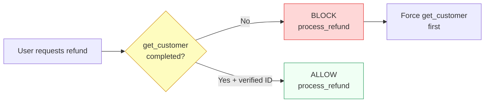

### 5.3 Multi-Concern Request Decomposition

When a customer message contains multiple concerns (e.g., "I want to return item A and also dispute the charge for item B"), the agent must:

1. Decompose the request into distinct items
2. Investigate each in parallel using shared context
3. Synthesize a unified resolution

### 5.4 Structured Handoff Protocols

When the agent escalates to a human, the human agent typically has NO access to the conversation transcript. The handoff must include a structured summary:

```
Handoff Summary:
- Customer ID: CUST-12345
- Issue: Refund request for Order #98765
- Root Cause: Item arrived damaged (photo evidence verified)
- Refund Amount: $149.99
- Policy Status: Within 30-day return window
- Recommended Action: Approve full refund
- Escalation Reason: Refund exceeds agent's $100 auto-approval threshold
```

### 5.5 Escalation Triggers — What the Exam Tests

The exam distinguishes between valid and invalid escalation triggers:

**Valid escalation triggers:**

- Customer explicitly requests a human agent → escalate immediately
- Policy is ambiguous or silent on the customer's specific request
- Agent cannot make meaningful progress after reasonable investigation
- Action exceeds agent's authorized limits (dollar threshold, etc.)

**Invalid/unreliable escalation triggers:**

- Sentiment-based escalation ("customer sounds angry" → unreliable)
- Self-reported confidence scores ("my confidence is 3/10" → uncalibrated)
- Case complexity alone ("this seems hard" → not an escalation criterion)

**Nuance the exam tests:** When a customer is frustrated but the issue is within the agent's capability, the agent should acknowledge frustration while offering resolution. It should escalate only if the customer reiterates their preference for a human.

### 5.6 Diagram — Escalation Decision Tree

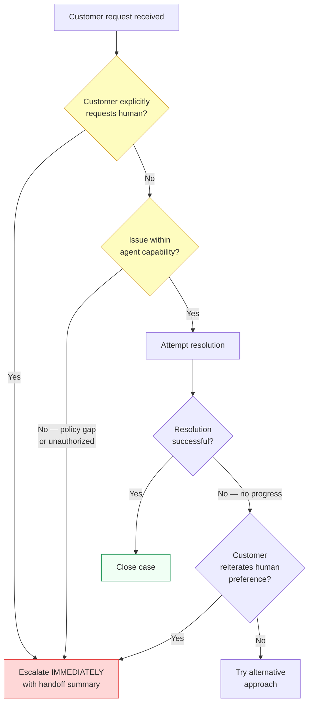

---

## 6 Agent SDK Hooks — Tool Call Interception and Data Normalization

### 6.1 What Are Hooks?

Hooks are programmatic interceptors in the Agent SDK that sit between the model and tool execution. They can transform data flowing in either direction:

- **Outgoing tool calls** — intercept BEFORE the tool executes (for enforcement)
- **Incoming tool results** — intercept AFTER the tool returns (for normalization)

### 6.2 Hook Types

**PostToolUse hooks** — Intercept tool results for transformation before the model processes them.

Use cases:
- Normalize heterogeneous date formats (Unix timestamps, ISO 8601, human-readable) from different MCP tools into a single consistent format
- Convert numeric status codes to human-readable labels
- Strip verbose metadata from tool responses to reduce context consumption

**Tool call interception hooks** — Intercept outgoing tool calls to enforce compliance rules.

Use cases:
- Block refunds exceeding a dollar threshold (e.g., $500) and redirect to human escalation
- Enforce identity verification before financial operations
- Log all tool calls for audit trails

### 6.3 Hooks vs Prompts — The Determinism Spectrum

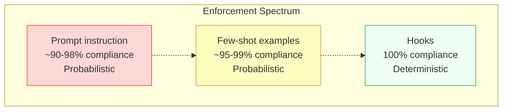

### 6.4 Production Example — Refund Threshold Hook

```python
# Hook: Block refunds > $500, redirect to human escalation
def intercept_tool_call(tool_name, tool_input):
    if tool_name == "process_refund":
        amount = tool_input.get("amount", 0)
        if amount > 500:
            return {
                "blocked": True,
                "reason": "Refund exceeds $500 threshold",
                "redirect": "escalate_to_human",
                "context": {
                    "customer_id": tool_input["customer_id"],
                    "refund_amount": amount,
                    "policy": "Refunds > $500 require human approval"
                }
            }
    return None  # Allow the call to proceed
```

### 6.5 Exam Decision Rule

**When should you use hooks vs prompts?**

- If failure means financial loss, legal liability, or safety risk → **Hooks** (deterministic)
- If failure means slightly wrong formatting or suboptimal but safe output → **Prompts** (probabilistic is acceptable)

---

## 7 Task Decomposition Strategies

### 7.1 Two Decomposition Paradigms

The exam tests your ability to select the right decomposition strategy for a given workflow:

| Strategy | When to Use | Example |
|----------|-------------|---------|
| **Fixed sequential pipeline (prompt chaining)** | Predictable, multi-aspect reviews with known stages | Code review: lint → security → style → integration |
| **Dynamic adaptive decomposition** | Open-ended investigation where subtasks depend on intermediate findings | "Add comprehensive tests to a legacy codebase" |

### 7.2 Prompt Chaining — Fixed Sequential Pipeline

Break a task into sequential focused passes. Each pass produces structured output consumed by the next.

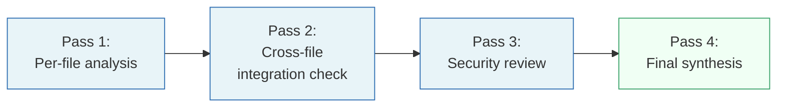

**Key pattern for code reviews:** Split large reviews into per-file local analysis passes plus a separate cross-file integration pass. This avoids **attention dilution** — when Claude processes many files at once, it may miss findings in middle sections (the "lost in the middle" effect).

### 7.3 Dynamic Adaptive Decomposition

For open-ended tasks, the agent generates its own subtask plan and adapts it based on discoveries:

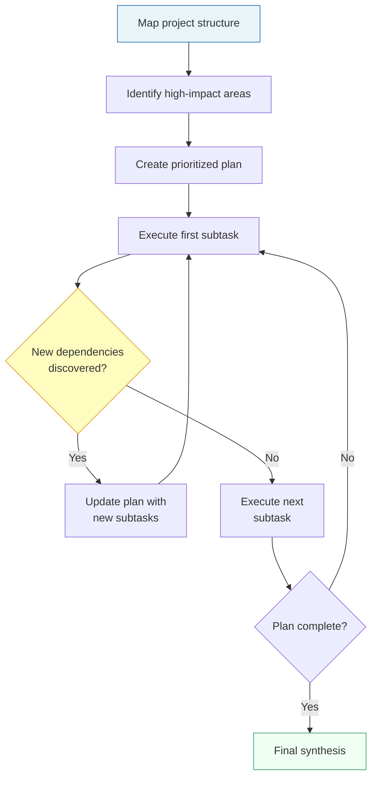

**Example:** "Add comprehensive tests to a legacy codebase"

1. First, map the codebase structure
2. Identify high-impact areas (frequently changed, no coverage)
3. Create a prioritized test plan
4. As you write tests, discover new dependencies → adapt the plan
5. Continue until coverage goals are met

### 7.4 Exam Decision Heuristic

```
Is the task structure known in advance?
├── YES → Prompt chaining (fixed pipeline)
│         Example: Code review, data extraction, report generation
└── NO  → Dynamic adaptive decomposition
          Example: Bug investigation, legacy refactoring, research
```

---

## 8 Session State Resumption and Forking

### 8.1 Named Session Resumption

Use `--resume <session-name>` to continue a specific prior conversation in Claude Code. This preserves the full conversation context from the previous session.

**Critical caveat:** If files have changed since the last session, you must inform the agent about specific changes. Otherwise, the agent operates on stale assumptions.

### 8.2 fork_session

`fork_session` creates independent branches from a shared analysis baseline to explore divergent approaches.

**Use case:** You've analyzed a codebase and want to compare two refactoring strategies. Fork the session after analysis, try Strategy A in one branch and Strategy B in the other.

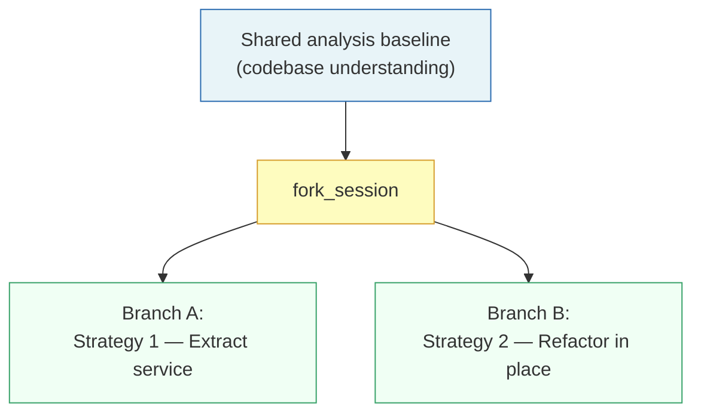

### 8.3 Resume vs Fresh Start — Decision Matrix

| Condition | Best Approach |
|-----------|--------------|
| Prior context is mostly valid, minimal file changes | `--resume` the session |
| Prior tool results are stale (many file changes, time elapsed) | Start a **new session** with a structured summary injected |
| Want to explore parallel approaches | `fork_session` from shared baseline |
| Need targeted re-analysis of specific changes | `--resume` + inform about specific file changes |

### 8.4 Why Fresh Starts Can Beat Resumption

When you resume a session with stale tool results, Claude may reason based on outdated information (e.g., a file that was deleted or substantially rewritten). Starting a new session with a structured summary of prior findings — minus the stale tool results — is more reliable.

```
# Structured summary for new session injection
"""
Prior Analysis Summary:
- Codebase uses React 18 + TypeScript
- 3 major modules identified: Auth, Payments, Notifications
- Key finding: Auth module has circular dependency with Payments
- CHANGED SINCE LAST SESSION: Auth module refactored (auth.ts split into auth-core.ts + auth-utils.ts)
"""
```

---

## 9 Anti-Patterns Master Reference

### 9.1 Agentic Loop Anti-Patterns

| Anti-Pattern | Why It Fails | Correct Approach |
|-------------|-------------|-----------------|
| Parsing natural language for loop termination | Non-deterministic phrasing | Check `stop_reason == "end_turn"` |
| Arbitrary iteration caps as primary stop | Too rigid — truncates or wastes | `stop_reason` check + cap as safety net |
| Checking for text content as completion indicator | Text can accompany tool_use | Only `stop_reason` determines completion |
| Discarding tool results between iterations | Claude loses reasoning context | Append all results to conversation history |

### 9.2 Multi-Agent Anti-Patterns

| Anti-Pattern | Why It Fails | Correct Approach |
|-------------|-------------|-----------------|
| Assuming subagents inherit parent context | They don't — isolated by design | Explicitly pass context in subagent prompt |
| Direct subagent-to-subagent communication | Loses observability and error control | Route everything through coordinator |
| Always invoking all subagents | Wastes resources on simple queries | Coordinator dynamically selects needed agents |
| Narrow task decomposition | Misses entire domains of the topic | Goal-oriented prompts, breadth-first decomposition |
| Giving subagents too many tools (18+) | Degrades tool selection reliability | Restrict to 4-5 role-specific tools |

### 9.3 Enforcement Anti-Patterns

| Anti-Pattern | Why It Fails | Correct Approach |
|-------------|-------------|-----------------|
| Using prompts for critical business rules | Non-zero failure rate (2-10%) | Programmatic hooks with deterministic enforcement |
| Sentiment-based escalation | Unreliable proxy for case complexity | Explicit escalation criteria with few-shot examples |
| Self-reported confidence scores | Uncalibrated, inconsistent | Structured escalation rules based on observable conditions |
| Generic error responses | Prevent intelligent recovery | Structured error context (type, retryable, partial results) |

### 9.4 Error Handling Anti-Patterns

| Anti-Pattern | Why It Fails | Correct Approach |
|-------------|-------------|-----------------|
| Silently suppressing errors (return empty as success) | Hides failures, produces incomplete results | Return structured error with `isError` flag |
| Terminating entire workflow on single failure | Wastes successful work from other subagents | Coordinator proceeds with partial results, annotates gaps |
| Generic "search unavailable" errors | Coordinator can't make intelligent decisions | Include failure type, attempted query, partial results, alternatives |
| Uniform error responses for all error types | Prevents appropriate recovery strategies | Distinguish transient/validation/business/permission errors |

---

## 10 Decision Frameworks and Heuristics

### 10.1 "Should I Use a Single Agent or Multi-Agent?"

```
Does the task require:
├── Multiple distinct specializations? → Multi-agent
├── More than 5-6 tools? → Multi-agent (too many tools degrades selection)
├── Parallel execution for latency? → Multi-agent
├── Simple, linear tool usage? → Single agent
└── Fewer than 5 tools, single domain? → Single agent
```

### 10.2 "Should I Use Hooks or Prompts?"

```
Is the consequence of failure:
├── Financial loss or legal liability? → Hooks (deterministic)
├── Safety risk? → Hooks (deterministic)
├── Audit/compliance requirement? → Hooks (deterministic)
├── Suboptimal but safe output? → Prompts (probabilistic OK)
└── Stylistic preference? → Prompts (probabilistic OK)
```

### 10.3 "Should I Resume or Start Fresh?"

```
Are prior tool results still valid?
├── Mostly yes, minor changes → --resume + inform about changes
├── Many files changed, stale results → Fresh session + structured summary
├── Want to compare approaches → fork_session
└── Session crashed mid-task → Reload from structured state manifest
```

### 10.4 "Fixed Pipeline or Dynamic Decomposition?"

```
Is the task structure predictable in advance?
├── Yes, known stages → Prompt chaining (fixed pipeline)
│   Examples: Code review, data extraction, report generation
└── No, depends on findings → Dynamic adaptive decomposition
    Examples: Bug investigation, legacy refactoring, open-ended research
```

### 10.5 "How Should the Coordinator Handle a Subagent Failure?"

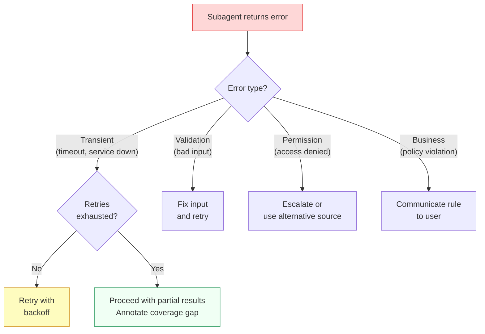

---

## 11 Exam-Style Questions With Explanations

### Question 1 — Agentic Loop Termination

**Scenario:** You've built a customer support agent. During testing, you observe that the agent occasionally enters an infinite loop, continuously calling `lookup_order` with the same order ID. Which change most effectively prevents this behavior while preserving the agent's ability to handle multi-step tasks?

A) Set a hard limit of 3 iterations for the agentic loop.
B) Add logic to detect duplicate tool calls with identical parameters and terminate the loop after 2 consecutive duplicates.
C) Check `stop_reason` for `"end_turn"` as the primary termination condition, with a maximum iteration count as a safety net.
D) Parse the assistant's response text for phrases like "I've completed the task" to trigger loop termination.

**Correct Answer: C**

**Explanation:**
- **C is correct** because `stop_reason` is the canonical, reliable termination signal. The iteration cap is a safety net, not the primary mechanism.
- **A is wrong** because a hard limit of 3 is arbitrary and would break legitimate multi-step workflows requiring more iterations.
- **B is wrong** because while duplicate detection is reasonable, it's a heuristic that may have false positives (legitimate re-queries with updated context) and doesn't address the root issue of proper loop control.
- **D is wrong** because parsing natural language is non-deterministic — Claude's phrasing varies and this is explicitly listed as an anti-pattern.

---

### Question 2 — Coordinator Task Decomposition

**Scenario:** Your multi-agent research system is asked to analyze "the global impact of remote work on urban economies." The coordinator decomposes this into: "remote work effect on commercial real estate," "remote work effect on office supply companies," and "remote work effect on coworking spaces." Subagents produce high-quality reports for each subtask. However, stakeholders note the report is missing retail, transportation, housing markets, and tax revenue impacts. What is the root cause?

A) The web search subagent's queries are too narrow and need broader search terms.
B) The coordinator's task decomposition is too narrow, missing major domains of the topic.
C) The synthesis agent failed to identify coverage gaps in the combined findings.
D) The document analysis subagent filtered out sources about non-office-related economic impacts.

**Correct Answer: B**

**Explanation:**
- **B is correct** because the coordinator only generated subtasks related to office/workspace topics, completely missing retail, transportation, housing, and tax impacts. The subagents executed their assigned tasks correctly — the problem is in what they were assigned.
- **A is wrong** because the web search agent searched exactly what it was told to search. Its queries were appropriate for its assigned subtask.
- **C is wrong** because the synthesis agent can only synthesize what it receives. If no subagent researched transportation impacts, there's nothing to synthesize.
- **D is wrong** because the document analysis agent would only analyze documents it received, which were constrained by the narrow decomposition.

---

### Question 3 — Hooks vs Prompts

**Scenario:** Your financial services agent processes investment transactions. Regulations require that all transactions above $10,000 must receive compliance review before execution. In production logs, you discover the agent bypasses this requirement in approximately 3% of cases, executing transactions directly. What is the most effective fix?

A) Add stronger language to the system prompt emphasizing that compliance review is "absolutely mandatory" and "non-negotiable" for transactions above $10,000.
B) Add 5 few-shot examples showing the agent correctly routing high-value transactions to compliance review.
C) Implement a programmatic hook that intercepts all transaction tool calls and blocks execution when the amount exceeds $10,000, routing to compliance review.
D) Add a self-check step where the agent evaluates whether it followed the compliance rule before submitting the transaction.

**Correct Answer: C**

**Explanation:**
- **C is correct** because regulatory compliance requires 100% enforcement. A programmatic hook provides deterministic guarantees. A 3% failure rate in financial regulation is unacceptable.
- **A is wrong** because stronger prompt language is still probabilistic. "Absolutely mandatory" doesn't change the fundamental compliance rate from ~97% to 100%.
- **B is wrong** because few-shot examples improve compliance rates but cannot guarantee 100%. They add token overhead without deterministic enforcement.
- **D is wrong** because a self-check is still LLM-based and therefore probabilistic. The agent that bypassed the rule in 3% of cases would also fail the self-check in some percentage of those cases.

---

### Question 4 — Subagent Context Passing

**Scenario:** Your multi-agent research pipeline has a web search subagent, a document analysis subagent, and a synthesis subagent. The synthesis subagent consistently produces reports without source citations, even though the web search subagent correctly identifies source URLs and the document analysis subagent correctly extracts publication dates. What is the most likely cause?

A) The synthesis subagent's system prompt doesn't explicitly require source citations.
B) The coordinator is not passing the source metadata (URLs, dates) to the synthesis subagent's prompt — only the content findings.
C) The synthesis subagent's allowed tools don't include a citation formatting tool.
D) The web search subagent and document analysis subagent are using different output formats, confusing the synthesis subagent.

**Correct Answer: B**

**Explanation:**
- **B is correct** because subagents have isolated context. If the coordinator strips metadata when passing findings to the synthesis subagent, the synthesis agent literally cannot include information it never received.
- **A is wrong** because even with explicit citation requirements, the synthesis agent cannot cite sources it doesn't have access to. The prompt instruction would be unactionable.
- **C is wrong** because citation formatting is a text generation task, not a tool use task. No special tool is needed.
- **D is wrong** because format inconsistency would cause confusion, not complete absence of citations. The root cause is missing data, not formatting issues.

---

### Question 5 — Session Management

**Scenario:** Your team is using Claude Code to analyze a large codebase. An engineer completed a thorough analysis yesterday, identifying 15 modules and their dependency relationships. Overnight, another engineer refactored the authentication module, splitting `auth.ts` into `auth-core.ts` and `auth-utils.ts`. The original engineer wants to continue the analysis today. What is the most reliable approach?

A) Resume the session with `--resume` and ask Claude to re-analyze the entire codebase from scratch.
B) Resume the session with `--resume` and inform Claude about the specific auth module changes for targeted re-analysis.
C) Start a completely new session with no context from yesterday's work.
D) Resume the session with `--resume` and continue as if nothing changed.

**Correct Answer: B**

**Explanation:**
- **B is correct** because the prior analysis is mostly valid (14 of 15 modules unchanged). Resuming preserves that context, and informing about specific changes enables targeted re-analysis without wasting time re-discovering unchanged modules.
- **A is wrong** because re-analyzing the entire codebase wastes the prior analysis of 14 unchanged modules.
- **C is wrong** because starting completely fresh loses all of yesterday's analysis, requiring full re-discovery.
- **D is wrong** because continuing without informing about changes means Claude operates on stale assumptions about the auth module, potentially producing incorrect dependency analysis.

---

### Question 6 — Error Propagation

**Scenario:** Your multi-agent research system's web search subagent times out while researching a complex topic. You need to design how this failure information flows back to the coordinator. Which approach best enables intelligent recovery?

A) Return structured error context to the coordinator including the failure type, the attempted query, any partial results, and potential alternative approaches.
B) Implement automatic retry logic with exponential backoff within the subagent, returning a generic "search unavailable" status only after all retries are exhausted.
C) Catch the timeout within the subagent and return an empty result set marked as successful.
D) Propagate the timeout exception directly to a top-level handler that terminates the entire research workflow.

**Correct Answer: A**

**Explanation:**
- **A is correct** because structured error context gives the coordinator everything it needs to make an intelligent recovery decision — retry with a modified query, try an alternative approach, or proceed with partial results while annotating the gap.
- **B is wrong** because a generic "search unavailable" status hides valuable context. The coordinator can't distinguish between "search timed out after finding 3 of 5 sources" and "search service is completely down."
- **C is wrong** because silently suppressing errors (marking failure as success) prevents any recovery and risks incomplete research being presented as complete.
- **D is wrong** because terminating the entire workflow is disproportionate. Other subagents may have completed successfully, and their results would be wasted.

---

### Question 7 — Scoped Tool Access

**Scenario:** Your synthesis agent in a multi-agent research pipeline frequently attempts to perform web searches instead of synthesizing the findings passed to it. It has access to all 18 tools in the system. What is the most effective fix?

A) Add stronger instructions to the synthesis agent's system prompt prohibiting web search usage.
B) Restrict the synthesis agent's `allowedTools` to only synthesis-relevant tools (e.g., `format_report`, `verify_fact`), removing web search tools entirely.
C) Add a routing layer before each tool call that checks whether the requested tool matches the agent's role.
D) Increase the synthesis agent's context window to reduce its tendency to search for additional information.

**Correct Answer: B**

**Explanation:**
- **B is correct** because reducing an agent's tool set to role-appropriate tools eliminates the possibility of cross-specialization misuse. With only 2-3 tools instead of 18, selection reliability improves dramatically.
- **A is wrong** because prompt-based prohibition is probabilistic. If the tools are available, the agent may still use them, especially when findings seem incomplete.
- **C is wrong** because a routing layer is over-engineered when the simpler solution is to remove access to inappropriate tools entirely.
- **D is wrong** because context window size doesn't cause tool misuse. The problem is tool availability, not context capacity.

---

## 12 Memory Anchors and Revision Notes

### 12.1 Memory Anchors — Phrases to Burn Into Memory

- **"stop_reason is the ONLY reliable termination signal."**
- **"Subagents do NOT inherit parent context."**
- **"Hooks = deterministic. Prompts = probabilistic."**
- **"If the coordinator decomposes poorly, perfect subagents still produce poor results."**
- **"Route everything through the coordinator."**
- **"4-5 tools per agent. 18 tools = chaos."**
- **"Structured error context enables intelligent recovery."**
- **"Don't suppress errors. Don't terminate on single failures."**
- **"Resume when context is valid. Fresh start when context is stale."**
- **"Fixed pipeline for predictable tasks. Dynamic decomposition for open-ended tasks."**

### 12.2 Rapid Revision Checklist

**Agentic Loop:**
- Loop controlled by YOUR code, not Claude
- `stop_reason == "tool_use"` → continue loop
- `stop_reason == "end_turn"` → terminate loop
- Append tool results to conversation history every iteration
- Never parse text for completion signals
- Iteration caps = safety net, not primary termination

**Multi-Agent:**
- Hub-and-spoke: coordinator manages all communication
- Subagents have isolated context — pass everything explicitly
- Parallel spawning: multiple Task calls in ONE turn
- Coordinator prompts: goals + quality criteria, NOT step-by-step
- Narrow decomposition = the #1 root cause of coverage gaps

**Enforcement:**
- Critical business rules → Hooks (deterministic)
- Style/preference → Prompts (probabilistic OK)
- PostToolUse hooks normalize data formats
- Tool interception hooks block policy violations
- Financial/safety/compliance → always hooks, never prompts

**Escalation:**
- Customer says "give me a human" → escalate immediately
- Policy gap or ambiguity → escalate
- Cannot progress → escalate
- Customer is frustrated but issue is resolvable → acknowledge + attempt
- Never use sentiment analysis or self-confidence scores

**Task Decomposition:**
- Predictable structure → prompt chaining (fixed pipeline)
- Unknown structure → dynamic adaptive decomposition
- Large code reviews → per-file analysis + cross-file integration pass

**Session Management:**
- `--resume <name>` → continue prior session
- `fork_session` → explore parallel approaches
- Stale context → fresh session + structured summary
- File changes since last session → inform the resumed session explicitly

**Error Handling:**
- Structured error: `{type, retryable, partial_results, alternatives}`
- Transient errors → retry with backoff
- Business errors → communicate to user
- Never suppress errors as empty successes
- Never terminate entire workflow on single subagent failure
- Coordinator proceeds with partial results + annotates coverage gaps

### 12.3 Top 10 Exam Traps for Domain 1

1. Distractor describes adding "stronger prompt language" for a critical business rule → WRONG (use hooks)
2. Distractor blames downstream subagent when coordinator's decomposition was narrow → WRONG (blame coordinator)
3. Distractor suggests parsing response text for completion → WRONG (use stop_reason)
4. Distractor suggests giving ALL tools to ALL agents → WRONG (scope tools per role)
5. Distractor suggests sentiment-based escalation → WRONG (unreliable proxy)
6. Distractor suggests self-reported confidence scores → WRONG (uncalibrated)
7. Distractor suggests fixed iteration count as primary termination → WRONG (safety net only)
8. Distractor suggests generic "search unavailable" error → WRONG (loses context)
9. Distractor suggests subagents communicate directly → WRONG (route through coordinator)
10. Distractor suggests resuming session when context is stale → WRONG (fresh start + summary)

---

## Appendix A — Key Technology References

| Technology | Key Concept for Domain 1 |
|-----------|-------------------------|
| Claude Agent SDK | Agent definitions, agentic loops, hooks, Task tool, allowedTools |
| `stop_reason` | `"tool_use"` (continue) vs `"end_turn"` (terminate) |
| Task tool | Mechanism for spawning subagents from coordinator |
| `allowedTools` | Must include `"Task"` for coordinators; scope per subagent role |
| PostToolUse hook | Normalize tool result data before model processes it |
| Tool interception hook | Block policy-violating tool calls before execution |
| `--resume` | Continue named session in Claude Code |
| `fork_session` | Branch from shared baseline for parallel exploration |
| `/compact` | Reduce context usage during extended sessions |
| Prompt chaining | Fixed sequential pipeline for predictable tasks |

## Appendix B — Scenario Quick Reference

| Exam Scenario | Domain 1 Topics Tested |
|--------------|----------------------|
| Customer Support Agent | Agentic loops, prerequisite gates, escalation logic, hooks |
| Multi-Agent Research System | Coordinator-subagent patterns, task decomposition, error propagation, context passing |
| Developer Productivity (Agent SDK) | Tool scoping, subagent spawning, allowedTools configuration |
| Claude Code for CI/CD | Session management, non-interactive execution, automation safety |

---

*End of Domain 1 Study Material — CCA-F Exam Preparation*
