# Domain 2 — Tool Design & MCP Integration (18% of Exam)

> **Exam Weight:** 18% of scored content (second-highest domain)
> **Core Principle:** *"Better tool design beats better prompting."*
> **Exam Style:** Scenario-heavy questions testing architectural judgment, not trivia recall.

---

## Table of Contents

- [[#1 Domain Overview and Exam Strategy]]
- [[#2 Task Statement 2.1 — Design Effective Tool Interfaces]]
- [[#3 Task Statement 2.2 — Implement Structured Error Responses]]
- [[#4 Task Statement 2.3 — Distribute Tools Across Agents and Configure tool_choice]]
- [[#5 Task Statement 2.4 — Integrate MCP Servers into Claude Code and Agent Workflows]]
- [[#6 Task Statement 2.5 — Select and Apply Built-in Tools Effectively]]
- [[#7 MCP Architecture Deep Dive]]
- [[#8 Anti-Pattern Encyclopedia]]
- [[#9 Decision Frameworks and Checklists]]
- [[#10 Scenario Walkthroughs]]
- [[#11 Exam-Style Questions with Explanations]]
- [[#12 Memory Anchors and Revision Notes]]

---

## 1 Domain Overview and Exam Strategy

### What This Domain Tests

Domain 2 evaluates your ability to design, configure, and troubleshoot the tool layer that connects Claude to external systems. The exam does NOT test you on deploying MCP servers, OAuth/API key rotation, or infrastructure concerns. It tests **design quality**, **error handling architecture**, **tool distribution strategy**, and **configuration judgment**.

### The Five Task Statements

| Task | Topic | What The Exam Tests |
|------|-------|---------------------|
| 2.1 | Tool Interface Design | Can you write descriptions that prevent misrouting? |
| 2.2 | Structured Error Responses | Can you design errors that enable intelligent recovery? |
| 2.3 | Tool Distribution & tool_choice | Can you scope tools correctly across agents? |
| 2.4 | MCP Server Integration | Can you configure project vs user scope correctly? |
| 2.5 | Built-in Tool Selection | Can you pick the right built-in tool for the job? |

### How Domain 2 Connects to Other Domains

Domain 2 is tested alongside Domain 1 (Agentic Architecture) and Domain 5 (Reliability) in most scenarios. The exam never tests tool design in isolation — it always appears within an orchestration or reliability context.

Relevant exam scenarios:
- **Scenario 1:** Customer Support Resolution Agent (MCP tools: `get_customer`, `lookup_order`, `process_refund`, `escalate_to_human`)
- **Scenario 3:** Multi-Agent Research System (tool distribution across subagents)
- **Scenario 4:** Developer Productivity with Claude (built-in tools + MCP servers)

---

## 2 Task Statement 2.1 — Design Effective Tool Interfaces

### Concept Overview

Tool descriptions are the **primary mechanism** LLMs use to decide which tool to call. The model reads the tool name, its description, and its input schema to make a selection decision. When descriptions are vague, overlapping, or minimal, the model cannot reliably distinguish between similar tools.

This is not a prompting problem. This is a **tool interface design** problem.

### Why It Matters For The Exam

The exam tests this concept repeatedly across multiple scenarios. The most common pattern is: "The agent keeps calling the wrong tool. What do you fix first?" The correct answer is almost always **improve tool descriptions** — not add few-shot examples, not build a routing layer, not consolidate tools.

### The Four Pillars of Tool Description Quality

Every tool description must answer four questions:

1. **Purpose** — What does this tool do? (One sentence, specific)
2. **Inputs** — What format does each input take? (With examples)
3. **Boundaries** — When should you NOT use this tool?
4. **Differentiation** — How is this different from similar tools?

### Production Example: Bad vs Good Descriptions

**BAD — Minimal descriptions that cause misrouting:**

```json
{
  "name": "analyze_content",
  "description": "Analyzes content and returns results."
}

{
  "name": "analyze_document",
  "description": "Analyzes a document and returns analysis."
}
```

Problem: Near-identical descriptions. The model has no basis to choose between them.

**GOOD — Differentiated descriptions with clear boundaries:**

```json
{
  "name": "extract_web_results",
  "description": "Extracts structured data from web search result 
    pages. Expects raw HTML or plaintext from web scraping. Returns 
    structured fields: title, URL, snippet, date. Use this for 
    web-sourced content ONLY. For PDF/Word documents, use 
    extract_document_data instead."
}

{
  "name": "extract_document_data",
  "description": "Extracts structured data points from uploaded PDF 
    or Word documents. Expects document text content. Returns 
    structured fields: section headers, key findings, tables, 
    citations. Use this for uploaded files ONLY. For web content, 
    use extract_web_results instead."
}
```

### The Splitting Principle

When a generic tool handles too many concerns, split it into purpose-specific tools with defined input/output contracts.

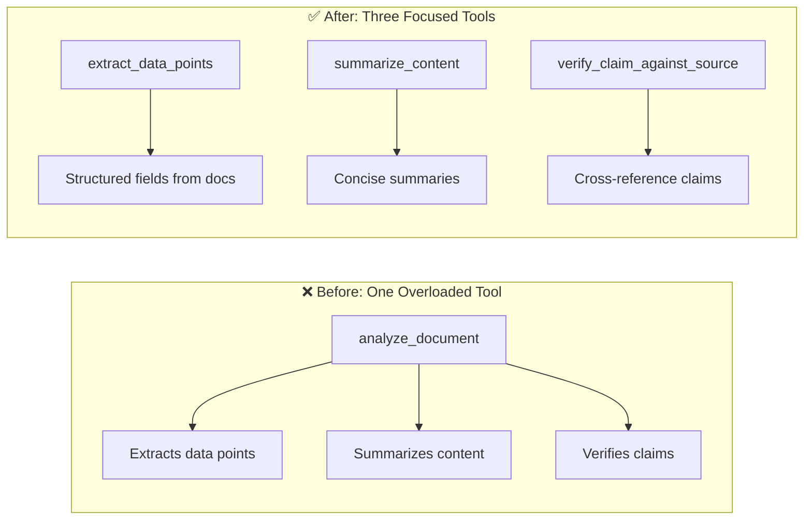

Each tool now has a clear, non-overlapping purpose. The model can select accurately.

### System Prompt Interaction Warning

Tool descriptions interact with system prompt wording. If your system prompt says "always analyze content before responding," the model may associate the keyword "analyze" with `analyze_content` even when `analyze_document` is the correct choice.

**Fix:** Review system prompts for keyword-sensitive instructions that might override well-written tool descriptions.

### Architecture: How Tool Selection Works

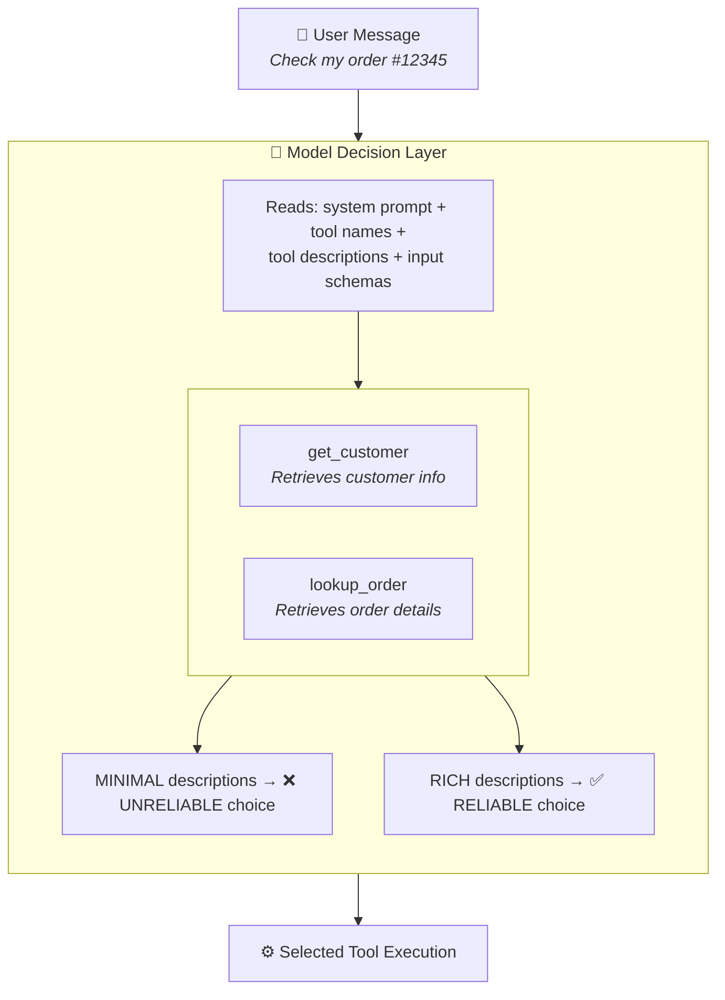

### Common Exam Traps

| Trap | Why It's Wrong |
|------|---------------|
| "Add few-shot examples to fix misrouting" | Few-shot adds token overhead without fixing the root cause (poor descriptions). Descriptions are the primary mechanism. |
| "Build a routing classifier layer" | Over-engineered. Bypasses the LLM's natural language understanding. |
| "Consolidate into one tool" | Valid architecture but NOT a first step. Fix descriptions first — it's lower effort and higher leverage. |
| "The descriptions are fine, the model just needs more context" | If the model misroutes, descriptions are the first suspect. |

### Anti-Patterns

| Anti-Pattern | Consequence |
|-------------|-------------|
| One-sentence descriptions without boundaries | Misrouting between similar tools |
| Tool names that overlap semantically | Model cannot differentiate by name alone |
| Missing input format specifications | Model sends wrong data types |
| No "when NOT to use" guidance | Model uses tool outside its intended scope |
| System prompt keywords that shadow tool descriptions | Unintended tool associations |

### Best Practices

1. Every description includes: purpose, input format, example queries, boundary conditions
2. Every description says when to use this tool VERSUS similar alternatives
3. Tool names are specific and non-overlapping (`extract_web_results` not `analyze_content`)
4. Split generic tools into purpose-specific tools with defined contracts
5. Review system prompts for keywords that might interfere with tool selection

---

## 3 Task Statement 2.2 — Implement Structured Error Responses

### Concept Overview

When an MCP tool fails, HOW it communicates that failure determines whether the agent can recover intelligently or fails blindly. Structured error responses give the agent the information it needs to decide: retry? escalate? inform the user? try a different approach?

The MCP specification provides the `isError` flag to signal tool failures back to the agent.

### The Error Taxonomy

The exam tests your knowledge of four distinct error categories. Each requires a different agent response.

| Error Category | Definition | Retryable? | Correct Agent Response |
|---------------|-----------|-----------|----------------------|
| **Transient** | Timeouts, service unavailability, network issues | Yes | Retry with backoff |
| **Validation** | Invalid input format, missing required fields | No (same input) | Fix input and retry, or inform user |
| **Business** | Policy violations (e.g., refund exceeds limit) | No | Explain policy to user, escalate if needed |
| **Permission** | Access denied, insufficient privileges | No | Escalate to human or request authorization |

### Structured Error Response Format

```json
{
  "isError": true,
  "content": [{
    "type": "text",
    "text": "{
      \"errorCategory\": \"business\",
      \"isRetryable\": false,
      \"message\": \"Refund amount of $750 exceeds the $500 
                     automatic approval threshold.\",
      \"customerMessage\": \"This refund requires manager 
                            approval due to the amount.\",
      \"suggestedAction\": \"escalate_to_human\",
      \"context\": {
        \"refundAmount\": 750,
        \"threshold\": 500,
        \"orderId\": \"ORD-12345\"
      }
    }"
  }]
}
```

### Architecture: Error Flow Through a Multi-Agent System

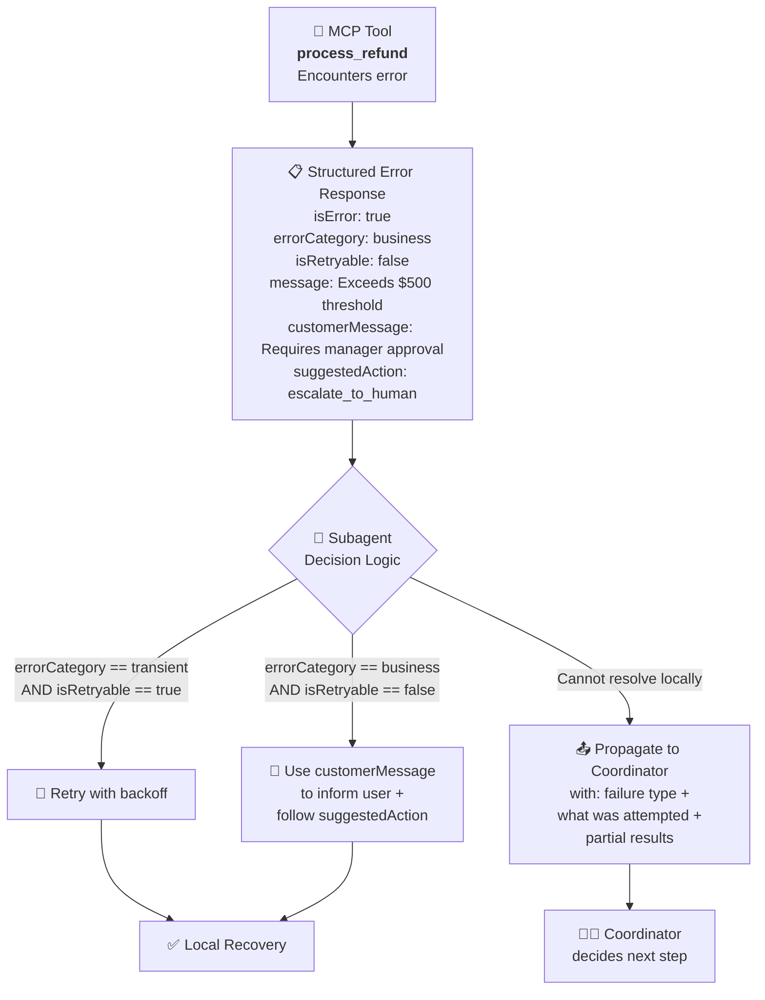

### Critical Distinction: Access Failure vs Empty Results

This is a frequently tested concept. The agent must distinguish between:

| Situation | What Happened | isError | Agent Behavior |
|-----------|--------------|---------|---------------|
| Access Failure | Database timeout, service down | `true` | Retry or escalate |
| Valid Empty Result | Query succeeded, no matches found | `false` | Report "no results found" to user |

Marking an empty result as an error causes unnecessary retries. Marking an access failure as success suppresses real problems.

### Local Recovery Pattern

Subagents should handle transient errors locally before escalating to the coordinator. Only propagate errors that cannot be resolved locally — and include partial results plus what was attempted.

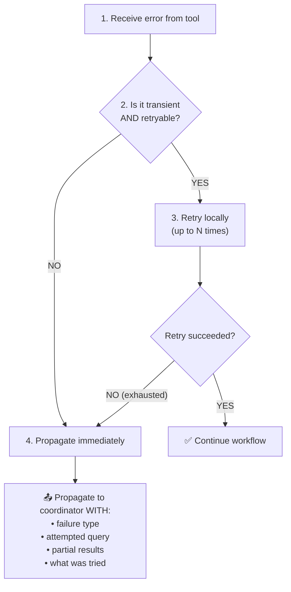

### Common Exam Traps

| Trap | Why It's Wrong |
|------|---------------|
| "Return generic 'Operation failed' for all errors" | Prevents agent from making appropriate recovery decisions |
| "Retry all errors automatically" | Wastes attempts on non-retryable errors (business rules, permissions) |
| "Suppress errors by returning empty results as success" | Prevents any recovery; risks incomplete outputs |
| "Propagate all errors to top-level handler" | Terminates entire workflow unnecessarily when local recovery could succeed |
| "Let the agent figure out error types from the message text" | Unreliable. Structured metadata enables deterministic branching. |

### Anti-Patterns

| Anti-Pattern | Production Impact |
|-------------|------------------|
| Uniform error responses | Agent cannot distinguish retry-worthy from fatal errors |
| Missing `isRetryable` flag | Agent wastes retries on business rule violations |
| No `customerMessage` field | Agent cannot communicate appropriately to end users |
| Propagating every error to coordinator | Coordinator overwhelmed; unnecessary round trips |
| Treating empty results as errors | False positives; agent retries valid queries |

### Best Practices

1. Always set the `isError` flag in MCP tool responses for failures
2. Include `errorCategory` (transient/validation/business/permission)
3. Include `isRetryable` boolean to prevent wasted retry attempts
4. Include `customerMessage` for business errors so the agent can communicate to users
5. Include `suggestedAction` to guide agent recovery behavior
6. Subagents handle transient errors locally; propagate only unresolvable errors
7. When propagating, include: failure type + attempted query + partial results
8. Distinguish between access failures (`isError: true`) and valid empty results (`isError: false`)

---

## 4 Task Statement 2.3 — Distribute Tools Across Agents and Configure tool_choice

### Concept Overview

In multi-agent systems, HOW you distribute tools across agents is as important as the tools themselves. Giving an agent access to too many tools degrades selection reliability. Giving an agent tools outside its specialization leads to misuse.

### The Tool Overload Problem

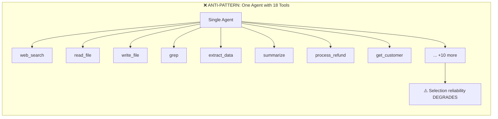

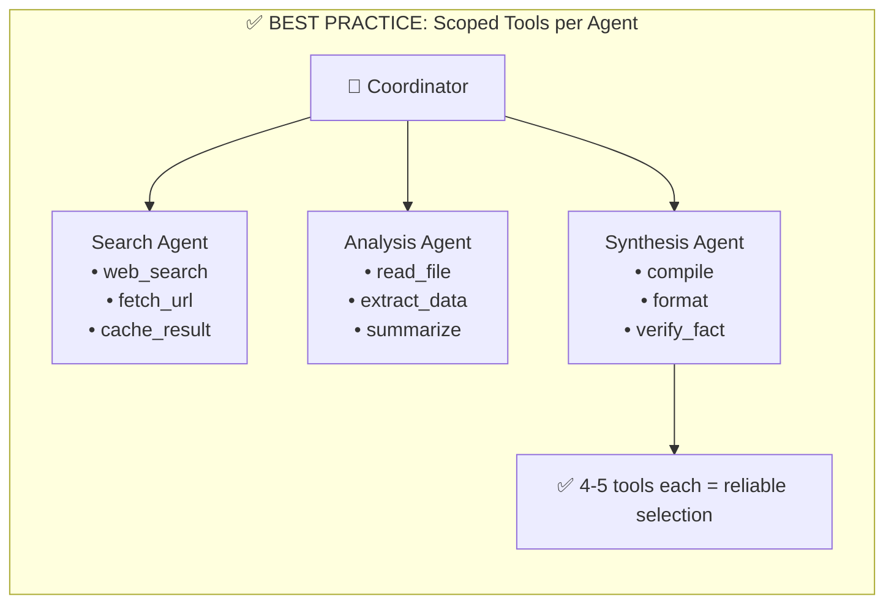

### Scoped Cross-Role Tools

Sometimes a subagent needs occasional access to a capability outside its primary role. The solution is a **scoped cross-role tool** — a constrained version of another agent's tool provided for high-frequency, simple needs.

**Example:** The synthesis agent frequently needs to verify simple facts (dates, names, statistics). Instead of routing every verification through the coordinator to the search agent (adding 2-3 round trips and 40% latency), give the synthesis agent a scoped `verify_fact` tool for simple lookups. Complex verifications still route through the coordinator.

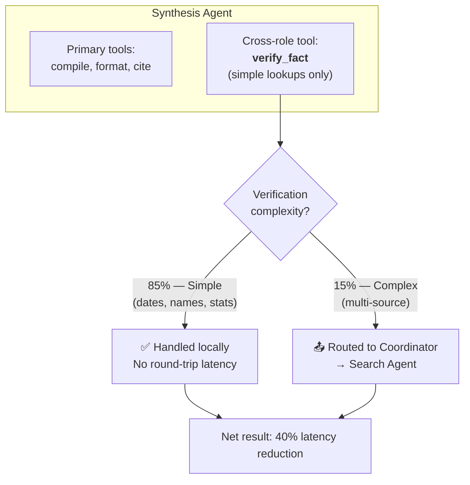

### Constrained Tool Alternatives

Replace generic tools with constrained alternatives that validate inputs and limit scope.

| Generic Tool | Constrained Alternative | Why |
|-------------|------------------------|-----|
| `fetch_url` (any URL) | `load_document` (validates document URLs only) | Prevents fetching arbitrary/malicious URLs |
| `execute_query` (any SQL) | `lookup_customer` (parameterized, read-only) | Prevents SQL injection, write operations |
| `send_message` (any recipient) | `notify_team_channel` (fixed channel) | Prevents sending to unauthorized recipients |

### tool_choice Configuration

The `tool_choice` parameter controls HOW the model selects tools. Three options exist:

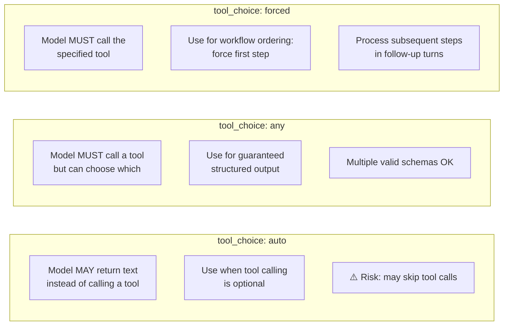

### tool_choice Decision Matrix

| Scenario | tool_choice Setting | Why |
|----------|-------------------|-----|
| General conversation with optional tool use | `"auto"` | Let model decide if a tool is needed |
| Guaranteed structured output, multiple schemas | `"any"` | Force a tool call, let model pick which |
| Enforce tool ordering (metadata first, then enrich) | `{"type": "tool", "name": "..."}` | Deterministic first step, then `"auto"` for subsequent |
| Unknown document type, multiple extractors | `"any"` | Model picks the right extractor |
| Must call exactly one specific tool | `{"type": "tool", "name": "..."}` | No ambiguity |

### Common Exam Traps

| Trap | Why It's Wrong |
|------|---------------|
| "Give all agents all tools for flexibility" | Degrades selection reliability; agents misuse out-of-scope tools |
| "Use `tool_choice: 'auto'` when you need guaranteed structured output" | Model may return text instead of calling a tool |
| "Give the synthesis agent full web search access to reduce latency" | Synthesis agent will attempt web searches it should delegate |
| "Forced tool selection for all steps" | Loses model flexibility; only useful for the first step in a sequence |

### Best Practices

1. Limit each agent to 4-5 tools relevant to its role
2. Use `allowedTools` in `AgentDefinition` to restrict tool sets
3. Provide scoped cross-role tools for high-frequency simple needs
4. Replace generic tools with constrained alternatives
5. Use `tool_choice: "any"` when you need guaranteed tool calls
6. Use forced selection for workflow ordering (first step only), then `"auto"`
7. Route all subagent communication through the coordinator for observability

---

## 5 Task Statement 2.4 — Integrate MCP Servers into Claude Code and Agent Workflows

### Concept Overview

MCP (Model Context Protocol) servers expose external capabilities to Claude as discoverable tools and resources. Configuration determines whether tools are shared across a team or personal to one developer, and how credentials are managed securely.

### MCP Server Scoping

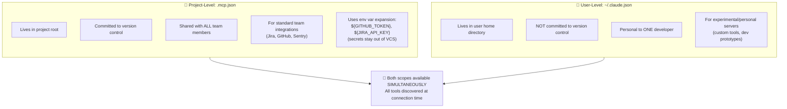

### Configuration Example: .mcp.json

```json
{
  "mcpServers": {
    "github": {
      "command": "mcp-server-github",
      "env": {
        "GITHUB_TOKEN": "${GITHUB_TOKEN}"
      }
    },
    "jira": {
      "command": "mcp-server-jira",
      "env": {
        "JIRA_API_KEY": "${JIRA_API_KEY}",
        "JIRA_BASE_URL": "${JIRA_BASE_URL}"
      }
    }
  }
}
```

Key points:
- `${GITHUB_TOKEN}` uses environment variable expansion — the actual secret is never committed
- This file IS committed to version control (it's project-scoped)
- Every team member who clones the repo gets these MCP servers
- Each developer sets their own tokens via environment variables

### MCP Resources vs MCP Tools

This distinction is important for the exam:

| Concept | MCP Resources | MCP Tools |
|---------|--------------|-----------|
| **Purpose** | Expose content catalogs for browsing | Perform actions on external systems |
| **Examples** | Issue summaries, doc hierarchies, DB schemas | Create ticket, merge PR, run query |
| **Agent use** | Read-only discovery of available data | Execute operations with side effects |
| **Value** | Reduces exploratory tool calls | Enables actual integrations |
| **Analogy** | A table of contents | A specific function call |

MCP resources give the agent visibility into what data exists without requiring exploratory tool calls. For example, exposing a list of Jira project names as a resource means the agent doesn't need to call `list_projects` before every task.

### MCP Tool Description Enhancement

When agents have access to both built-in tools (Grep, Glob, Read) and MCP tools, the agent may prefer built-in tools because they are better documented. Solution: enhance MCP tool descriptions to explain capabilities and outputs in detail.

**Problem:**

```
MCP tool: "jira_search" — "Searches Jira issues"
Built-in: Grep — (detailed documentation about searching file contents)

Agent prefers Grep for everything, ignoring jira_search.
```

**Fix:**

```
MCP tool: "jira_search" — "Searches Jira issues by JQL query. 
  Returns: issue key, summary, status, assignee, priority, 
  created date, and labels. Accepts JQL syntax (e.g., 
  'project = BACKEND AND status = Open'). Use this for 
  any Jira-related queries. Do NOT use Grep for Jira data."
```

### Community vs Custom MCP Servers

| Decision | Use Community MCP Server | Build Custom MCP Server |
|----------|------------------------|----------------------|
| **When** | Standard integrations (Jira, GitHub, Slack) | Team-specific workflows |
| **Why** | Already built, tested, maintained | Unique business logic |
| **Example** | `mcp-server-github` for GitHub | Custom approval workflow server |
| **Exam position** | Prefer community servers first | Reserve custom for unique needs |

### Common Exam Traps

| Trap | Why It's Wrong |
|------|---------------|
| "Put team MCP config in ~/.claude.json" | User-level config is not shared with teammates |
| "Commit API tokens directly in .mcp.json" | Security violation; use env var expansion |
| "Build a custom MCP server for Jira" | Community server exists; unnecessary effort |
| "MCP servers need manual tool registration" | Tools are discovered automatically at connection time |

### Best Practices

1. Team integrations go in project-scoped `.mcp.json` (committed to VCS)
2. Personal/experimental servers go in user-scoped `~/.claude.json` (NOT committed)
3. Always use environment variable expansion (`${TOKEN}`) for credentials
4. Enhance MCP tool descriptions to compete with built-in tool documentation
5. Prefer community MCP servers for standard integrations
6. Expose content catalogs as MCP resources to reduce exploratory calls
7. Both project and user MCP servers are available simultaneously

---

## 6 Task Statement 2.5 — Select and Apply Built-in Tools Effectively

### Concept Overview

Claude Code provides six built-in tools. Each has a specific purpose. The exam tests whether you can select the right tool for a given task.

### Built-in Tool Reference

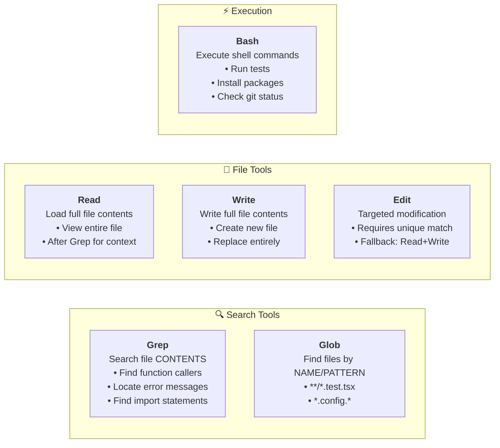

### Tool Selection Decision Tree

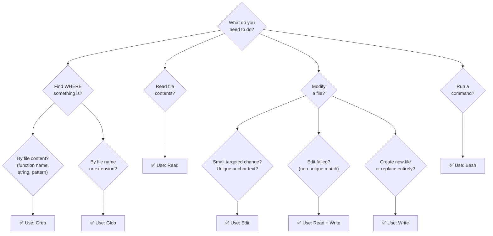

### Incremental Codebase Understanding Pattern

The exam tests whether you understand the correct strategy for exploring an unfamiliar codebase. The correct approach is incremental, NOT exhaustive.

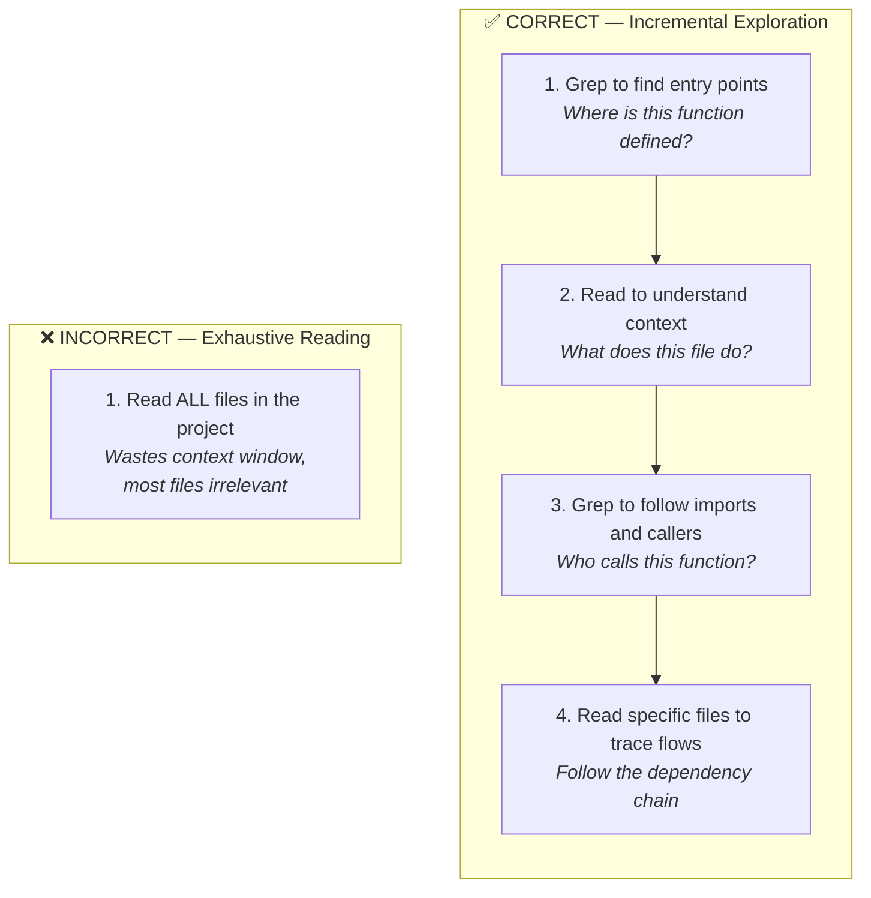

### The Edit Fallback Pattern

When `Edit` fails because the anchor text appears in multiple places (non-unique match), the reliable fallback is `Read + Write`:

1. `Read` the full file contents
2. Modify the content programmatically
3. `Write` the entire modified file back

### Tracing Function Usage Across Wrappers

For questions about understanding code usage patterns:

1. Use Grep to identify all exported names from a module
2. Use Grep to search for each name across the codebase
3. Use Read on the files where matches appear to understand the usage context

### Common Exam Traps

| Trap | Why It's Wrong |
|------|---------------|
| "Use Grep to find test files" | Grep searches file CONTENTS. Use Glob for file NAMES/PATTERNS. |
| "Use Glob to find function callers" | Glob finds file PATHS. Use Grep for CONTENT search. |
| "Read all files first to understand the codebase" | Wastes context. Use incremental Grep → Read. |
| "Always use Edit for modifications" | Edit requires unique text matches. Falls back to Read+Write. |

---

## 7 MCP Architecture Deep Dive

### MCP Protocol Architecture

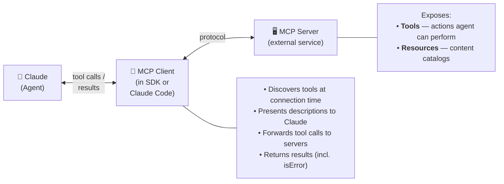

### Multi-Server Simultaneous Access

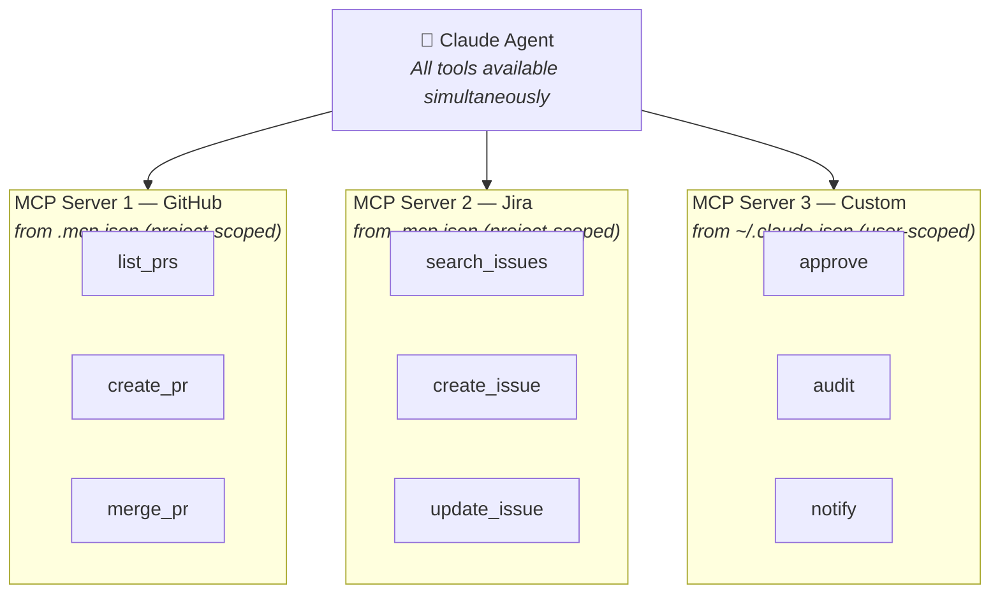

### MCP Configuration Hierarchy

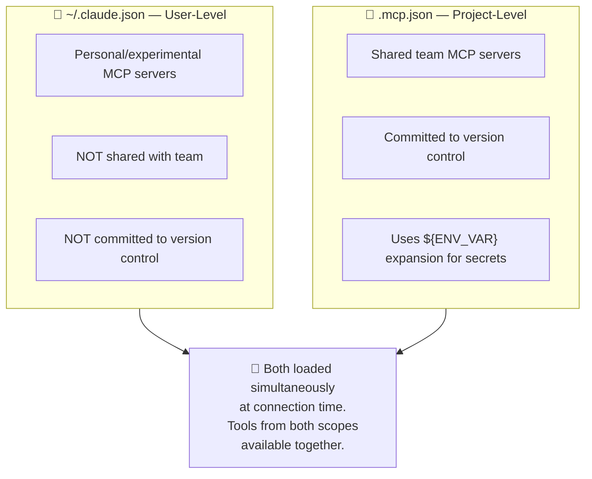

---

## 8 Anti-Pattern Encyclopedia

### Complete Anti-Pattern Reference for Domain 2

| # | Anti-Pattern | Why It Fails | Production Impact | Exam Signal |
|---|-------------|-------------|-------------------|-------------|
| 1 | Minimal tool descriptions | Model cannot differentiate similar tools | Misrouting, wrong tool called | "The agent keeps calling the wrong tool" |
| 2 | Overlapping tool names | Semantic confusion during selection | Non-deterministic routing | Two tools with similar names |
| 3 | Generic "Operation failed" errors | Agent cannot determine recovery strategy | Wasted retries, poor UX | "The agent retries endlessly" |
| 4 | Missing `isRetryable` flag | Agent retries non-retryable errors | Wasted API calls, user frustration | "Retrying a policy violation" |
| 5 | 18+ tools on one agent | Decision complexity degrades selection | Frequent misrouting | "Agent has access to many tools" |
| 6 | Cross-specialization tools | Agents misuse out-of-scope tools | Synthesis agent does web searches | "Agent uses tools outside its role" |
| 7 | Credentials in .mcp.json | Secrets committed to VCS | Security vulnerability | "API key in configuration file" |
| 8 | Team config in ~/.claude.json | Not shared with teammates | Inconsistent tool availability | "New team member lacks tools" |
| 9 | Custom MCP for standard integrations | Unnecessary effort | Maintenance burden | "Building custom Jira server" |
| 10 | Reading all files upfront | Context window waste | Performance degradation | "Agent reads entire codebase first" |
| 11 | Using Grep for file discovery | Wrong tool (Grep searches content) | Missing files, wrong results | "Find all test files using Grep" |
| 12 | Empty results marked as errors | False retries | Agent retries valid queries | "No results" treated as failure |
| 13 | `tool_choice: "auto"` for required output | Model may skip tool calls | Missing structured output | "Sometimes returns text instead" |
| 14 | Suppressing errors as success | Silent failures | Incomplete, unreliable outputs | "Returns empty results as success" |
| 15 | No boundary conditions in descriptions | Tool used outside intended scope | Incorrect results | "Tool used for wrong input type" |

---

## 9 Decision Frameworks and Checklists

### Tool Description Quality Checklist

Before deploying any tool, verify each item:

- [ ] Purpose: One-sentence specific description
- [ ] Inputs: Format, types, example values
- [ ] Outputs: What the tool returns
- [ ] Boundaries: When NOT to use this tool
- [ ] Differentiation: How this differs from similar tools
- [ ] Edge cases: Behavior with empty/invalid inputs
- [ ] System prompt review: No keyword conflicts

### Error Response Design Checklist

- [ ] isError flag set correctly (true for failures)
- [ ] errorCategory present (transient/validation/business/permission)
- [ ] isRetryable boolean present
- [ ] Human-readable message included
- [ ] customerMessage included (for business errors)
- [ ] suggestedAction included
- [ ] Context object with relevant metadata
- [ ] Empty results return isError: false (not true)

### Tool Distribution Checklist

- [ ] Each agent has 4-5 tools maximum
- [ ] No agent has tools outside its specialization
- [ ] Cross-role needs handled by scoped tools
- [ ] Generic tools replaced with constrained alternatives
- [ ] tool_choice configured appropriately per step
- [ ] allowedTools set in AgentDefinition
- [ ] Coordinator uses Task tool for subagent spawning

### MCP Configuration Checklist

- [ ] Team integrations in .mcp.json (project-scoped)
- [ ] Personal tools in ~/.claude.json (user-scoped)
- [ ] All credentials use ${ENV_VAR} expansion
- [ ] No secrets in version control
- [ ] MCP tool descriptions enhanced to compete with built-ins
- [ ] Community servers used for standard integrations
- [ ] Content catalogs exposed as MCP resources

### "Which tool_choice?" Quick Decision

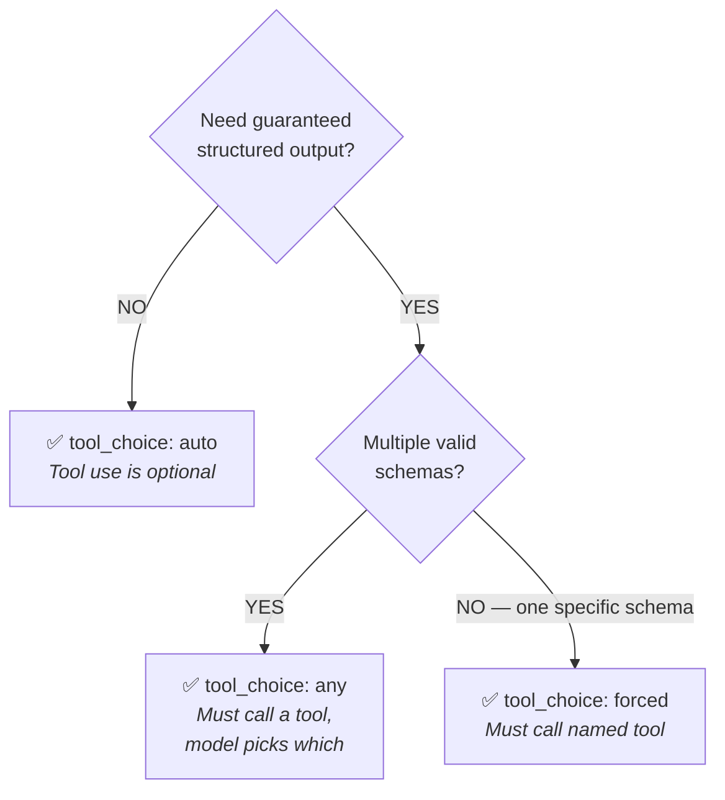

---

## 10 Scenario Walkthroughs

### Scenario A: Customer Support Agent Tool Misrouting

**Situation:** Your customer support agent has two tools: `get_customer` ("Retrieves customer information") and `lookup_order` ("Retrieves order details"). Both accept similar identifier formats. In 12% of cases, the agent calls `get_customer` when users ask about orders.

**Analysis:**

Root cause: Minimal, nearly identical descriptions. The model lacks differentiation signals.

Approach evaluation:

| Approach | Verdict | Reasoning |
|----------|---------|-----------|
| Improve tool descriptions | **CORRECT** — First step | Directly addresses root cause. Low effort, high leverage. |
| Add few-shot examples | Partial | Adds token overhead without fixing the underlying issue. |
| Build routing classifier | Over-engineered | Bypasses LLM's natural language understanding. |
| Consolidate tools | Valid architecture | But too much effort for a "first step" question. |

**Solution:** Expand each tool's description to include input formats, example queries, edge cases, and boundaries explaining when to use it versus similar tools.

### Scenario B: Agent Skipping Required Verification Step

**Situation:** In 12% of cases, your agent skips `get_customer` entirely and calls `lookup_order` using only the customer's stated name, leading to misidentified accounts and incorrect refunds.

**Analysis:**

Root cause: No programmatic enforcement of tool ordering. The agent relies on prompt instructions, which have a non-zero failure rate.

**Critical principle:** When a specific tool sequence is required for critical business logic (customer identity verification before refunds), **programmatic enforcement** provides deterministic guarantees that prompt-based approaches cannot.

| Approach | Verdict | Reasoning |
|----------|---------|-----------|
| Programmatic prerequisite gate | **CORRECT** | Blocks downstream tools until prerequisite completes. Deterministic. |
| Enhance system prompt | Insufficient | Probabilistic compliance. 12% failure rate already proves this. |
| Add few-shot examples | Insufficient | Same probabilistic problem. |
| Routing classifier | Wrong problem | Addresses tool availability, not tool ordering. |

### Scenario C: Multi-Agent Research System Error Handling

**Situation:** The web search subagent times out while researching a complex topic. You need to design how failure information flows back to the coordinator.

**Analysis:**

The coordinator needs to make intelligent recovery decisions. It needs structured context, not generic error messages.

| Approach | Verdict | Reasoning |
|----------|---------|-----------|
| Return structured error context | **CORRECT** | Includes failure type, attempted query, partial results, alternatives. Enables intelligent recovery. |
| Automatic retry with generic status | Insufficient | Generic "search unavailable" hides context from coordinator. |
| Return empty result as success | **DANGEROUS** | Suppresses the error. Prevents any recovery. |
| Terminate entire workflow | Overkill | Kills everything when local recovery could succeed. |

### Scenario D: Synthesis Agent Verification Bottleneck

**Situation:** The synthesis agent needs to verify claims while combining findings. Currently, every verification routes through the coordinator to the search agent (2-3 round trips, 40% latency increase). 85% of verifications are simple fact-checks.

**Solution:** Give the synthesis agent a scoped `verify_fact` tool for simple lookups. Complex verifications continue through the coordinator.

**Why NOT give full search access:** The synthesis agent would misuse search tools for purposes beyond its specialization. Scoped access preserves role boundaries while reducing latency.

---

## 11 Exam-Style Questions with Explanations

### Question 1

Your multi-agent research system has a coordinator that delegates to three specialized subagents. The web search agent has 4 tools, the document analysis agent has 5 tools, and the synthesis agent has 3 tools. A new requirement asks you to add 6 new tools for interacting with a project management system. Which approach is most architecturally sound?

A) Add all 6 tools to the coordinator agent since it manages the overall workflow.
B) Create a new project management subagent with the 6 tools and spawn it through the coordinator.
C) Distribute the 6 tools across the existing three subagents based on functional similarity.
D) Add all 6 tools to every agent so any agent can interact with the project management system when needed.

**Correct Answer: B**

**Explanation:** Creating a dedicated subagent with scoped tools follows the principle that each agent should have 4-5 tools relevant to its role. Option A overloads the coordinator (which should focus on delegation, not execution). Option C violates specialization — project management tools don't belong on research agents. Option D creates the tool overload anti-pattern across all agents.

---

### Question 2

Your MCP tool `process_refund` returns the following when a refund request violates business rules:

```json
{"status": "error", "message": "Operation failed"}
```

The agent retries this call three times before giving up and telling the user "There was a temporary issue." What is the root cause of this behavior?

A) The tool should return a more descriptive error message.
B) The agent's retry logic should use exponential backoff.
C) The tool should return structured error metadata including `errorCategory` and `isRetryable` fields so the agent can distinguish business errors from transient failures.
D) The agent should be configured with a maximum retry count of 1 instead of 3.

**Correct Answer: C**

**Explanation:** The uniform error response ("Operation failed") prevents the agent from distinguishing between a transient failure (worth retrying) and a business rule violation (never worth retrying). Option A improves readability but doesn't enable programmatic decision-making. Option B addresses retry timing but not whether to retry at all. Option D reduces wasted retries but doesn't fix the root cause — the agent still can't make informed recovery decisions.

---

### Question 3

You're configuring MCP servers for a team of 8 developers. The team needs a shared GitHub integration and each developer wants to experiment with their own custom MCP servers. What configuration approach is correct?

A) Put all MCP server configs in `.mcp.json` in the project root.
B) Put the GitHub integration in `.mcp.json` and personal servers in each developer's `~/.claude.json`.
C) Put all MCP server configs in each developer's `~/.claude.json`.
D) Put the GitHub integration in `~/.claude.json` and personal servers in `.mcp.json`.

**Correct Answer: B**

**Explanation:** Team integrations belong in project-scoped `.mcp.json` (committed to version control, shared via clone). Personal/experimental servers belong in user-scoped `~/.claude.json` (not committed, personal to each developer). Both are loaded simultaneously. Option A would put personal experiments in version control. Option C would require each developer to manually configure the shared GitHub integration. Option D reverses the correct scoping.

---

### Question 4

Your agent needs to find all files ending in `.test.tsx` across a large codebase, then search within those files for usage of a deprecated function `oldHelper()`. What tool sequence is most appropriate?

A) Use Bash to run `find . -name "*.test.tsx" | xargs grep "oldHelper"`
B) Use Glob to find `**/*.test.tsx`, then use Grep to search for `oldHelper` within those files
C) Use Grep to search for `oldHelper` across the entire codebase, then filter results for `.test.tsx` files
D) Use Read on each directory to find test files, then search their contents

**Correct Answer: B**

**Explanation:** Glob finds files by name/pattern (`**/*.test.tsx`). Grep searches file contents for patterns (`oldHelper`). Using Glob first, then Grep, is the correct composition. Option A works but uses raw Bash instead of the purpose-built tools. Option C searches the entire codebase when only test files are relevant — wasteful and potentially noisy. Option D is extremely inefficient — Read loads full file contents directory by directory.

---

### Question 5

You have a data extraction pipeline with three schemas: `extract_invoice`, `extract_receipt`, and `extract_contract`. The document type is unknown at processing time. What `tool_choice` configuration guarantees the model produces structured output using the appropriate schema?

A) `tool_choice: "auto"` — the model will naturally select the right schema.
B) `tool_choice: "any"` — the model must call a tool but picks the right one.
C) `tool_choice: {"type": "tool", "name": "extract_invoice"}` — force the most common schema.
D) Don't set `tool_choice` and rely on the system prompt to instruct schema selection.

**Correct Answer: B**

**Explanation:** `tool_choice: "any"` guarantees the model calls one of the available tools (preventing text-only responses) while allowing it to choose which schema fits the document. Option A may return text instead of a tool call — no guarantee of structured output. Option C forces the wrong schema for receipts and contracts. Option D provides no guarantees at all.

---

### Question 6

A new team member reports that they don't have access to the Jira MCP server that other team members use. The Jira configuration exists in the project. What is the most likely cause?

A) The Jira MCP server crashed and needs to be restarted.
B) The Jira configuration is in `~/.claude.json` on other developers' machines instead of in the project-scoped `.mcp.json`.
C) The new team member's Claude Code version is outdated.
D) The Jira MCP server has a maximum connection limit.

**Correct Answer: B**

**Explanation:** If the Jira config is in user-level `~/.claude.json`, it's personal to each developer and not shared through version control. A new team member cloning the repo wouldn't get it. The fix is to move the Jira config to project-scoped `.mcp.json` with environment variable expansion for credentials. Option A is an infrastructure issue (out of scope). Option C is unlikely to cause selective tool unavailability. Option D is an infrastructure concern.

---

### Question 7

Your agent handles a request where `lookup_order` returns zero results for a valid order number. The tool correctly returns `isError: false` with an empty results array. What should the agent do?

A) Retry the call with exponential backoff, as the empty result likely indicates a transient failure.
B) Report "no results found" to the user and offer to try alternative identifiers.
C) Escalate to a human agent because the system appears to have an error.
D) Call `get_customer` instead to try finding the order through the customer record.

**Correct Answer: B**

**Explanation:** `isError: false` with an empty array means the query succeeded — there are simply no matching results. This is a valid empty result, not a failure. Option A wastes retries on a successful query. Option C unnecessarily escalates a normal situation. Option D might be a reasonable follow-up, but the immediate correct response is to inform the user of the empty result.

---

### Question 8

You notice that your agent prefers using the built-in Grep tool to search for Jira tickets instead of using the `jira_search` MCP tool, even though `jira_search` would return richer, structured data directly from Jira. What is the most effective fix?

A) Remove Grep from the agent's available tools.
B) Add a system prompt instruction: "Always use jira_search for Jira-related queries."
C) Enhance the `jira_search` tool description to explain its capabilities, output format, and when to use it instead of Grep.
D) Rename `jira_search` to `search_issues` to make it more discoverable.

**Correct Answer: C**

**Explanation:** The agent prefers Grep because built-in tools typically have better documentation. Enhancing the MCP tool description to be equally detailed directly addresses this. Option A removes a useful tool for legitimate file searches. Option B is keyword-sensitive and may cause unintended associations. Option D changes the name but doesn't fix the description quality gap.

---

## 12 Memory Anchors and Revision Notes

### Memory Anchors (Key Phrases to Remember)

1. **"Descriptions are the primary mechanism"** — Tool descriptions drive tool selection. Fix descriptions first, always.
2. **"Structured metadata enables deterministic branching"** — Structured errors let agents make programmatic decisions. Generic messages don't.
3. **"4-5 tools per agent"** — More tools = worse selection. Scope tightly.
4. **"isError false means success"** — Empty results with `isError: false` are valid. Don't retry them.
5. **"Project scope = shared; User scope = personal"** — `.mcp.json` is for the team. `~/.claude.json` is for you.
6. **"Grep searches contents; Glob finds files"** — Never confuse them.
7. **"Programmatic > probabilistic for critical sequences"** — Hooks and gates beat prompt instructions for mandatory ordering.
8. **"Scoped cross-role tools, not full access"** — Give `verify_fact`, not all search tools.
9. **"Community servers before custom"** — Don't build what already exists.
10. **"Resources for catalogs, tools for actions"** — MCP resources reduce exploratory calls.

### Revision Notes (Compressed Cheat Sheet)

**Tool Descriptions:**
- Must include: purpose, inputs, outputs, boundaries, differentiation
- Minimal descriptions = unreliable selection among similar tools
- System prompt keywords can override tool descriptions (review for conflicts)
- Splitting > consolidating as a first fix
- Renaming + re-describing eliminates functional overlap

**Structured Errors:**
- MCP uses `isError` flag for error signaling
- Four categories: transient (retryable), validation, business, permission
- Must include: `errorCategory`, `isRetryable`, `message`, `customerMessage`
- Empty results with no error ≠ errors (isError: false)
- Subagents handle transient errors locally; propagate unresolvable with partial results

**Tool Distribution:**
- 4-5 tools per agent maximum
- `allowedTools` in AgentDefinition restricts tool sets
- Scoped cross-role tools for high-frequency simple needs
- Replace generic tools with constrained alternatives
- `tool_choice: "auto"` = optional; `"any"` = must call a tool; forced = must call specific tool

**MCP Configuration:**
- `.mcp.json` = project-scoped, committed, shared, uses `${ENV_VAR}`
- `~/.claude.json` = user-scoped, personal, NOT committed
- Both loaded simultaneously at connection time
- Enhance MCP tool descriptions to compete with built-in documentation
- MCP resources = content catalogs; MCP tools = actions
- Community servers before custom implementations

**Built-in Tools:**
- Grep = search file CONTENTS (function names, error strings, imports)
- Glob = find files by NAME/PATTERN (`**/*.test.tsx`)
- Read = load full file contents
- Write = create/overwrite full file
- Edit = targeted modification (requires unique anchor text; fallback = Read+Write)
- Bash = execute shell commands
- Incremental exploration: Grep entry points → Read context → Grep callers → Read flows

### Correct vs Incorrect Quick Reference

| Situation | Correct | Incorrect |
|-----------|---------|-----------|
| Agent calls wrong tool | Fix tool descriptions | Add few-shot examples |
| Agent skips required step | Programmatic prerequisite gate | Enhance system prompt |
| Agent retries business errors | Add `isRetryable: false` to error response | Reduce retry count |
| Need guaranteed structured output | `tool_choice: "any"` | `tool_choice: "auto"` |
| Team needs shared MCP server | `.mcp.json` with `${ENV_VAR}` | `~/.claude.json` per developer |
| Need standard integration (Jira) | Use community MCP server | Build custom MCP server |
| Find test files | Glob `**/*.test.tsx` | Grep "test" |
| Search code for function usage | Grep "functionName" | Read all files |
| Subagent needs simple fact verification | Scoped `verify_fact` tool | Full search tool access |
| Empty query results, no error | Report "no results" to user | Retry the query |
| Edit fails (non-unique text) | Read + Write fallback | Retry Edit with different anchor |
| New feature needs 6 new tools | Create new specialized subagent | Add tools to existing agents |

---

## Appendix A: Technologies and Concepts Testable on the Exam

From the official exam guide, the following Domain 2 technologies may appear:

- **Model Context Protocol (MCP):** MCP servers, MCP tools, MCP resources, `isError` flag, tool descriptions, tool distribution, `.mcp.json` configuration, environment variable expansion
- **Claude Agent SDK:** `allowedTools` configuration, `AgentDefinition`, hooks (`PostToolUse`, tool call interception)
- **Claude API:** `tool_use` with JSON schemas, `tool_choice` options (`"auto"`, `"any"`, forced tool selection)
- **Built-in tools:** Read, Write, Edit, Bash, Grep, Glob — their purposes and selection criteria
- **JSON Schema:** Required vs optional fields, enum types, nullable fields, `"other"` + detail string patterns

## Appendix B: What Is NOT Tested

The exam explicitly excludes:

- Deploying or hosting MCP servers (infrastructure, networking, containers)
- OAuth, API key rotation, or authentication protocol details
- Claude API authentication, billing, or account management
- Specific cloud provider configurations (AWS, GCP, Azure)
- Rate limiting, quotas, or API pricing calculations

Do NOT spend study time on these topics.

---

*End of Domain 2 Study Material — CCA-F Exam Preparation*
