# Domain 3 — Claude Code Configuration & Workflows (20%)

> **Weight:** 20% of scored content — tied second-highest with Domain 4.
> **Core philosophy:** Operational correctness through structured configuration beats ad-hoc instruction.

---

## Table of Contents

- [[#1 Task Statement 3.1 — Configure CLAUDE.md Files with Hierarchy Scoping and Modular Organization]]
- [[#2 Task Statement 3.2 — Create and Configure Custom Slash Commands and Skills]]
- [[#3 Task Statement 3.3 — Apply Path-Specific Rules for Conditional Convention Loading]]
- [[#4 Task Statement 3.4 — Determine When to Use Plan Mode vs Direct Execution]]
- [[#5 Task Statement 3.5 — Apply Iterative Refinement Techniques for Progressive Improvement]]
- [[#6 Task Statement 3.6 — Integrate Claude Code into CI/CD Pipelines]]
- [[#7 Anti-Patterns Master Reference]]
- [[#8 Decision Frameworks and Heuristics]]
- [[#9 Exam-Style Questions With Explanations]]
- [[#10 Memory Anchors]]
- [[#11 Rapid Revision Checklist]]
- [[#12 Top 10 Exam Traps]]
- [[#13 Appendix — Key Technology References]]
- [[#14 Appendix — Scenario Quick Reference]]

---

## 1 Task Statement 3.1 — Configure CLAUDE.md Files with Hierarchy Scoping and Modular Organization

### 1.1 Concept Overview

CLAUDE.md is the primary configuration mechanism for Claude Code. It provides persistent instructions, coding standards, project context, and behavioral constraints that Claude Code loads automatically when working within a project. Unlike prompts typed in each session, CLAUDE.md files persist across sessions and team members.

The configuration system uses a **three-level hierarchy** that mirrors how organizations typically structure their development standards:

**Level 1 — User-level:** `~/.claude/CLAUDE.md`
- Applies only to a single developer
- NOT shared via version control
- Contains personal preferences, editor-specific settings, or experimental rules
- Invisible to teammates

**Level 2 — Project-level:** `.claude/CLAUDE.md` or root `CLAUDE.md`
- Applies to all team members who clone the repository
- Shared via version control
- Contains universal coding standards, testing conventions, architectural guidelines
- The default location for team-wide instructions

**Level 3 — Directory-level:** Subdirectory `CLAUDE.md` files
- Applies only when working within that subdirectory
- Useful for package-specific or module-specific conventions
- Inherits parent CLAUDE.md instructions and adds local overrides

Additionally, the system supports:

- **`@import` syntax:** Reference external files to keep CLAUDE.md modular (e.g., importing specific standards files relevant to each package)
- **`.claude/rules/` directory:** Organize topic-specific rule files as an alternative to a monolithic CLAUDE.md
- **`/memory` command:** Verify which memory files are loaded and diagnose inconsistent behavior across sessions

### 1.2 Why It Matters For The Exam

This is the **foundational task statement** for Domain 3. The exam tests your ability to:

- **Diagnose configuration hierarchy issues:** A new team member doesn't receive coding standards — is the config at user-level instead of project-level?
- **Choose the right scope for instructions:** When should a rule be user-level, project-level, or directory-level?
- **Modularize configuration:** When should you use `@import` vs `.claude/rules/` vs monolithic CLAUDE.md?
- **Recognize sharing boundaries:** User-level config is NOT committed to version control

Scenario patterns to expect:
- "A new team member clones the repo but Claude Code doesn't follow the coding standards" → Config is in user-level (`~/.claude/CLAUDE.md`) instead of project-level
- "The CLAUDE.md file has grown to 2000 lines and is hard to maintain" → Split into `.claude/rules/` topic files or use `@import`
- "Different packages in a monorepo need different standards" → Use `@import` to selectively include relevant standards files per package

### 1.3 Production Perspective

In real-world team environments, configuration hierarchy solves three problems:

1. **Consistency:** Project-level config ensures every developer gets the same instructions — coding style, testing patterns, architectural constraints.
2. **Personalization:** User-level config lets individuals customize without affecting the team (e.g., verbose output preference, personal experimental features).
3. **Modularity:** As projects grow, a single CLAUDE.md becomes unwieldy. Splitting into focused topic files (`testing.md`, `api-conventions.md`, `deployment.md`) in `.claude/rules/` keeps each file focused and maintainable.

### 1.4 Architecture Diagram

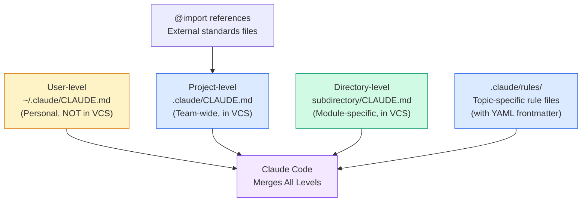

### 1.5 Configuration Examples

**Project-level CLAUDE.md (shared by all):**

```markdown
# Project Standards

## Code Style
- Use TypeScript strict mode
- All functions must have JSDoc comments
- Maximum function length: 50 lines

## Testing
- Every new function requires a test
- Use vitest for unit tests
- Minimum 80% branch coverage

@import docs/api-standards.md
@import docs/security-guidelines.md
```

**User-level CLAUDE.md (personal only):**

```markdown
# Personal Preferences
- Use verbose explanations when suggesting changes
- Always show the diff before applying changes
```

**Modular `.claude/rules/` structure:**

```
.claude/
  rules/
    testing.md        # Testing conventions
    api-conventions.md # API design rules
    deployment.md      # Deployment checklist
    security.md        # Security standards
```

### 1.6 Common Exam Traps

| Trap | Why It's Wrong | Correct Understanding |
|------|---------------|----------------------|
| "Put team standards in `~/.claude/CLAUDE.md`" | User-level is personal — not shared via VCS | Team standards go in project-level `.claude/CLAUDE.md` |
| "Use a single massive CLAUDE.md for everything" | Becomes unmaintainable at scale | Split into `.claude/rules/` topic files or use `@import` |
| "Directory-level CLAUDE.md can handle cross-cutting concerns" | Directory-level is bound to a single directory tree | Use `.claude/rules/` with glob patterns for cross-cutting concerns |
| "The `/memory` command is for creating new memories" | `/memory` verifies which memory files are loaded | It's a diagnostic tool for debugging inconsistent behavior |
| "All configuration levels have equal precedence" | There is a merge hierarchy | User + project + directory all merge into the active context |

---

## 2 Task Statement 3.2 — Create and Configure Custom Slash Commands and Skills

### 2.1 Concept Overview

Claude Code supports two distinct mechanisms for extending its capabilities: **slash commands** and **skills**. Understanding when to use each — and their scoping rules — is critical for the exam.

**Slash Commands** are predefined prompt templates invoked by typing `/commandname`. They are stored as files in specific directories:

- **Project-scoped:** `.claude/commands/` — shared via version control, available to all team members
- **User-scoped:** `~/.claude/commands/` — personal, NOT shared via version control

**Skills** are more powerful. They live in `.claude/skills/` and use `SKILL.md` files with frontmatter configuration supporting three key options:

| Frontmatter Option | Purpose | Example Use Case |
|-------------------|---------|-----------------|
| `context: fork` | Runs the skill in an isolated sub-agent context, preventing skill outputs from polluting the main conversation | Codebase analysis that generates verbose output |
| `allowed-tools` | Restricts which tools the skill can access during execution | Limiting to file write operations to prevent destructive actions |
| `argument-hint` | Prompts developers for required parameters when they invoke the skill without arguments | A migration skill that needs a target version number |

**Personal skills** can be created in `~/.claude/skills/` with different names to avoid affecting teammates.

### 2.2 Why It Matters For The Exam

The exam tests your ability to:

- **Scope commands correctly:** Project commands go in `.claude/commands/` (shared), personal commands in `~/.claude/commands/` (not shared)
- **Choose between commands and skills:** Commands are simple prompt templates; skills support isolation (`context: fork`), tool restriction (`allowed-tools`), and parameter hints
- **Choose between skills and CLAUDE.md:** Skills are on-demand (invoked explicitly for task-specific workflows); CLAUDE.md is always-loaded (universal standards)
- **Apply `context: fork` correctly:** Use it to isolate verbose or exploratory output from the main conversation

Scenario patterns to expect:
- "Create a team-wide code review command" → `.claude/commands/` (project-scoped, version-controlled)
- "A skill for codebase analysis pollutes the main conversation with verbose output" → Add `context: fork` to the skill's SKILL.md frontmatter
- "A skill should only be able to read files, not write or delete" → Configure `allowed-tools` in the skill's frontmatter

### 2.3 Production Perspective

In production teams, the command/skill distinction maps to two patterns:

1. **Commands** = team workflows. A `/review` command that applies the team's standard review checklist. A `/deploy-check` command that verifies pre-deployment criteria. These are simple, standardized, and shared.

2. **Skills** = isolated task execution. A codebase analysis skill that generates 500 lines of output should use `context: fork` to prevent that output from consuming context in the main conversation. A migration skill should use `allowed-tools` to prevent accidental destructive operations.

### 2.4 Architecture Diagram

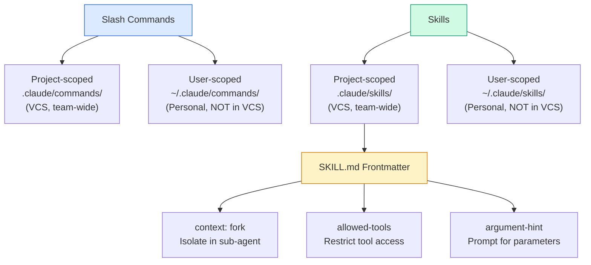

### 2.5 Code Examples

**Project-scoped slash command (`.claude/commands/review.md`):**

```markdown
Review the current changes against our team's code review checklist:

1. Check for TypeScript type safety issues
2. Verify error handling patterns
3. Ensure test coverage for new functions
4. Validate API response schemas
5. Check for security vulnerabilities (SQL injection, XSS)

Report findings grouped by severity: Critical, Warning, Info.
```

**Skill with frontmatter (`.claude/skills/analyze-codebase/SKILL.md`):**

```yaml
---
context: fork
allowed-tools:
  - Read
  - Grep
  - Glob
argument-hint: "Provide the module or directory to analyze"
---

# Codebase Analysis Skill

Analyze the specified module's architecture:
1. Map all public exports
2. Trace dependency chains
3. Identify circular dependencies
4. Report test coverage gaps
5. Return a structured summary
```

### 2.6 Key Decision: Skills vs CLAUDE.md

| Dimension | Skills | CLAUDE.md |
|-----------|--------|-----------|
| **Loading** | On-demand (explicit invocation) | Always loaded |
| **Use case** | Task-specific workflows | Universal standards |
| **Isolation** | Supports `context: fork` | No isolation |
| **Tool restriction** | Supports `allowed-tools` | No tool restriction |
| **Context cost** | Only when invoked | Always consumes tokens |
| **Example** | "Analyze this module" | "All functions need JSDoc" |

### 2.7 Common Exam Traps

| Trap | Why It's Wrong | Correct Understanding |
|------|---------------|----------------------|
| "Put shared slash commands in `~/.claude/commands/`" | User-scoped commands are NOT shared via VCS | Shared commands go in `.claude/commands/` (project) |
| "Skills are just commands with more features" | Skills have fundamentally different capabilities | Skills support isolation, tool restriction, and parameter hints |
| "Use CLAUDE.md for everything" | CLAUDE.md is always loaded — costs tokens even when irrelevant | Task-specific workflows should be skills (on-demand) |
| "Skills automatically run in isolation" | Isolation requires explicit `context: fork` | Without `context: fork`, skill output goes into the main conversation |
| "Use skills for file-type conventions" | Skills require manual invocation | Use `.claude/rules/` with path-scoping for automatic convention loading |

---

## 3 Task Statement 3.3 — Apply Path-Specific Rules for Conditional Convention Loading

### 3.1 Concept Overview

Path-specific rules solve a critical problem: how do you apply different coding conventions to different parts of a codebase **automatically**, without relying on Claude to infer which conventions apply?

The mechanism: **`.claude/rules/` files with YAML frontmatter** containing `paths` fields with glob patterns. When Claude Code edits a file matching the pattern, the corresponding rules are loaded. When editing a non-matching file, the rules are NOT loaded — saving context and reducing irrelevant instructions.

**Key insight:** Path-scoped rules load **only when editing matching files**. This is fundamentally different from directory-level CLAUDE.md files, which apply to all files within a specific directory.

### 3.2 Why It Matters For The Exam

This is one of the most directly tested task statements on the exam. The exam presents scenarios where:

- Test files are spread throughout the codebase (not in a single `tests/` directory)
- Different code areas have different conventions (React components vs API handlers vs database models)
- You need to apply conventions **automatically** based on file type, regardless of directory location

The exam specifically tests whether you understand the advantage of glob-pattern rules over directory-level CLAUDE.md files for cross-cutting conventions.

**The critical distinction:**
- **Directory-level CLAUDE.md:** Bound to a single directory tree. Cannot handle files spread across multiple directories.
- **`.claude/rules/` with glob patterns:** Apply to files by type regardless of location. `**/*.test.tsx` matches test files everywhere in the codebase.

### 3.3 Production Perspective

Real codebases rarely organize conventions by directory alone. Consider:

- Test files sit next to the code they test: `Button.test.tsx` next to `Button.tsx`
- Terraform files appear in multiple service directories
- Migration scripts live in different packages

Glob-pattern rules handle all of these because they match file patterns, not directory locations.

### 3.4 Architecture Diagram

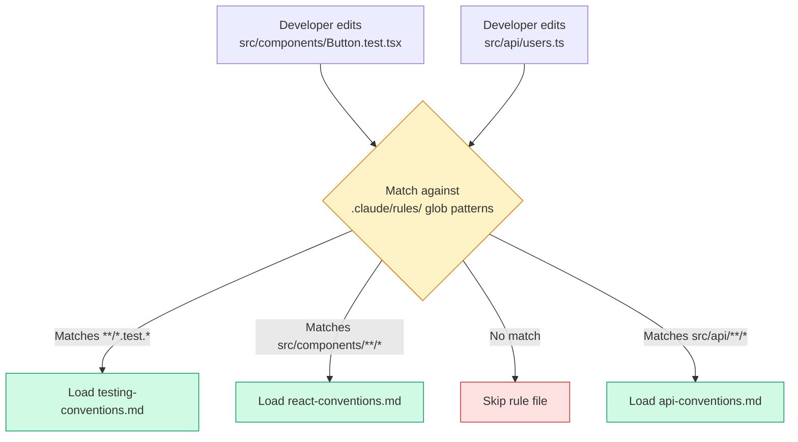

### 3.5 Code Examples

**Testing conventions (`.claude/rules/testing-conventions.md`):**

```yaml
---
paths: ["**/*.test.*", "**/*.spec.*"]
---

# Testing Conventions

- Use describe/it pattern for test organization
- Each test file must import from the adjacent source file
- Use factory functions for test data, not raw object literals
- Mock external services, never hit real APIs
- Assert both success and error paths
```

**API conventions (`.claude/rules/api-conventions.md`):**

```yaml
---
paths: ["src/api/**/*"]
---

# API Handler Conventions

- Use async/await with try/catch error handling
- Return standardized error response objects
- Validate all input with Zod schemas
- Log all requests with correlation IDs
```

**Terraform conventions (`.claude/rules/terraform-conventions.md`):**

```yaml
---
paths: ["terraform/**/*", "**/*.tf"]
---

# Terraform Conventions

- Use modules for reusable infrastructure
- Tag all resources with environment and team
- Use data sources instead of hardcoded ARNs
```

### 3.6 Key Decision: Path-Specific Rules vs Directory-Level CLAUDE.md

| Scenario | Use Path-Specific Rules | Use Directory-Level CLAUDE.md |
|----------|------------------------|------------------------------|
| Test files spread throughout codebase | **Yes** — `**/*.test.tsx` matches everywhere | No — can't cover files in multiple directories |
| All API code in `src/api/` only | Works, but CLAUDE.md also works | **Yes** — simpler for single-directory scoping |
| Terraform files in multiple service dirs | **Yes** — `**/*.tf` matches everywhere | No — would need a CLAUDE.md in every service dir |
| Universal project standards | No — use project-level CLAUDE.md | Not directory-level either — use project root |

### 3.7 Common Exam Traps

| Trap | Why It's Wrong | Correct Understanding |
|------|---------------|----------------------|
| "Use subdirectory CLAUDE.md for test conventions" | Test files are spread across the codebase | Use `.claude/rules/` with `**/*.test.*` glob pattern |
| "Rely on Claude to infer which section of CLAUDE.md applies" | Inference is unreliable | Explicit glob-pattern matching is deterministic |
| "Use skills for file-type conventions" | Skills require manual invocation | Path-specific rules load automatically when editing matching files |
| "Path rules load for all files in the project" | That would waste context tokens | Rules load ONLY when editing files matching the glob pattern |

---

## 4 Task Statement 3.4 — Determine When to Use Plan Mode vs Direct Execution

### 4.1 Concept Overview

Claude Code offers two execution modes that serve fundamentally different purposes:

**Plan Mode** is designed for:
- Complex tasks involving large-scale changes
- Multiple valid approaches requiring architectural decisions
- Multi-file modifications where dependencies must be understood first
- Safe codebase exploration and design BEFORE committing to changes

**Direct Execution** is appropriate for:
- Simple, well-scoped changes with clear requirements
- Single-file modifications (e.g., adding a validation check to one function)
- Tasks where the implementation path is obvious
- Bug fixes with a clear stack trace

**The Explore Subagent** is a specialized tool for isolating verbose discovery output during multi-phase tasks. It returns summaries to the main conversation, preserving context for the implementation phase.

### 4.2 Why It Matters For The Exam

The exam presents scenarios with varying complexity and asks you to choose the appropriate execution mode. The key signal is **ambiguity**:

- **High ambiguity** (multiple valid approaches, unknown dependencies, architectural decisions) → Plan mode
- **Low ambiguity** (clear fix, single file, obvious implementation) → Direct execution

The exam also tests the **hybrid pattern**: using plan mode for investigation, then switching to direct execution for implementation.

Critical exam pattern: A scenario describes a task that is "already complex by definition" (e.g., monolith-to-microservices restructuring). A distractor suggests starting with direct execution and switching to plan mode only if complexity emerges. This is wrong because the complexity is stated upfront, not something that might emerge later.

### 4.3 Production Perspective

In production workflows, the plan-then-execute pattern prevents costly rework. Consider a library migration affecting 45+ files: planning first reveals dependency chains that would otherwise cause cascading breaks during direct implementation.

The Explore subagent is critical for multi-phase tasks. During a large codebase analysis, verbose discovery output (listing every file, every dependency, every import chain) can exhaust the context window. The Explore subagent runs in isolation and returns only a structured summary.

### 4.4 Decision Diagram

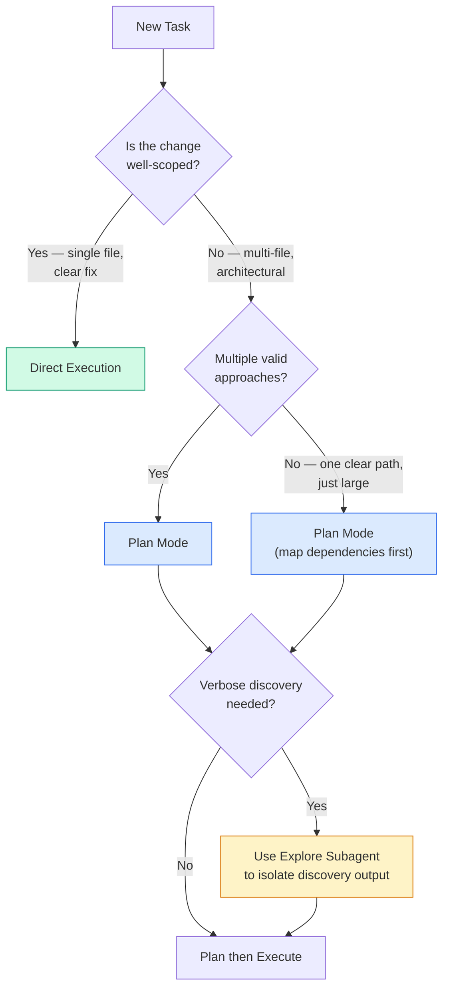

### 4.5 Plan Mode vs Direct Execution Quick Reference

| Signal | Mode | Example |
|--------|------|---------|
| Single-file bug fix with stack trace | Direct execution | Fix null pointer in `auth.ts` line 42 |
| Adding a validation check to one function | Direct execution | Add date range check to `processOrder()` |
| Multi-file refactoring | Plan mode | Extract service from monolith |
| Library migration (45+ files) | Plan mode | Migrate from Moment.js to date-fns |
| New feature with multiple valid approaches | Plan mode | Implement caching — Redis vs in-memory vs CDN |
| Architectural decision | Plan mode | Choose between REST vs GraphQL for new API |
| Codebase exploration (unfamiliar repo) | Plan mode + Explore subagent | Understand legacy system before modifying |
| Well-understood pattern application | Direct execution | Add CRUD endpoint following existing pattern |

### 4.6 The Hybrid Pattern

The most powerful approach combines both modes:

1. **Plan mode:** Investigate the codebase, understand dependencies, evaluate approaches
2. **Explore subagent:** Isolate verbose discovery output (file listings, dependency traces)
3. **Direct execution:** Implement the planned approach with clear, scoped changes

This hybrid is the correct answer when the exam presents a multi-phase task.

### 4.7 Common Exam Traps

| Trap | Why It's Wrong | Correct Understanding |
|------|---------------|----------------------|
| "Start with direct execution, switch to plan mode if needed" | If complexity is stated upfront, use plan mode from the start | Don't wait to discover complexity you already know about |
| "Use direct execution with comprehensive upfront instructions" | Assumes you already know the right structure | Plan mode lets you explore before committing |
| "Plan mode is always better" | Over-engineering for simple tasks wastes time | Single-file, clear-scope tasks should use direct execution |
| "The Explore subagent is a separate tool you need to install" | It's a built-in feature of Claude Code | Use it to isolate verbose discovery output |

---

## 5 Task Statement 3.5 — Apply Iterative Refinement Techniques for Progressive Improvement

### 5.1 Concept Overview

Iterative refinement is how developers collaborate with Claude Code to progressively improve output quality. The exam tests four specific techniques:

**Technique 1 — Concrete Input/Output Examples:**
When prose descriptions are interpreted inconsistently, provide 2-3 concrete examples showing input → expected output. This is the **most effective** way to communicate expected transformations.

**Technique 2 — Test-Driven Iteration:**
Write test suites first (covering expected behavior, edge cases, and performance requirements), then iterate by sharing test failures. The test suite becomes the objective measure of progress.

**Technique 3 — The Interview Pattern:**
Have Claude ask questions to surface considerations the developer may not have anticipated before implementing. Useful in unfamiliar domains where you don't know what you don't know.

**Technique 4 — Single Message vs Sequential Iteration:**
- **Interacting problems** (fixes that affect each other) → Provide all issues in a single message
- **Independent problems** (isolated fixes) → Fix them sequentially, one at a time

### 5.2 Why It Matters For The Exam

The exam tests your ability to diagnose **why** Claude Code produces inconsistent results and select the appropriate refinement technique. Key patterns:

- "Natural language descriptions produce inconsistent results" → Provide concrete input/output examples
- "Edge cases aren't handled correctly" → Write test cases with example input and expected output
- "Working in an unfamiliar domain" → Use the interview pattern to surface hidden considerations
- "Multiple fixes interfere with each other" → Address interacting issues in a single message

### 5.3 Production Perspective

In production development workflows:

- **Input/output examples** are the fastest way to align on expected behavior. Instead of writing a paragraph describing a data transformation, show 2-3 before/after pairs.
- **Test-driven iteration** creates a feedback loop. When Claude generates code that fails tests, sharing the specific test failures provides precise, actionable feedback.
- **The interview pattern** is valuable for cache invalidation strategies, failure mode design, database schema decisions — domains where the developer may not know the full problem space.

### 5.4 Decision Diagram

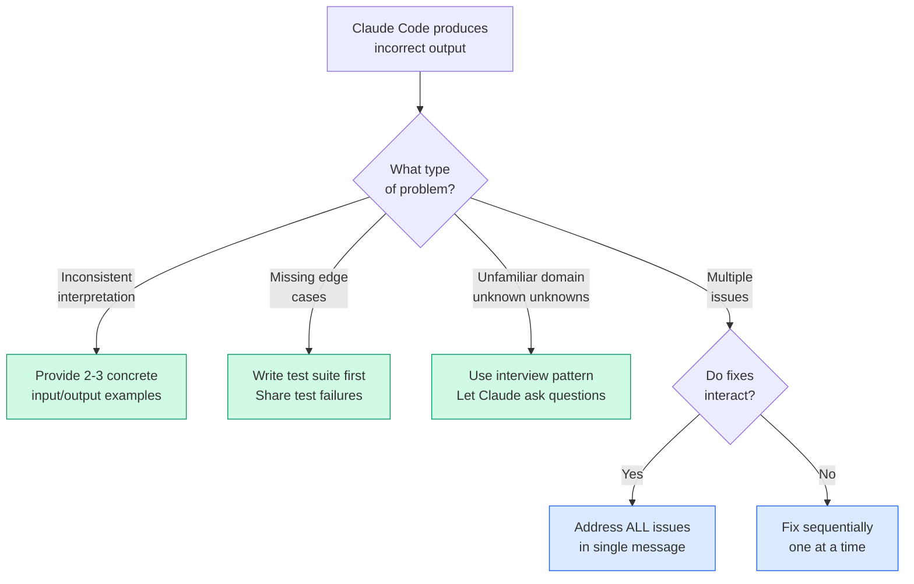

### 5.5 Code Examples

**Concrete input/output examples for data transformation:**

```markdown
Transform customer records from legacy format to new schema.

Example 1:
Input:  {"name": "John Doe", "phone": "555-1234", "type": "premium"}
Output: {"fullName": "John Doe", "contactPhone": "+1-555-1234", "tier": "PREMIUM"}

Example 2:
Input:  {"name": "Jane", "phone": "", "type": "basic"}
Output: {"fullName": "Jane", "contactPhone": null, "tier": "BASIC"}

Example 3 (edge case):
Input:  {"name": "", "phone": "555-0000", "type": "unknown"}
Output: {"fullName": "UNNAMED", "contactPhone": "+1-555-0000", "tier": "BASIC"}
```

**Test-driven iteration:**

```markdown
Here are the test failures from the migration script. Fix only these issues:

FAIL: test_null_values_in_amount_field
  Expected: null
  Got: 0
  → The script converts null amounts to 0 instead of preserving null.

FAIL: test_date_format_edge_case
  Expected: "2024-02-29"
  Got: "2024-03-01"
  → Leap year dates are being incorrectly rounded to the next month.
```

### 5.6 Common Exam Traps

| Trap | Why It's Wrong | Correct Understanding |
|------|---------------|----------------------|
| "Rewrite the prompt with more detail" | Prose descriptions can be interpreted inconsistently | Provide concrete input/output examples instead |
| "Address each issue in separate messages" | Interacting fixes may conflict if applied separately | Group interacting issues in a single message |
| "Start implementing immediately in unfamiliar domains" | Risk missing critical design considerations | Use the interview pattern first |
| "Run all tests and share the full test output" | Noise overwhelms the useful signal | Share specific test failures with context |

---

## 6 Task Statement 3.6 — Integrate Claude Code into CI/CD Pipelines

### 6.1 Concept Overview

Claude Code can be integrated into automated CI/CD pipelines for code review, test generation, and PR feedback. This requires specific CLI flags and architectural patterns to work correctly in non-interactive environments.

**Critical CLI flags for CI/CD:**

| Flag | Purpose | When to Use |
|------|---------|-------------|
| `-p` or `--print` | Non-interactive mode — processes prompt, outputs result, exits | **Required** for all CI/CD usage. Without it, Claude Code hangs waiting for interactive input |
| `--output-format json` | Produces machine-parseable JSON output | When CI pipeline needs to process results programmatically |
| `--json-schema` | Enforces structured output matching a specific JSON schema | When posting findings as inline PR comments or feeding into downstream tools |

**Session Context Isolation Principle:**
The same Claude session that generated code is less effective at reviewing its own changes. The model retains reasoning context from generation, making it less likely to question its own decisions. **Independent review instances** (without prior reasoning context) are more effective at catching subtle issues.

**CLAUDE.md in CI:**
CLAUDE.md serves as the mechanism for providing project context to CI-invoked Claude Code. Document testing standards, fixture conventions, review criteria, and valuable test criteria in CLAUDE.md so automated Claude Code runs produce higher quality output.

### 6.2 Why It Matters For The Exam

The exam directly tests CI/CD integration through **Scenario 5: Claude Code for Continuous Integration**. Key test patterns:

- "The CI pipeline hangs" → Missing `-p` flag
- "Review findings are not machine-readable" → Use `--output-format json` with `--json-schema`
- "Duplicate review comments after re-running" → Include prior findings in context, instruct to report only new/unaddressed issues
- "Generated tests duplicate existing test scenarios" → Provide existing test files in context
- "Low-quality test generation" → Document testing standards and fixtures in CLAUDE.md
- "Self-review misses its own bugs" → Use independent review instance without prior reasoning context

### 6.3 Production Perspective

In production CI/CD pipelines:

1. **Code review automation:** Claude Code reviews PRs using `-p` flag, produces JSON-formatted findings via `--output-format json`, and posts them as inline PR comments.
2. **Test generation:** Claude Code generates test cases for new code, using CLAUDE.md to understand testing standards and existing fixtures to avoid duplication.
3. **Incremental review:** When a PR is updated after initial review, include prior findings in context and instruct Claude to report only new or still-unaddressed issues.
4. **Batch vs real-time decision:** Blocking pre-merge checks use synchronous API. Non-blocking overnight analysis (technical debt reports, nightly test generation) can use the Message Batches API for 50% cost savings.

### 6.4 Architecture Diagram

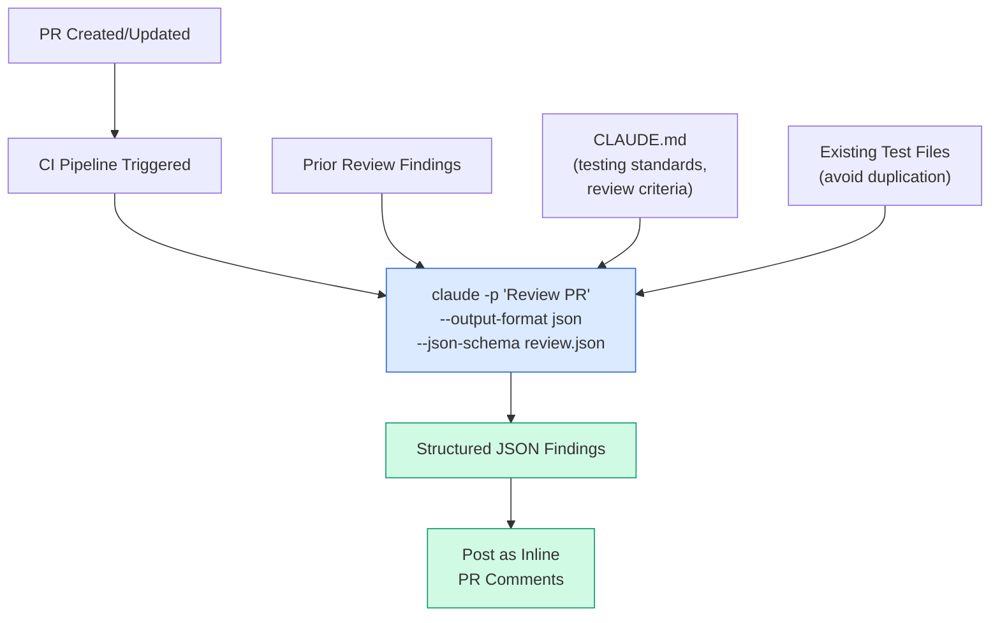

### 6.5 Code Examples

**CI pipeline script (correct):**

```bash
# Non-interactive mode with structured output
claude -p "Analyze this pull request for security issues" \
  --output-format json \
  --json-schema security-review.json
```

**CI pipeline script (WRONG — will hang):**

```bash
# Missing -p flag — Claude Code waits for interactive input
claude "Analyze this pull request for security issues"
```

**Incremental review with prior findings:**

```bash
claude -p "Review this PR. Previous review found these issues:
$(cat prior-findings.json)
Report ONLY new issues or issues that remain unaddressed.
Do not repeat findings that have already been fixed." \
  --output-format json
```

**Batch API usage decision:**

```
Pre-merge check (blocking, developer waits) → Synchronous API (real-time)
Technical debt report (overnight, non-blocking) → Message Batches API (50% savings)
Nightly test generation (overnight, non-blocking) → Message Batches API (50% savings)
Weekly code audit (weekly, non-blocking) → Message Batches API (50% savings)
```

### 6.6 Self-Review Limitation

This is a critical concept that spans Domain 3 and Domain 4:

**Why self-review is less effective:**
- The model retains reasoning context from generation
- It is less likely to question its own decisions in the same session
- Shared reasoning context creates blind spots

**Why independent review instances are more effective:**
- No prior reasoning context to bias evaluation
- Fresh perspective on the code
- More likely to catch subtle issues and inconsistencies

**Exam application:** When a scenario asks how to improve code review quality, the correct answer involves using a **separate, independent Claude instance** for review — NOT adding self-review instructions or extended thinking to the generating session.

### 6.7 Common Exam Traps

| Trap | Why It's Wrong | Correct Understanding |
|------|---------------|----------------------|
| "Use `CLAUDE_HEADLESS=true` for CI" | This environment variable does not exist | Use the `-p` flag for non-interactive mode |
| "Use `--batch` flag for CI" | This flag does not exist | Use `-p` (or `--print`) for non-interactive mode |
| "Redirect stdin from `/dev/null`" | Unix workaround, not proper Claude Code syntax | Use the documented `-p` flag |
| "Use the same session for generation and review" | Self-review bias reduces effectiveness | Use an independent review instance |
| "Switch both pre-merge and overnight to batch API" | Pre-merge checks are blocking — can't wait 24 hours | Only non-blocking workflows should use batch API |
| "Batch results can't be correlated" | `custom_id` fields solve this | Use `custom_id` for request/response correlation |

---

## 7 Anti-Patterns Master Reference

| Anti-Pattern | Why It Fails | Correct Approach |
|-------------|-------------|-----------------|
| Team standards in `~/.claude/CLAUDE.md` | Not shared via version control | Use project-level `.claude/CLAUDE.md` |
| Monolithic 2000-line CLAUDE.md | Unmaintainable, wastes tokens on irrelevant rules | Split into `.claude/rules/` topic files or use `@import` |
| Directory-level CLAUDE.md for cross-cutting concerns | Can't cover files spread across multiple directories | Use `.claude/rules/` with glob patterns |
| Shared commands in `~/.claude/commands/` | User-scoped, not version-controlled | Use `.claude/commands/` (project-scoped) |
| Skills without `context: fork` for verbose output | Pollutes main conversation context | Add `context: fork` to SKILL.md frontmatter |
| Skills for file-type conventions | Skills require manual invocation | Use `.claude/rules/` with glob patterns for automatic loading |
| Relying on Claude to infer which CLAUDE.md section applies | Inference is unreliable and non-deterministic | Use explicit glob patterns for deterministic matching |
| Direct execution for complex multi-file refactoring | Risks costly rework when dependencies are discovered late | Use plan mode to investigate before committing |
| Plan mode for single-file bug fix | Over-engineering, wastes time | Use direct execution for well-scoped changes |
| Skipping `-p` flag in CI/CD | Pipeline hangs waiting for interactive input | Always use `-p` (or `--print`) in CI |
| Using same session for generation and review | Self-review bias reduces effectiveness | Use independent review instance |
| Batch API for blocking pre-merge checks | Up to 24-hour processing — can't block developers | Use synchronous API for blocking workflows |
| All issues in separate messages when they interact | Fixes may conflict or interfere | Group interacting issues in a single message |
| Starting implementation without examples | Prose descriptions interpreted inconsistently | Provide 2-3 concrete input/output examples |
| Putting API tokens directly in `.mcp.json` | Security violation — tokens visible in VCS | Use environment variable expansion (`${ENV_VAR}`) |
| Team MCP servers in `~/.claude.json` | User-scoped config, not shared with team | Use `.mcp.json` (project-scoped) for team servers |
| Resuming session with stale tool results | Claude reasons on outdated information | Start fresh with structured summary when context is stale |
| Not informing resumed session about file changes | Claude operates on stale assumptions | Explicitly inform about specific changes for targeted re-analysis |

---

## 8 Decision Frameworks and Heuristics

### 8.1 Configuration Scope Decision

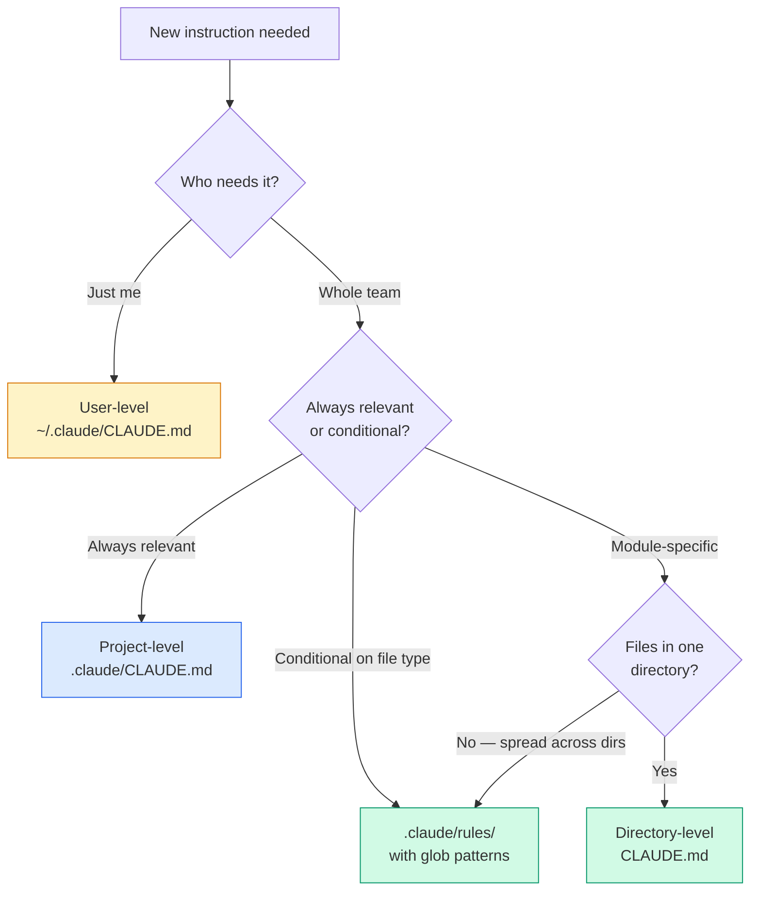

### 8.2 Command vs Skill vs CLAUDE.md Decision

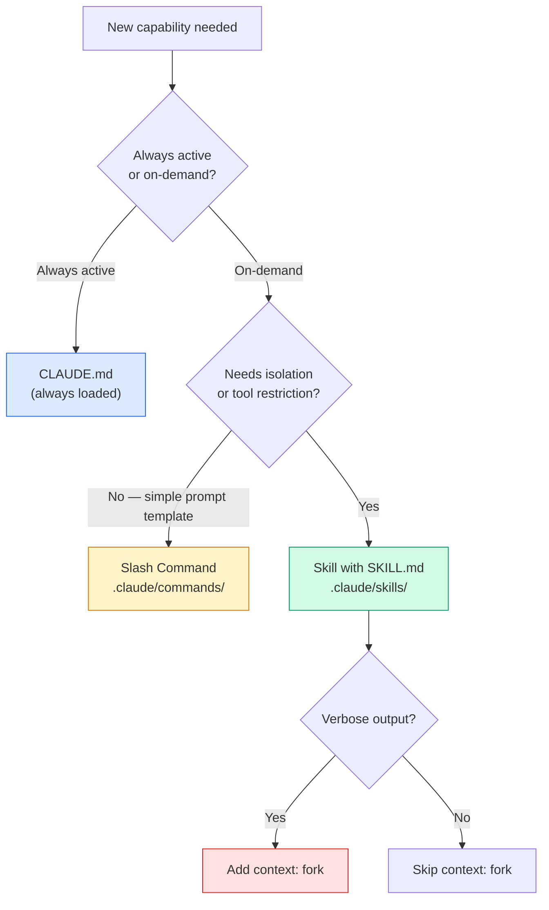

### 8.3 Plan Mode vs Direct Execution Decision

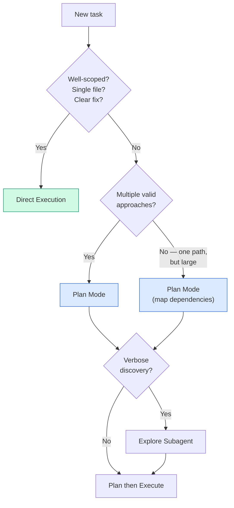

### 8.4 CI/CD API Selection Decision

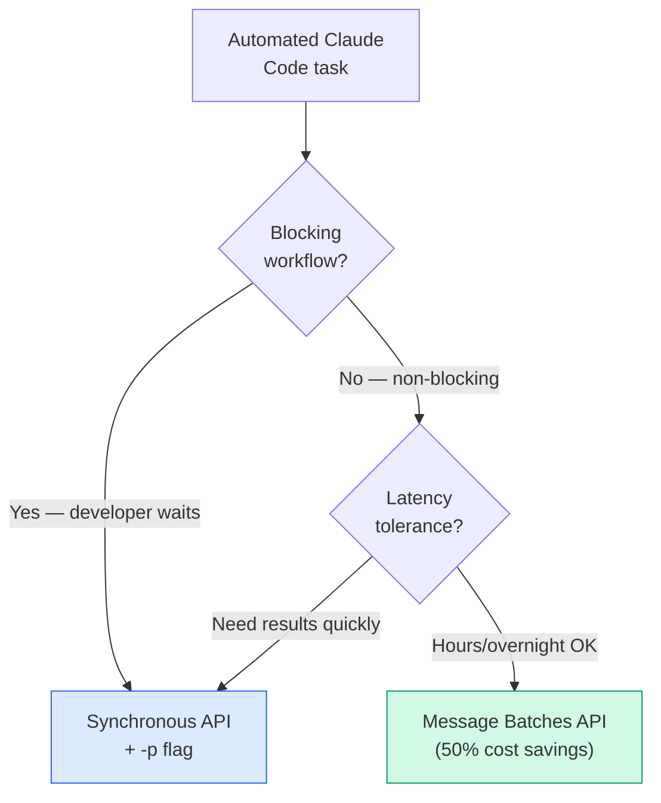

### 8.5 Iterative Refinement Technique Selection

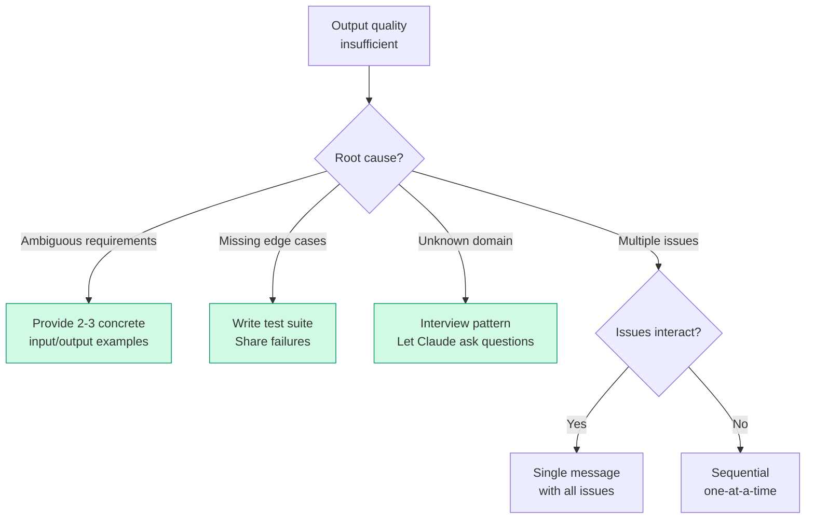

### 8.6 Session Management Decision (Cross-Domain with Domain 1)

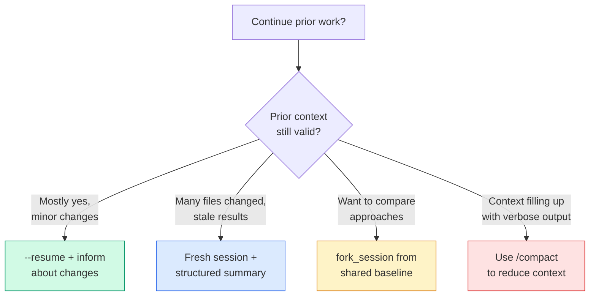

---

## 9 Exam-Style Questions With Explanations

### Question 1 — Configuration Hierarchy Debugging

**Scenario:** Your team has 8 developers working on a monorepo. You've created comprehensive coding standards and testing conventions in a CLAUDE.md file. When a new team member joins and clones the repository, they report that Claude Code doesn't follow any of the team's standards. Other team members confirm the standards work correctly for them. What is the most likely cause?

A) The CLAUDE.md file is in `~/.claude/CLAUDE.md` on each existing developer's machine rather than in the project repository.
B) The new team member's Claude Code version doesn't support CLAUDE.md configuration.
C) The CLAUDE.md file is too large and exceeds the maximum allowed configuration size.
D) The new team member needs to run `/memory` to manually load the project's memory files.

**Correct Answer: A**

**Explanation:**
- **A is correct** because `~/.claude/CLAUDE.md` is user-level configuration that exists only on each developer's local machine. It is NOT committed to version control, so when a new developer clones the repo, they don't receive these instructions. The fix is to move the config to project-level (`.claude/CLAUDE.md`).
- **B is wrong** because CLAUDE.md support is a core feature, not version-dependent. The fact that other team members have it working rules out a feature gap.
- **C is wrong** because file size limits would affect all developers, not just the new one.
- **D is wrong** because `/memory` is a diagnostic command to verify which files are loaded, not a loading mechanism. Project-level CLAUDE.md loads automatically.

---

### Question 2 — Slash Command Scoping

**Scenario:** You want to create a custom `/review` slash command that runs your team's standard code review checklist. This command should be available to every developer when they clone or pull the repository. Where should you create this command file?

A) In the `.claude/commands/` directory in the project repository
B) In `~/.claude/commands/` in each developer's home directory
C) In the CLAUDE.md file at the project root
D) In a `.claude/config.json` file with a commands array

**Correct Answer: A**

**Explanation:**
- **A is correct** because `.claude/commands/` is project-scoped and version-controlled. Commands placed here are automatically available to all developers who clone or pull the repo.
- **B is wrong** because `~/.claude/commands/` is user-scoped — personal commands that aren't shared via version control. Each developer would need to manually create the command.
- **C is wrong** because CLAUDE.md is for project instructions and context, not command definitions. Commands are defined as separate files in the commands directory.
- **D is wrong** because `.claude/config.json` with a commands array is not a valid configuration mechanism in Claude Code.

---

### Question 3 — Path-Specific Rules vs Alternatives

**Scenario:** Your codebase has distinct areas with different coding conventions: React components use functional style with hooks, API handlers use async/await with specific error handling, and database models follow a repository pattern. Test files are spread throughout the codebase alongside the code they test (e.g., `Button.test.tsx` next to `Button.tsx`), and you want all tests to follow the same conventions regardless of location. What's the most maintainable way to ensure Claude automatically applies the correct conventions when generating code?

A) Create rule files in `.claude/rules/` with YAML frontmatter specifying glob patterns to conditionally apply conventions based on file paths
B) Consolidate all conventions in the root CLAUDE.md file under headers for each area, relying on Claude to infer which section applies
C) Create skills in `.claude/skills/` for each code type that include the relevant conventions in their SKILL.md files
D) Place a separate CLAUDE.md file in each subdirectory containing that area's specific conventions

**Correct Answer: A**

**Explanation:**
- **A is correct** because `.claude/rules/` with glob patterns (e.g., `**/*.test.tsx`) allows conventions to be automatically applied based on file paths regardless of directory location — essential for test files spread throughout the codebase. Rules load deterministically when editing matching files.
- **B is wrong** because it relies on inference rather than explicit matching. Claude would need to guess which section applies, making convention application unreliable and non-deterministic.
- **C is wrong** because skills require manual invocation (`/skillname`) or rely on Claude choosing to load them. The question asks for "automatic" application, which contradicts the on-demand nature of skills.
- **D is wrong** because directory-level CLAUDE.md files can't handle files spread across many directories. Test files like `Button.test.tsx` sit next to `Button.tsx` in many different directories — you'd need a CLAUDE.md in every single directory.

---

### Question 4 — Plan Mode Selection

**Scenario:** You've been assigned to restructure the team's monolithic application into microservices. This will involve changes across dozens of files and requires decisions about service boundaries and module dependencies. Which approach should you take?

A) Enter plan mode to explore the codebase, understand dependencies, and design an implementation approach before making changes.
B) Start with direct execution and make changes incrementally, letting the implementation reveal the natural service boundaries.
C) Use direct execution with comprehensive upfront instructions detailing exactly how each service should be structured.
D) Begin in direct execution mode and only switch to plan mode if you encounter unexpected complexity during implementation.

**Correct Answer: A**

**Explanation:**
- **A is correct** because monolith-to-microservices restructuring is exactly the type of task plan mode is designed for: large-scale changes, multiple valid approaches, and architectural decisions. Plan mode enables safe codebase exploration and design before committing to changes, preventing costly rework.
- **B is wrong** because incremental direct execution risks costly rework when dependencies are discovered late. You'd build a service boundary only to discover it creates circular dependencies with another module.
- **C is wrong** because it assumes you already know the right structure without exploring the code. The problem statement itself says decisions about service boundaries are needed — you don't have the answers yet.
- **D is wrong** because the complexity is stated in the requirements ("changes across dozens of files," "decisions about service boundaries"). It's not something that "might emerge later" — it's declared upfront.

---

### Question 5 — CI/CD Pipeline Failure

**Scenario:** Your pipeline script runs `claude "Analyze this pull request for security issues"` but the job hangs indefinitely. Logs indicate Claude Code is waiting for interactive input. What's the correct approach to run Claude Code in an automated pipeline?

A) Add the `-p` flag: `claude -p "Analyze this pull request for security issues"`
B) Set the environment variable `CLAUDE_HEADLESS=true` before running the command
C) Redirect stdin from `/dev/null`: `claude "Analyze this pull request for security issues" < /dev/null`
D) Add the `--batch` flag: `claude --batch "Analyze this pull request for security issues"`

**Correct Answer: A**

**Explanation:**
- **A is correct** because `-p` (or `--print`) is the documented way to run Claude Code in non-interactive mode. It processes the prompt, outputs the result to stdout, and exits without waiting for user input — exactly what CI/CD pipelines require.
- **B is wrong** because `CLAUDE_HEADLESS=true` is a non-existent environment variable. It sounds plausible but does not exist in Claude Code.
- **C is wrong** because redirecting stdin is a Unix workaround that doesn't properly address Claude Code's interactive mode. The `-p` flag is the designed solution.
- **D is wrong** because `--batch` is a non-existent flag. It sounds plausible but does not exist in Claude Code.

---

### Question 6 — Iterative Refinement Selection

**Scenario:** You're working with Claude Code to build a data migration script. The script needs to transform customer records from a legacy CSV format to a new JSON schema. Your initial natural language description ("convert the CSV to JSON with the new field names") produces inconsistent results — sometimes fields are mapped correctly, sometimes the mapping is wrong, and null handling varies between runs. What is the most effective way to improve consistency?

A) Rewrite the prompt with more detailed descriptions of each field mapping and explicit null handling rules
B) Provide 2-3 concrete input/output examples showing the exact expected transformation, including null handling
C) Use plan mode to let Claude Code analyze the CSV structure before attempting the transformation
D) Create a skill with `allowed-tools` restricted to only file read and write operations

**Correct Answer: B**

**Explanation:**
- **B is correct** because concrete input/output examples are the most effective way to communicate expected transformations when prose descriptions are interpreted inconsistently. The exam guide explicitly states this is the recommended technique for this situation. Showing before/after pairs eliminates ambiguity about field mapping and null handling.
- **A is wrong** because more detailed prose descriptions are still susceptible to inconsistent interpretation. The problem is the medium (prose), not the amount of detail.
- **C is wrong** because plan mode helps with architectural decisions and multi-file changes, not with clarifying transformation logic for a single script.
- **D is wrong** because restricting tools doesn't address the root cause — inconsistent interpretation of the transformation requirements.

---

### Question 7 — Review Architecture and Batch API

**Scenario:** Your team wants to reduce API costs for automated analysis. Currently, real-time Claude calls power two workflows: (1) a blocking pre-merge check that must complete before developers can merge, and (2) a technical debt report generated overnight for review the next morning. Your manager proposes switching both to the Message Batches API for its 50% cost savings. How should you evaluate this proposal?

A) Use batch processing for the technical debt reports only; keep real-time calls for pre-merge checks.
B) Switch both workflows to batch processing with status polling to check for completion.
C) Keep real-time calls for both workflows to avoid batch result ordering issues.
D) Switch both to batch processing with a timeout fallback to real-time if batches take too long.

**Correct Answer: A**

**Explanation:**
- **A is correct** because the Message Batches API offers 50% cost savings but has processing times up to 24 hours with no guaranteed latency SLA. This makes it unsuitable for blocking pre-merge checks where developers wait for results, but ideal for overnight batch jobs like technical debt reports. Match each API to its use case.
- **B is wrong** because pre-merge checks are blocking — developers can't merge until the check completes. Relying on batch processing that might take up to 24 hours is unacceptable for blocking workflows, even with polling.
- **C is wrong** because it reflects a misconception — batch results CAN be correlated using `custom_id` fields. There's no "ordering issue" problem.
- **D is wrong** because it adds unnecessary complexity. The simpler solution is to use the right API for each use case, not build a fallback mechanism.

---

### Question 8 — Skill Configuration

**Scenario:** Your team creates a codebase analysis skill that maps all modules, traces dependencies, and generates a comprehensive architecture report. During testing, you notice that the skill's verbose output (listing every file, import chain, and dependency) consumes most of the context window, leaving insufficient room for subsequent implementation work. What is the most effective fix?

A) Increase the context window size to accommodate the verbose output
B) Add `context: fork` to the skill's SKILL.md frontmatter so it runs in an isolated sub-agent context
C) Split the skill into smaller skills that each analyze one module at a time
D) Add a `/compact` call after the skill completes to reduce the context usage

**Correct Answer: B**

**Explanation:**
- **B is correct** because `context: fork` runs the skill in an isolated sub-agent context, preventing its verbose output from polluting the main conversation. The skill returns only a structured summary to the main context, preserving context for implementation work.
- **A is wrong** because context window size is a model parameter, not something developers configure per-skill. Even if possible, it doesn't address the fundamental issue of verbose output polluting the main context.
- **C is wrong** because splitting the skill doesn't prevent verbose output from each sub-skill from accumulating in the main context. The isolation problem remains.
- **D is wrong** because `/compact` reduces context after the fact, potentially losing important analysis findings. Prevention (fork) is better than remediation (compact).

---

### Question 9 — Multi-Pass Review for Large PRs

**Scenario:** A pull request modifies 14 files across the stock tracking module. Your single-pass review analyzing all files together produces inconsistent results: detailed feedback for some files but superficial comments for others, obvious bugs missed, and contradictory feedback — flagging a pattern as problematic in one file while approving identical code elsewhere in the same PR. How should you restructure the review?

A) Split into focused passes: analyze each file individually for local issues, then run a separate integration-focused pass examining cross-file data flow.
B) Require developers to split large PRs into smaller submissions of 3-4 files before the automated review runs.
C) Switch to a higher-tier model with a larger context window to give all 14 files adequate attention in one pass.
D) Run three independent review passes on the full PR and only flag issues that appear in at least two of the three runs.

**Correct Answer: A**

**Explanation:**
- **A is correct** because splitting reviews into focused passes directly addresses the root cause: attention dilution when processing many files at once. File-by-file analysis ensures consistent depth, while a separate integration pass catches cross-file issues like data flow problems.
- **B is wrong** because it shifts burden to developers without improving the review tool. It's a workflow constraint, not an architectural improvement.
- **C is wrong** because the problem is attention dilution, not context window size. A larger context window still processes 14 files in a single pass with the same attention limitations.
- **D is wrong** because running three full passes wastes resources and a consensus approach may miss real issues that only appear in one pass. The root cause is single-pass attention dilution, not randomness.

---

## 10 Memory Anchors

Quotable one-liners to burn into memory:

- **"User-level is personal. Project-level is team. User-level is NOT in version control."**
- **"Glob patterns match file type. Directories match file location. For cross-cutting concerns, use globs."**
- **"Skills = on-demand isolation. CLAUDE.md = always-loaded standards."**
- **"`context: fork` prevents skill output from polluting your conversation."**
- **"Plan mode explores. Direct execution implements. Know the complexity before you start."**
- **"The `-p` flag is the ONLY way to run Claude Code in CI. Everything else hangs."**
- **"Self-review is biased. Independent instances catch more."**
- **"Input/output examples beat detailed prose for transformation clarity."**
- **"Batch API for overnight. Synchronous API for blocking. Never batch a blocking workflow."**
- **"If complexity is stated upfront, plan mode from the start. Don't wait to discover what you already know."**
- **"Commands are shared prompts. Skills are isolated execution environments."**
- **"`--output-format json` + `--json-schema` = machine-readable CI findings."**

---

## 11 Rapid Revision Checklist

### CLAUDE.md Hierarchy

- Three levels: user (`~/.claude/CLAUDE.md`), project (`.claude/CLAUDE.md`), directory (subdirectory `CLAUDE.md`)
- User-level = personal, NOT in VCS
- Project-level = team-wide, in VCS
- `@import` syntax for modular composition
- `.claude/rules/` for topic-specific rule files
- `/memory` command = diagnostic tool to verify loaded files

### Slash Commands and Skills

- Project commands: `.claude/commands/` (VCS, shared)
- User commands: `~/.claude/commands/` (personal, NOT shared)
- Skills: `.claude/skills/` with `SKILL.md` frontmatter
- Three frontmatter options: `context: fork`, `allowed-tools`, `argument-hint`
- `context: fork` = isolated sub-agent context
- `allowed-tools` = restrict tool access during skill execution
- Skills = on-demand; CLAUDE.md = always-loaded
- Personal skills: `~/.claude/skills/` with different names

### Path-Specific Rules

- `.claude/rules/` files with YAML frontmatter `paths` field
- Glob patterns for conditional rule activation
- Rules load ONLY when editing matching files
- `**/*.test.tsx` matches test files everywhere
- Glob patterns beat directory-level CLAUDE.md for cross-cutting concerns
- Reduces irrelevant context and token usage

### Plan Mode vs Direct Execution

- Plan mode: complex tasks, multiple valid approaches, architectural decisions, multi-file changes
- Direct execution: simple, well-scoped, single-file, clear fix
- Explore subagent: isolates verbose discovery output, returns summaries
- Hybrid pattern: plan → explore → direct execute
- If complexity is stated upfront → plan mode (don't wait for it to emerge)

### Iterative Refinement

- Inconsistent results → concrete input/output examples (2-3 pairs)
- Missing edge cases → test-driven iteration (test suite first)
- Unfamiliar domain → interview pattern (let Claude ask questions)
- Interacting issues → single message with all issues
- Independent issues → sequential iteration

### CI/CD Integration

- `-p` / `--print` = non-interactive mode (REQUIRED for CI)
- `--output-format json` = machine-parseable output
- `--json-schema` = enforce specific JSON structure
- CLAUDE.md provides project context to CI-invoked Claude Code
- Independent review instance > self-review (reasoning context bias)
- Include prior findings to avoid duplicate review comments
- Include existing tests to avoid duplicate test generation
- Blocking workflows → synchronous API
- Non-blocking workflows → Message Batches API (50% savings)

### Session Management (Cross-Domain)

- `--resume <session-name>` = continue named session
- `fork_session` = parallel exploration branches
- Stale context → fresh session + structured summary
- File changes → inform resumed session explicitly
- `/compact` = reduce context usage in extended sessions

---

## 12 Top 10 Exam Traps

1. **Distractor places team standards in `~/.claude/CLAUDE.md`** → WRONG. User-level config is personal and NOT shared via version control. Team standards must be in project-level `.claude/CLAUDE.md`.

2. **Distractor suggests relying on Claude to "infer which section of CLAUDE.md applies"** → WRONG. Inference is non-deterministic. Use `.claude/rules/` with glob patterns for explicit, reliable matching.

3. **Distractor suggests using skills for automatic file-type conventions** → WRONG. Skills require manual invocation. Path-specific rules in `.claude/rules/` load automatically when editing matching files.

4. **Distractor suggests starting with direct execution for a complex multi-file task** → WRONG when complexity is stated upfront. Plan mode is designed for architectural decisions, multi-file changes, and multiple valid approaches.

5. **Distractor says "switch to plan mode if unexpected complexity emerges"** → WRONG when the task description already states the complexity. Don't wait to discover what the requirements already tell you.

6. **Distractor uses `CLAUDE_HEADLESS=true` or `--batch` for CI/CD** → WRONG. These don't exist. The documented flag is `-p` (or `--print`).

7. **Distractor suggests rewriting the prompt with "more detail" when examples would fix inconsistency** → WRONG. Concrete input/output examples beat detailed prose for transformation clarity.

8. **Distractor proposes self-review (same session) instead of independent review instance** → WRONG. The generating session retains reasoning context that creates blind spots. Independent instances catch more.

9. **Distractor suggests batch API for blocking pre-merge checks** → WRONG. Message Batches API has up to 24-hour processing with no guaranteed SLA. Blocking workflows require synchronous API.

10. **Distractor suggests a `.claude/config.json` with a commands array** → WRONG. This configuration mechanism does not exist. Commands are files in `.claude/commands/`.

---

## 13 Appendix — Key Technology References

| Technology / Concept | Domain 3 Relevance |
|---------------------|-------------------|
| `CLAUDE.md` | Configuration hierarchy — user/project/directory levels |
| `@import` | Modular composition of CLAUDE.md files |
| `.claude/rules/` | Topic-specific rule files with YAML frontmatter path-scoping |
| `.claude/commands/` | Project-scoped slash commands (VCS, shared) |
| `~/.claude/commands/` | User-scoped slash commands (personal, NOT shared) |
| `.claude/skills/` | Skills with SKILL.md frontmatter |
| `context: fork` | Run skills in isolated sub-agent context |
| `allowed-tools` | Restrict tool access during skill execution |
| `argument-hint` | Prompt for parameters when skill invoked without args |
| `/memory` | Diagnostic command to verify loaded memory files |
| `/compact` | Reduce context usage during extended sessions |
| Plan mode | Codebase exploration and design before committing changes |
| Direct execution | Well-scoped changes with clear requirements |
| Explore subagent | Isolate verbose discovery output, return summaries |
| `-p` / `--print` | Non-interactive mode for CI/CD pipelines |
| `--output-format json` | Machine-parseable JSON output for CI |
| `--json-schema` | Enforce structured output matching specific schema |
| `--resume` | Continue named session (preserves prior context) |
| `fork_session` | Branch from shared baseline for parallel exploration |
| `.mcp.json` | Project-scoped MCP server config (VCS, shared, with `${ENV_VAR}` expansion) |
| `~/.claude.json` | User-scoped MCP server config (personal, NOT shared) |
| Message Batches API | 50% cost savings, up to 24-hour processing, non-blocking only |
| `custom_id` | Correlate batch request/response pairs |

---

## 14 Appendix — Scenario Quick Reference

| Exam Scenario | Domain 3 Topics Tested |
|--------------|----------------------|
| **Scenario 2: Code Generation with Claude Code** | CLAUDE.md configuration, slash commands, plan mode vs direct execution, iterative refinement |
| **Scenario 4: Developer Productivity with Claude** | Built-in tools (Grep, Glob, Read, Write, Edit, Bash), MCP server integration, skills, session management |
| **Scenario 5: Claude Code for Continuous Integration** | `-p` flag, `--output-format json`, `--json-schema`, self-review limitations, independent review instances, batch vs synchronous API, incremental review, test generation |

### Cross-Domain Overlaps

| Domain 3 Topic | Overlapping Domain | Connection |
|---------------|--------------------|------------|
| `.mcp.json` configuration | Domain 2 (MCP Integration) | Project vs user scope for MCP servers |
| Session management (`--resume`, `fork_session`) | Domain 1 (Agentic Architecture) | Session state resumption and forking patterns |
| Self-review limitations | Domain 4 (Prompt Engineering) | Multi-instance review architectures |
| Context exhaustion from verbose output | Domain 5 (Context Management) | Context degradation, `/compact`, scratchpad files |
| Batch API for CI | Domain 4 (Structured Output) | Batch processing strategies, `custom_id` correlation |
| Explore subagent | Domain 1 (Agentic Architecture) | Subagent spawning for isolation |
| `allowed-tools` in skills | Domain 2 (Tool Design) | Tool scoping and restriction patterns |
| Test-driven iteration | Domain 4 (Prompt Engineering) | Validation-retry loops for quality |

### What Is NOT Tested (Domain 3)

Do NOT spend study time on these topics:

- Deploying or hosting MCP servers (infrastructure, networking)
- Claude Code internal implementation details
- Specific programming language syntax beyond configuration examples
- Claude API authentication, billing, or account management
- OAuth, API key rotation, or authentication protocol details
- Streaming API implementation
- Rate limiting, quotas, or API pricing calculations
- Performance benchmarking or model comparison metrics
- Fine-tuning Claude models or training custom models
- Computer use (browser automation, desktop interaction)

---

*End of Domain 3 Study Material — CCA-F Exam Preparation*
