# Domain 4 — Prompt Engineering & Structured Output (20% of Exam)

> **Exam Weight:** 20% of scored content (tied second-highest with Domain 3)
> **Core Principle:** *"Production prompting prioritizes reliability over creativity."*
> **Exam Style:** Scenario-heavy questions testing architectural judgment about prompt design, schema enforcement, validation loops, batch strategy, and review architecture.

---

## Table of Contents

- [[#1 Domain Overview and Exam Strategy]]
- [[#2 Task Statement 4.1 — Design Prompts with Explicit Criteria to Improve Precision and Reduce False Positives]]
- [[#3 Task Statement 4.2 — Apply Few-Shot Prompting to Improve Output Consistency and Quality]]
- [[#4 Task Statement 4.3 — Enforce Structured Output Using Tool Use and JSON Schemas]]
- [[#5 Task Statement 4.4 — Implement Validation Retry and Feedback Loops for Extraction Quality]]
- [[#6 Task Statement 4.5 — Design Efficient Batch Processing Strategies]]
- [[#7 Task Statement 4.6 — Design Multi-Instance and Multi-Pass Review Architectures]]
- [[#8 Anti-Patterns Master Reference]]
- [[#9 Decision Frameworks and Heuristics]]
- [[#10 Exam-Style Questions with Explanations]]
- [[#11 Memory Anchors]]
- [[#12 Rapid Revision Checklist]]
- [[#13 Top 10 Exam Traps]]
- [[#14 Appendix — Key Technology References]]
- [[#15 Appendix — Scenario Quick Reference]]

---

## 1 Domain Overview and Exam Strategy

### What This Domain Tests

Domain 4 evaluates your ability to design prompts, schemas, validation loops, and processing strategies that produce **reliable, structured, production-grade output**. The exam does NOT test creative prompting or abstract NLP theory. It tests whether you can engineer prompts and pipelines that work consistently at scale with predictable failure modes and recovery mechanisms.

### The Six Task Statements

| Task | Topic | What The Exam Tests |
|------|-------|---------------------|
| 4.1 | Explicit Criteria for Precision | Can you reduce false positives through categorical criteria rather than vague instructions? |
| 4.2 | Few-Shot Prompting | Can you use targeted examples to achieve consistency where instructions alone fail? |
| 4.3 | Structured Output via tool_use | Can you enforce schema compliance and choose the right tool_choice configuration? |
| 4.4 | Validation-Retry Loops | Can you design feedback loops that know when retries will and won't help? |
| 4.5 | Batch Processing Strategies | Can you match API approach to latency requirements and handle failures? |
| 4.6 | Multi-Instance/Multi-Pass Review | Can you architect review systems that overcome self-review bias and attention dilution? |

### How Domain 4 Connects to Other Domains

Domain 4 is never tested in isolation. It intersects with every other domain:

| Domain 4 Topic | Overlapping Domain | Connection |
|---------------|--------------------|------------|
| Explicit criteria, few-shot examples | Domain 1 (Orchestration) | Escalation calibration, coordinator prompt design |
| Structured output via tool_use | Domain 2 (Tool Design) | tool_choice configuration, schema-as-tool patterns |
| Validation-retry loops | Domain 5 (Reliability) | Error propagation, semantic validation, confidence calibration |
| Batch processing | Domain 3 (Claude Code) | CI/CD pipeline integration, `-p` flag, `--output-format json` |
| Multi-pass review | Domain 3 (Claude Code) | Self-review limitations, independent review instances |
| Schema design (nullable fields) | Domain 5 (Reliability) | Preventing hallucination via optional fields |

### Relevant Exam Scenarios

| Exam Scenario | Domain 4 Topics Tested |
|--------------|----------------------|
| **Scenario 5: Claude Code for Continuous Integration** | Explicit review criteria, false positive reduction, multi-pass review, structured CI output, batch vs synchronous API |
| **Scenario 6: Structured Data Extraction** | JSON schemas, tool_use, validation-retry loops, batch processing, few-shot examples for varied document formats, confidence scoring |
| **Scenario 1: Customer Support Agent** | Escalation calibration (few-shot examples), structured handoff output |
| **Scenario 3: Multi-Agent Research System** | Structured subagent output, provenance-preserving schemas |

### The Cardinal Rule of Domain 4

> **Reliability beats creativity. Explicit structure beats ambiguity. Schemas beat free text. Validation loops catch what schemas cannot.**

---

## 2 Task Statement 4.1 — Design Prompts with Explicit Criteria to Improve Precision and Reduce False Positives

### Concept Overview

Precision in LLM output is not achieved by telling the model to "be careful" or "be conservative." These vague instructions have almost zero effect on actual precision. What works is defining **explicit categorical criteria** — concrete rules that specify exactly what to flag and what to skip.

The difference is between:

- **Vague:** "Check that comments are accurate"
- **Explicit:** "Flag comments ONLY when the claimed behavior contradicts the actual code behavior. Do NOT flag comments that are merely imprecise, outdated in phrasing but correct in substance, or describe intent rather than mechanics."

The explicit version gives the model a decision boundary. The vague version forces the model to invent one, and it will invent a different one every time.

### Why It Matters For The Exam

The exam tests this across Scenario 5 (CI/CD code review) and Scenario 6 (extraction). The typical pattern is a scenario where an automated review system produces too many false positives, eroding developer trust. Distractors will suggest confidence-based filtering ("only report high-confidence findings") or increasing the model's temperature/thinking. The correct answer is almost always **replace vague criteria with explicit categorical criteria**.

**Key exam insight:** High false positive rates in one category undermine developer trust in ALL categories — even accurate ones. Developers start ignoring all findings when they learn that certain categories are unreliable. The exam tests whether you understand this cascading trust effect.

### Production Perspective

In production code review systems, false positives are the primary adoption blocker. A system that catches 95% of real bugs but also flags 200 non-issues per PR will be disabled within a week. The correct production approach:

1. Define explicit categories of issues to report (bugs, security vulnerabilities, data races)
2. Define explicit categories to SKIP (minor style preferences, local naming conventions, documented workarounds)
3. For each category, provide concrete code examples of what qualifies and what does not
4. Define severity levels with specific criteria and code examples for each level
5. Monitor false positive rates per category — temporarily disable any category whose false positive rate erodes trust while improving prompts for that category

### Architecture: Precision Through Explicit Criteria

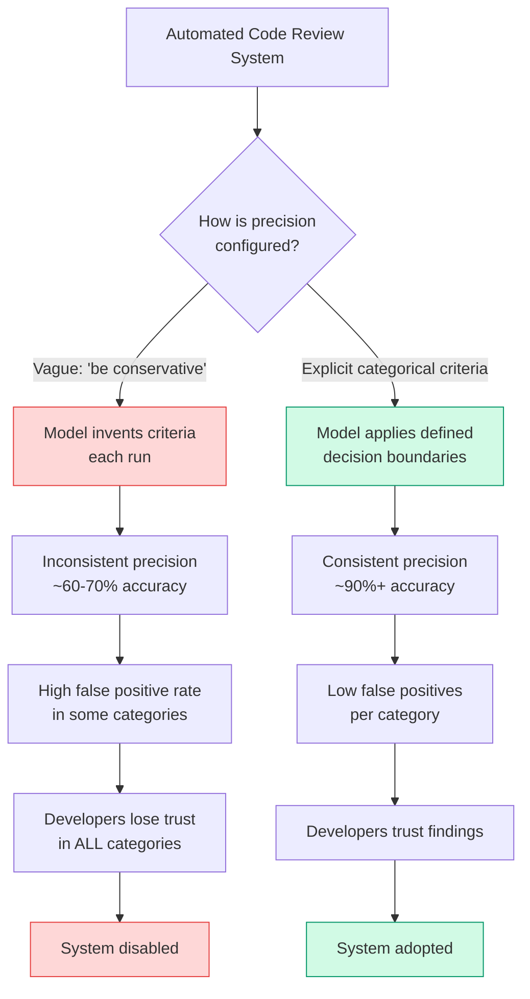

### Code Examples

**BAD — Vague confidence-based filtering:**

```text
Review this code for issues. Be conservative — only report 
high-confidence findings. Focus on important problems.
```

Why this fails: "conservative," "high-confidence," and "important" are subjective. The model will interpret them differently each time. You will get inconsistent results.

**GOOD — Explicit categorical criteria with severity definitions:**

```text
Review this code. Report ONLY the following issue types:

REPORT (always flag):
- Bugs: Logic errors that cause incorrect behavior at runtime
- Security: SQL injection, XSS, path traversal, hardcoded secrets
- Data races: Unsynchronized concurrent access to shared state

SKIP (never flag):
- Style: Naming conventions, bracket placement, line length
- Local patterns: Project-specific conventions the reviewer may not know
- Documented workarounds: Code with "HACK" or "WORKAROUND" comments
  explaining why non-standard approach was chosen

SEVERITY CLASSIFICATION:
- CRITICAL: Can cause data loss, security breach, or system crash
  Example: `DELETE FROM users` without WHERE clause
- HIGH: Causes incorrect behavior in common paths
  Example: Off-by-one error in pagination logic  
- MEDIUM: Causes incorrect behavior in edge cases only
  Example: Missing null check on optional API response field
- LOW: Code quality issue that may cause future problems
  Example: Unbounded list growth without pagination
```

**Handling high false-positive categories in production:**

```text
# When "comment accuracy" findings have 40% false positive rate:
# Step 1: Temporarily disable the category
DISABLED_CATEGORIES = ["comment_accuracy"]

# Step 2: Improve the criteria for that specific category
IMPROVED_CRITERIA = """
Flag comment issues ONLY when:
- Comment claims a function returns X but code returns Y
- Comment says "never null" but code has null return paths
- Comment describes an algorithm that differs from implementation

Do NOT flag:
- Comments that are slightly imprecise but directionally correct
- TODO/FIXME comments about known issues
- Comments describing intent rather than mechanics
"""

# Step 3: Re-enable with improved criteria and monitor
```

### Common Exam Traps

| Trap | Why It's Wrong | Correct Approach |
|------|---------------|-----------------|
| "Add `only report high-confidence findings`" | Confidence-based filtering is vague; the model already reports what it considers high-confidence | Define explicit categorical criteria for what to flag vs skip |
| "Lower the model temperature for more conservative output" | Temperature affects randomness, not precision/recall tradeoffs | Explicit criteria define the decision boundary |
| "Add a confidence score threshold and filter output" | The model's self-reported confidence is poorly calibrated — it's confident on wrong findings too | Use categorical criteria to prevent false findings from being generated |
| "Use extended thinking to improve review quality" | Extended thinking improves reasoning but doesn't fix undefined criteria | Define criteria first; extended thinking may help secondarily |

---

## 3 Task Statement 4.2 — Apply Few-Shot Prompting to Improve Output Consistency and Quality

### Concept Overview

Few-shot examples are the single most effective technique for achieving consistent, well-formatted output when detailed instructions alone produce inconsistent results. Few-shot examples work because they demonstrate judgment in context — showing the model not just WHAT to do but HOW to handle ambiguous cases and WHY certain decisions were made.

Few-shot examples serve four distinct purposes:

1. **Format consistency** — Showing the exact output structure (location, issue, severity, suggested fix) ensures uniform formatting across all findings
2. **Ambiguous-case handling** — Demonstrating how to decide when a request could map to multiple tools, or when a code pattern is acceptable vs problematic
3. **Generalization** — Enabling the model to infer judgment patterns and apply them to novel situations, rather than only matching pre-specified cases
4. **Hallucination reduction** — Showing correct handling of varied document structures (inline citations vs bibliographies, informal measurements, missing data) teaches the model to extract accurately from diverse inputs

### Why It Matters For The Exam

The exam tests few-shot prompting in two key patterns:

**Pattern 1 — "Instructions aren't working, what do you try next?"** When a scenario describes detailed instructions that still produce inconsistent output, the correct answer is almost always "add few-shot examples." The exam positions this as the logical escalation from instructions alone.

**Pattern 2 — "How do you fix hallucination in extraction?"** When the model fabricates values or handles varied document formats inconsistently, the correct fix is few-shot examples showing correct extraction from diverse document structures, including examples of returning null/empty for fields not present in the source.

**Critical distinction:** Few-shot examples are NOT the fix for tool misrouting. If the agent calls the wrong tool, fix tool descriptions first (Domain 2). Few-shot examples are for output consistency and quality problems.

### Production Perspective

In production, few-shot examples are targeted and maintained like test cases:

- Use 2-4 examples (not 8-10 — that wastes tokens)
- Target ambiguous scenarios specifically — don't use examples for obvious cases
- Each example should show reasoning for WHY one action was chosen over plausible alternatives
- Update examples when new edge cases emerge in production
- Monitor output quality metrics and add new examples when specific patterns degrade

### Architecture: When to Apply Few-Shot Examples

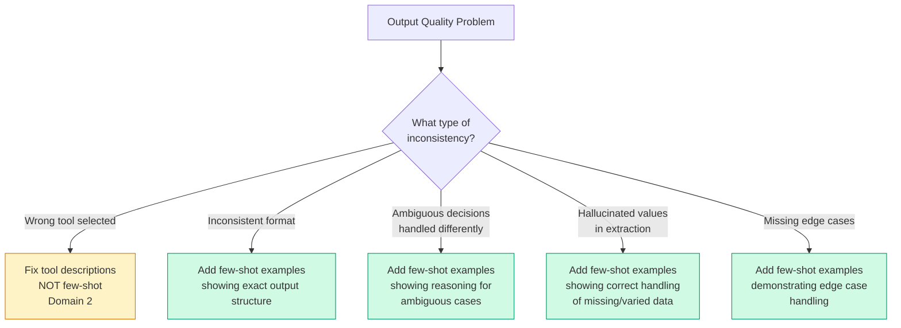

### Code Examples

**Few-shot examples for code review consistency (Scenario 5):**

```text
Review the following code and report issues in this exact format:

<example>
<code>
def get_user(id):
    user = db.query(f"SELECT * FROM users WHERE id = {id}")
    return user
</code>
<finding>
  <location>get_user, line 2</location>
  <issue>SQL injection vulnerability via string interpolation</issue>
  <severity>CRITICAL</severity>
  <suggested_fix>Use parameterized query: db.query("SELECT * FROM users WHERE id = ?", [id])</suggested_fix>
  <detected_pattern>string-interpolation-in-sql</detected_pattern>
</finding>
</example>

<example>
<code>
# Calculates the total price including tax
def calculate_total(items):
    subtotal = sum(item.price for item in items)
    return subtotal  # Tax calculation removed per TICKET-4521
</code>
<finding>No issues found. The comment references a ticket explaining the intentional removal of tax calculation. This is a documented workaround, not a stale comment.</finding>
</example>
```

The second example is critical — it shows the model a case where it should NOT flag an issue. This teaches the model to distinguish acceptable patterns from genuine problems.

**Few-shot examples for document extraction (Scenario 6):**

```text
Extract metadata from the following research document.

<example>
<document>
Smith et al. (2024) conducted a study of approximately 1,500 
participants across three states. The budget was "around two million 
dollars" according to the project lead.
</document>
<extraction>
{
  "authors": ["Smith et al."],
  "year": 2024,
  "sample_size": 1500,
  "sample_size_approximate": true,
  "budget_usd": 2000000,
  "budget_approximate": true,
  "methodology": null,
  "methodology_source": null
}
</extraction>
<reasoning>
"approximately 1,500" → rounded to 1500 with approximate flag.
"around two million" → converted to 2000000 with approximate flag.
methodology not described in this excerpt → null, not fabricated.
</reasoning>
</example>

<example>
<document>
The RCT enrolled 342 patients. Primary endpoints were measured 
at 6 and 12 months. Funding: NIH Grant R01-AG055501 ($1,234,567).
</document>
<extraction>
{
  "authors": null,
  "year": null,
  "sample_size": 342,
  "sample_size_approximate": false,
  "budget_usd": 1234567,
  "budget_approximate": false,
  "methodology": "RCT",
  "methodology_source": "explicit mention"
}
</extraction>
<reasoning>
No author or year in this excerpt → null.
342 is exact, $1,234,567 is exact → approximate flags false.
"RCT" explicitly stated → extracted with source annotation.
</reasoning>
</example>
```

Notice how these examples teach:
- Handling informal measurements ("approximately," "around")
- Returning null for absent information instead of fabricating
- Adding `_approximate` boolean flags for uncertain values
- Including reasoning to show judgment transparency

### Common Exam Traps

| Trap | Why It's Wrong | Correct Understanding |
|------|---------------|----------------------|
| "Use 8-10 few-shot examples for comprehensive coverage" | Token-expensive; 2-4 targeted examples are more efficient | Quality and targeting of examples matters more than quantity |
| "Few-shot examples fix tool misrouting" | Tool selection is determined by tool descriptions, not prompt examples | Fix descriptions for routing; use few-shot for output quality |
| "The model only matches exact patterns from examples" | Few-shot enables generalization to novel patterns | Examples teach judgment rules the model applies broadly |
| "Detailed instructions always outperform few-shot examples" | Instructions can be interpreted inconsistently | Few-shot shows concrete expected behavior, eliminating ambiguity |
| "Few-shot examples aren't needed if you use structured schemas" | Schemas enforce format but not judgment quality | Few-shot teaches WHAT to put in the fields; schemas enforce field structure |

---

## 4 Task Statement 4.3 — Enforce Structured Output Using Tool Use and JSON Schemas

### Concept Overview

`tool_use` with JSON schemas is the most reliable approach for getting Claude to produce structured output that conforms to a defined schema. When you define a tool whose input parameters match your desired output schema, Claude will call that tool with schema-compliant JSON. This eliminates JSON syntax errors entirely.

However, `tool_use` with schemas eliminates **syntax errors** but does NOT prevent **semantic errors**. The model will always produce valid JSON that matches the schema structure, but the values may be semantically wrong — line items that don't sum to the stated total, values placed in the wrong fields, or fabricated data to satisfy required fields.

### The Three tool_choice Modes

Understanding these three modes is critical for the exam:

| Mode | Syntax | Behavior | Use When |
|------|--------|----------|----------|
| **auto** | `tool_choice: "auto"` | Model MAY return text instead of calling any tool | Tool calling is optional; conversational fallback acceptable |
| **any** | `tool_choice: "any"` | Model MUST call a tool but can choose which one | Guaranteed structured output needed; multiple schemas exist; document type unknown |
| **forced** | `tool_choice: {"type": "tool", "name": "extract_metadata"}` | Model MUST call the specified tool | Enforce workflow ordering; guarantee a specific extraction runs first |

### Why It Matters For The Exam

The exam tests this primarily through Scenario 6 (Structured Data Extraction). The critical question patterns are:

1. **"How do you guarantee the model produces structured output?"** → `tool_choice: "any"` (NOT "auto," which can return text)
2. **"Document type is unknown, multiple extractors exist — which tool_choice?"** → `tool_choice: "any"` (model picks the right extractor)
3. **"Must run metadata extraction before enrichment — how?"** → `tool_choice: forced` for the first step, then `"auto"` for subsequent
4. **"Model fabricates values for required fields — how to fix?"** → Make fields `optional` (nullable) in the schema

### Production Perspective

Production extraction pipelines combine tool_use schemas with several supporting patterns:

- **Nullable fields** prevent the model from inventing data to satisfy required fields. If a source document may not contain a value, the schema field must be optional/nullable.
- **Enum fields with "other" + detail string** allow extensible categorization without losing structure. Example: `"category": "other"` with `"category_detail": "government report"` for documents that don't fit predefined categories.
- **"unclear" enum values** give the model an explicit way to express ambiguity rather than guessing.
- **Format normalization rules in prompts** handle inconsistent source formatting while the schema enforces output structure.

### Architecture: Structured Output Pipeline

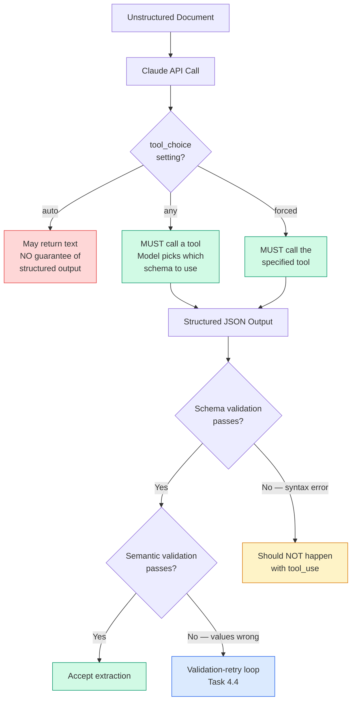

### Code Examples

**Defining an extraction tool with JSON schema:**

```json
{
  "name": "extract_invoice_data",
  "description": "Extract structured data from an invoice document",
  "input_schema": {
    "type": "object",
    "properties": {
      "vendor_name": {
        "type": "string",
        "description": "Name of the vendor/supplier"
      },
      "invoice_number": {
        "type": "string",
        "description": "Invoice reference number"
      },
      "invoice_date": {
        "type": ["string", "null"],
        "description": "Invoice date in ISO 8601 format. Null if not found in document."
      },
      "line_items": {
        "type": "array",
        "items": {
          "type": "object",
          "properties": {
            "description": {"type": "string"},
            "quantity": {"type": "number"},
            "unit_price": {"type": "number"},
            "total": {"type": "number"}
          },
          "required": ["description", "quantity", "unit_price", "total"]
        }
      },
      "stated_total": {
        "type": ["number", "null"],
        "description": "Total amount as stated on the invoice"
      },
      "calculated_total": {
        "type": "number",
        "description": "Sum of all line item totals — used for cross-validation"
      },
      "document_type": {
        "type": "string",
        "enum": ["standard_invoice", "credit_note", "proforma", "other"],
        "description": "Type of invoice document"
      },
      "document_type_detail": {
        "type": ["string", "null"],
        "description": "Detail when document_type is 'other'"
      },
      "conflict_detected": {
        "type": "boolean",
        "description": "True if stated_total differs from calculated_total"
      }
    },
    "required": ["vendor_name", "line_items", "calculated_total", "conflict_detected"]
  }
}
```

Key schema design patterns to note:

- `invoice_date` is nullable — prevents fabrication when not found
- `document_type` uses enum with "other" + detail string — extensible categorization
- `stated_total` AND `calculated_total` — enables self-correction validation (see Task 4.4)
- `conflict_detected` boolean — explicit flag for data inconsistency

**tool_choice configuration for unknown document types:**

```python
# Multiple extraction schemas exist — model picks the right one
response = client.messages.create(
    model="claude-sonnet-4-20250514",
    max_tokens=4096,
    tools=[extract_invoice, extract_receipt, extract_contract],
    tool_choice={"type": "any"},  # MUST call a tool, picks which
    messages=[{"role": "user", "content": document_text}]
)
```

**Forced tool selection for workflow ordering:**

```python
# Step 1: Force metadata extraction first
response_1 = client.messages.create(
    model="claude-sonnet-4-20250514",
    max_tokens=4096,
    tools=[extract_metadata, enrich_entity, classify_document],
    tool_choice={"type": "tool", "name": "extract_metadata"},
    messages=[{"role": "user", "content": document_text}]
)

# Step 2: Use auto for subsequent steps — model decides what's next
metadata = response_1.content[0].input  # Extract the metadata
response_2 = client.messages.create(
    model="claude-sonnet-4-20250514",
    max_tokens=4096,
    tools=[enrich_entity, classify_document],
    tool_choice={"type": "auto"},  # Model decides freely now
    messages=[
        {"role": "user", "content": document_text},
        {"role": "assistant", "content": response_1.content},
        {"role": "user", "content": [{"type": "tool_result", ...}]}
    ]
)
```

### Common Exam Traps

| Trap | Why It's Wrong | Correct Approach |
|------|---------------|-----------------|
| "Use `tool_choice: auto` for guaranteed structured output" | `auto` may return text instead of a tool call | Use `"any"` to guarantee a tool call |
| "Strict JSON schemas prevent all errors" | Schemas prevent syntax errors; semantic errors still occur | Add semantic validation (Task 4.4) on top of schema enforcement |
| "Make all schema fields required for completeness" | Model fabricates values to satisfy required fields | Make fields nullable when source may not contain the data |
| "Use forced tool selection for every step" | Loses model flexibility after the first step | Force only the first step; use `"auto"` for subsequent steps |
| "Parse JSON from the model's text response" | Fragile; subject to formatting inconsistencies | Use tool_use — the response IS structured JSON already |

---

## 5 Task Statement 4.4 — Implement Validation Retry and Feedback Loops for Extraction Quality

### Concept Overview

Even with perfect schemas (Task 4.3), the model can produce semantically incorrect output. Validation-retry loops catch these semantic errors and give the model a chance to self-correct by appending the specific validation error to a follow-up request.

The critical insight is knowing **when retries will work and when they won't:**

| Error Type | Retryable? | Why |
|-----------|-----------|-----|
| Format mismatches (wrong date format, inconsistent units) | Yes | Model can reformat from the same source |
| Structural output errors (field in wrong position, wrong nesting) | Yes | Model can restructure from the same source |
| Semantic validation failures (totals don't sum, cross-field conflicts) | Yes | Model can recalculate or re-examine source |
| Information absent from source document | **No** | No amount of retrying will produce data that doesn't exist |
| Information in external document not provided | **No** | Model cannot access documents not in context |

### Why It Matters For The Exam

The exam tests two distinct patterns:

**Pattern 1 — Validation-retry loop design:** The scenario describes a failed extraction and asks how to implement the retry. The correct answer includes: the original document, the failed extraction, AND the specific validation error. Sending just "try again" without the error is insufficient.

**Pattern 2 — Identifying when retries are futile:** The scenario describes extraction failures where the information simply doesn't exist in the source document. The correct answer is NOT "retry with a better prompt" — it's "mark the field as null and route to human review" or "return the extraction with a flag indicating missing data."

### Production Perspective

Production validation-retry systems have three components:

1. **Schema validation** (Pydantic/JSON Schema) — catches structural errors
2. **Semantic validation** — catches logical errors (totals don't sum, dates out of range, cross-field inconsistencies)
3. **Feedback loop** — tracks which code constructs or document patterns trigger findings, enabling systematic analysis of false positive patterns

The `detected_pattern` field is particularly important for production systems. When developers dismiss findings, the `detected_pattern` data enables analysis of WHICH patterns generate false positives, allowing targeted prompt improvements.

### Architecture: Validation-Retry Loop

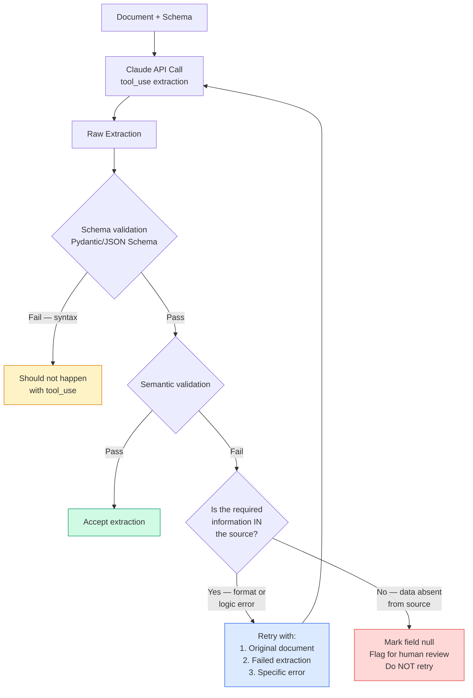

### Code Examples

**Validation-retry loop implementation:**

```python
def extract_with_validation(document_text, schema, max_retries=2):
    extraction = call_claude_extraction(document_text, schema)
    
    for attempt in range(max_retries):
        # Step 1: Schema validation (structural)
        schema_errors = validate_schema(extraction, schema)
        if schema_errors:
            # Should be rare with tool_use, but handle gracefully
            extraction = retry_with_error(
                document_text, extraction, schema_errors
            )
            continue
        
        # Step 2: Semantic validation (logical)
        semantic_errors = validate_semantics(extraction)
        if not semantic_errors:
            return extraction  # All validations pass
        
        # Step 3: Classify errors as retryable vs non-retryable
        retryable = [e for e in semantic_errors if is_retryable(e)]
        non_retryable = [e for e in semantic_errors if not is_retryable(e)]
        
        if not retryable:
            # All errors are non-retryable — stop trying
            return flag_for_human_review(extraction, non_retryable)
        
        # Step 4: Retry with specific error feedback
        extraction = retry_with_error(
            document_text, extraction, retryable
        )
    
    return flag_for_human_review(extraction, semantic_errors)


def retry_with_error(document_text, failed_extraction, errors):
    """Retry with the original document, failed extraction, 
    and specific validation errors."""
    retry_prompt = f"""
The following extraction from this document failed validation.

<document>
{document_text}
</document>

<failed_extraction>
{json.dumps(failed_extraction, indent=2)}
</failed_extraction>

<validation_errors>
{format_errors(errors)}
</validation_errors>

Please re-extract, correcting the specific errors listed above.
Do NOT change fields that passed validation.
"""
    return call_claude_extraction(retry_prompt, schema)
```

**Self-correction validation — extracting both stated and calculated totals:**

```json
{
  "stated_total": 1250.00,
  "calculated_total": 1230.00,
  "conflict_detected": true
}
```

When `conflict_detected` is true, the system knows to flag this extraction for human review rather than silently passing incorrect data downstream.

**Semantic validation functions:**

```python
def validate_semantics(extraction):
    errors = []
    
    # Check: line items sum to calculated_total
    line_sum = sum(item["total"] for item in extraction["line_items"])
    if abs(line_sum - extraction["calculated_total"]) > 0.01:
        errors.append({
            "field": "calculated_total",
            "error": f"Line items sum to {line_sum} but calculated_total is {extraction['calculated_total']}",
            "retryable": True
        })
    
    # Check: stated_total vs calculated_total
    if (extraction.get("stated_total") and 
        abs(extraction["stated_total"] - extraction["calculated_total"]) > 0.01):
        errors.append({
            "field": "conflict_detected",
            "error": "stated_total and calculated_total differ — verify against source",
            "retryable": True  # Model can re-examine the source
        })
    
    # Check: dates are valid
    if extraction.get("invoice_date"):
        try:
            parsed = datetime.fromisoformat(extraction["invoice_date"])
            if parsed > datetime.now():
                errors.append({
                    "field": "invoice_date",
                    "error": "Invoice date is in the future",
                    "retryable": True
                })
        except ValueError:
            errors.append({
                "field": "invoice_date", 
                "error": "Invalid date format",
                "retryable": True
            })
    
    return errors
```

**Feedback loop with detected_pattern for false positive analysis:**

```json
{
  "location": "auth.ts:42",
  "issue": "Potential null pointer dereference",
  "severity": "HIGH",
  "suggested_fix": "Add null check before accessing .user property",
  "detected_pattern": "optional-chain-missing-on-nullable-return",
  "confidence": 0.85
}
```

When a developer dismisses this finding, the `detected_pattern` field allows the system to aggregate: "35% of `optional-chain-missing-on-nullable-return` findings are dismissed — investigate whether this pattern needs prompt refinement."

### Common Exam Traps

| Trap | Why It's Wrong | Correct Approach |
|------|---------------|-----------------|
| "Retry all validation failures with exponential backoff" | Some failures are non-retryable (data absent from source) | Classify errors as retryable vs non-retryable first |
| "Just send 'try again' without specifying the error" | Model doesn't know what to fix | Include original doc + failed extraction + specific error |
| "tool_use eliminates the need for validation" | tool_use prevents syntax errors, NOT semantic errors | Always add semantic validation on top of schema enforcement |
| "Retry fixes missing data problems" | If data isn't in the source, no retry will find it | Route missing data to human review or accept null |
| "Schema syntax errors are the primary failure mode" | With tool_use, syntax errors are effectively eliminated | Semantic errors are the real challenge |

---

## 6 Task Statement 4.5 — Design Efficient Batch Processing Strategies

### Concept Overview

The Message Batches API offers 50% cost savings compared to synchronous API calls. However, it has a processing window of up to 24 hours with no guaranteed latency SLA. This creates a sharp decision boundary:

| Workflow Type | API Choice | Why |
|--------------|-----------|-----|
| **Blocking** (developer waits for result) | Synchronous API | Cannot wait up to 24 hours |
| **Non-blocking** (overnight, weekly, no one waiting) | Message Batches API | 50% savings, latency acceptable |

The batch API also has a critical limitation: **it does not support multi-turn tool calling within a single request.** You cannot have the model call a tool mid-request, receive the result, and continue. Each batch request is a single turn.

### Why It Matters For The Exam

The exam tests this through Scenario 5 (CI/CD). The classic question: "Your manager proposes switching both pre-merge checks and overnight reports to batch API for cost savings. What do you recommend?" The correct answer is ALWAYS: batch for overnight only, synchronous for blocking pre-merge checks.

**Key exam details:**
- `custom_id` fields correlate batch request/response pairs
- Failed documents are identified by `custom_id` and resubmitted individually with modifications (e.g., chunking oversized documents)
- Prompt refinement on a sample set BEFORE batch-processing large volumes maximizes first-pass success and reduces resubmission costs
- Batch submission frequency must be calculated based on SLA constraints (e.g., 4-hour submission windows to guarantee 30-hour SLA with 24-hour processing)

### Production Perspective

Production batch processing follows this lifecycle:

1. **Refine prompts on a sample set** — Process 10-20 documents synchronously, iterate on prompts until quality meets threshold
2. **Batch-process the full volume** — Submit all documents with unique `custom_id` values
3. **Handle failures** — Identify failed documents by `custom_id`, diagnose failure reasons (usually oversized context or edge-case formats)
4. **Resubmit failures with modifications** — Chunk oversized documents, adjust prompts for edge cases
5. **Monitor aggregate quality** — Track accuracy across the batch, segment by document type

### Architecture: Batch Processing Decision and Flow

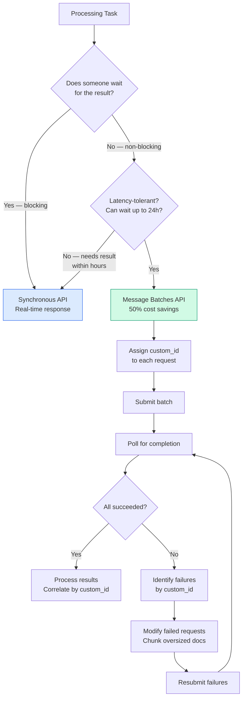

### Code Examples

**Batch submission with custom_id:**

```python
batch_requests = []
for doc_id, document in documents.items():
    batch_requests.append({
        "custom_id": f"doc-{doc_id}",  # Correlates request/response
        "params": {
            "model": "claude-sonnet-4-20250514",
            "max_tokens": 4096,
            "tools": [extract_invoice_tool],
            "tool_choice": {"type": "any"},
            "messages": [
                {"role": "user", "content": document.text}
            ]
        }
    })

# Submit batch
batch = client.batches.create(requests=batch_requests)

# Poll for completion
while batch.processing_status != "ended":
    time.sleep(300)  # Check every 5 minutes
    batch = client.batches.retrieve(batch.id)

# Process results — correlate by custom_id
for result in batch.results:
    doc_id = result.custom_id.replace("doc-", "")
    if result.result.type == "succeeded":
        extraction = result.result.message.content[0].input
        store_extraction(doc_id, extraction)
    else:
        failed_docs.append(doc_id)  # Resubmit with modifications
```

**Matching API to workflow — the complete decision:**

```text
Pre-merge check (blocking, developer waits)
  → Synchronous API (real-time)

Technical debt report (overnight, non-blocking)  
  → Message Batches API (50% savings)

Nightly test generation (overnight, non-blocking) 
  → Message Batches API (50% savings)

Weekly code audit (weekly, non-blocking)          
  → Message Batches API (50% savings)

Incident response analysis (urgent, blocking)     
  → Synchronous API (real-time)
```

**SLA calculation for batch submission frequency:**

```text
Business SLA: Results needed within 30 hours of document receipt
Batch processing window: Up to 24 hours (worst case)
Submission overhead: ~1 hour (collection, validation, submission)
Safety margin: 1 hour

Available time: 30 - 24 - 1 - 1 = 4 hours
→ Submit batches every 4 hours to guarantee 30-hour SLA
```

### Common Exam Traps

| Trap | Why It's Wrong | Correct Approach |
|------|---------------|-----------------|
| "Switch all workflows to batch API for cost savings" | Blocking workflows can't tolerate up to 24h latency | Only non-blocking, latency-tolerant workflows use batch |
| "Batch results can't be correlated with requests" | `custom_id` fields solve this exactly | Use unique `custom_id` per request for correlation |
| "Batch API supports multi-turn tool calling" | It does not — each request is a single turn | Design extraction to work in a single turn, or use synchronous API |
| "Process the full volume first, then iterate on prompts" | Wastes batch cost on suboptimal prompts | Refine prompts on a sample set BEFORE batch processing |
| "Batch processing always completes faster than 24 hours" | No guaranteed latency SLA — up to 24 hours worst case | Design around worst-case 24-hour processing time |

---

## 7 Task Statement 4.6 — Design Multi-Instance and Multi-Pass Review Architectures

### Concept Overview

This task statement addresses two fundamental limitations of LLM-based review:

**Limitation 1 — Self-review bias:** A model that generates code retains the reasoning context from generation. When asked to review its own output in the same session, it is less likely to question its own decisions. This creates blind spots that an independent instance — without prior reasoning context — would catch.

**Limitation 2 — Attention dilution:** When processing many files at once, the model's attention is spread thin. It produces detailed feedback for some files but superficial or contradictory feedback for others. This manifests as:
- Detailed feedback for early files, diminishing quality for later files
- Missing obvious bugs in middle-section files
- Contradictory findings — flagging a pattern as problematic in one file while approving identical code elsewhere

### Why It Matters For The Exam

This is one of the most heavily tested concepts in Domain 4 because it spans both Scenario 5 (CI/CD) and Scenario 2 (Code Generation).

**Key exam patterns:**

1. **"How to improve code review quality when the same model generates and reviews?"** → Use an independent review instance (NOT self-review instructions, NOT extended thinking)
2. **"14-file PR produces inconsistent review results — how to fix?"** → Split into per-file local analysis passes + a separate cross-file integration pass
3. **"Running a verification pass with confidence scores — why?"** → Enables calibrated review routing: high-confidence findings go to automated action, low-confidence to human review

### Production Perspective

Production review architectures combine multi-instance and multi-pass:

**Multi-instance pattern:**
1. **Generator instance** creates the code
2. **Reviewer instance** (independent, no shared context) evaluates it
3. The reviewer has no knowledge of the generator's reasoning, approach selection, or tradeoffs — it evaluates the code on its own merits

**Multi-pass pattern for large reviews:**
1. **Per-file local analysis passes** — Each file analyzed individually for local issues (bugs, security, style within that file)
2. **Cross-file integration pass** — A separate pass that examines data flow, API contracts, and consistency ACROSS files
3. **Optional verification pass** — The model self-reports confidence alongside each finding, enabling automated routing

### Architecture: Multi-Pass Review

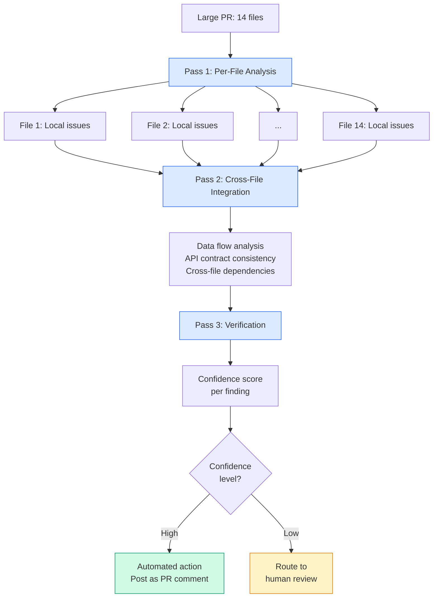

### Architecture: Independent Review Instance

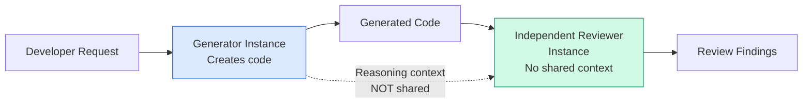

### Code Examples

**Independent review instance (NOT self-review):**

```bash
# Step 1: Generate code (Session A)
claude -p "Implement the authentication module for our REST API" \
  --output-format json > generated_code.json

# Step 2: Review code (Session B — INDEPENDENT INSTANCE)
claude -p "Review the following code for security issues, 
bugs, and architectural problems. You did NOT write this code.
$(cat generated_code.json)" \
  --output-format json \
  --json-schema review-findings.json
```

**Multi-pass review in CI:**

```bash
# Pass 1: Per-file local analysis
for file in $(git diff --name-only HEAD~1); do
  claude -p "Analyze this file for local issues (bugs, security, 
  null safety). Report per-file findings only.
  File: $file
  $(cat $file)" \
    --output-format json >> local-findings.json
done

# Pass 2: Cross-file integration analysis
claude -p "Analyze cross-file data flow and API consistency 
across these files. Report ONLY cross-file issues (mismatched 
types between caller and callee, inconsistent error handling 
across modules, broken data contracts).
$(git diff HEAD~1)" \
  --output-format json > integration-findings.json

# Pass 3: Confidence verification
claude -p "Review these findings and assign a confidence score 
(0.0-1.0) to each. A finding with high confidence (>0.8) has 
clear evidence in the code. Low confidence (<0.5) may be a 
false positive.
$(cat local-findings.json integration-findings.json)" \
  --output-format json > scored-findings.json
```

**Incremental review — avoiding duplicate comments on updated PRs:**

```bash
claude -p "Review this PR. Previous review found these issues:
$(cat prior-findings.json)
Report ONLY new issues or issues that remain unaddressed.
Do not repeat findings that have already been fixed." \
  --output-format json
```

### Common Exam Traps

| Trap | Why It's Wrong | Correct Approach |
|------|---------------|-----------------|
| "Add self-review instructions to the generator prompt" | Self-review retains reasoning context; blind spots persist | Use an independent review instance |
| "Use extended thinking to improve self-review" | Extended thinking improves reasoning but doesn't eliminate self-review bias | Independent instance without prior context catches more |
| "Process all 14 files in a larger context window" | Attention dilution is the problem, not context size | Split into per-file passes + integration pass |
| "Run 3 identical passes and use majority vote" | Wastes resources; real issues may appear in only 1 pass | Focused per-file + integration passes address the root cause |
| "Add more detailed review instructions" | Instructions don't fix attention dilution across many files | Structural change (multi-pass) is required |

---

## 8 Anti-Patterns Master Reference

| Anti-Pattern | Why It Fails | Correct Approach |
|-------------|-------------|-----------------|
| Vague precision instructions ("be conservative") | Model interprets differently each time; no decision boundary | Define explicit categorical criteria with code examples |
| Confidence-based filtering ("only high-confidence") | Model's self-confidence is poorly calibrated | Use categorical criteria to prevent false findings from being generated |
| 8-10 few-shot examples for coverage | Token-expensive; diminishing returns past 4 examples | Use 2-4 targeted examples for ambiguous cases specifically |
| Few-shot examples to fix tool misrouting | Tool selection is driven by descriptions, not prompt examples | Fix tool descriptions (Domain 2) |
| `tool_choice: "auto"` for guaranteed structured output | Model may return text instead of calling a tool | Use `"any"` or forced selection |
| All schema fields required | Model fabricates values to satisfy required fields | Make fields nullable/optional when source may lack data |
| Retrying when data is absent from source | Information that doesn't exist cannot be extracted | Accept null; route to human review |
| Sending "try again" without error specifics | Model doesn't know what to fix | Include original doc + failed extraction + specific error |
| Batch API for blocking pre-merge checks | Up to 24-hour latency is unacceptable for blocking workflows | Synchronous API for blocking; batch for non-blocking |
| Processing full volume before refining prompts | Wastes batch cost on suboptimal prompts | Refine on sample set first |
| Self-review in the same session | Shared reasoning context creates blind spots | Independent review instance |
| Single-pass review of 14+ files | Attention dilution causes inconsistent, contradictory findings | Per-file passes + cross-file integration pass |
| Parsing JSON from model text output | Fragile; formatting inconsistencies break parsing | Use tool_use — output IS structured JSON |
| Using extended thinking to fix self-review bias | Improves reasoning but doesn't fix the shared-context problem | Independent instance eliminates the problem structurally |
| Ignoring the `detected_pattern` field in findings | Loses the ability to systematically analyze false positive patterns | Include `detected_pattern` for feedback loop analysis |
| Disabling all review categories due to false positives | Loses the value of accurate categories too | Disable only the high-FP categories; improve prompts for those |

---

## 9 Decision Frameworks and Heuristics

### Decision Tree: Output Quality Problem Diagnosis

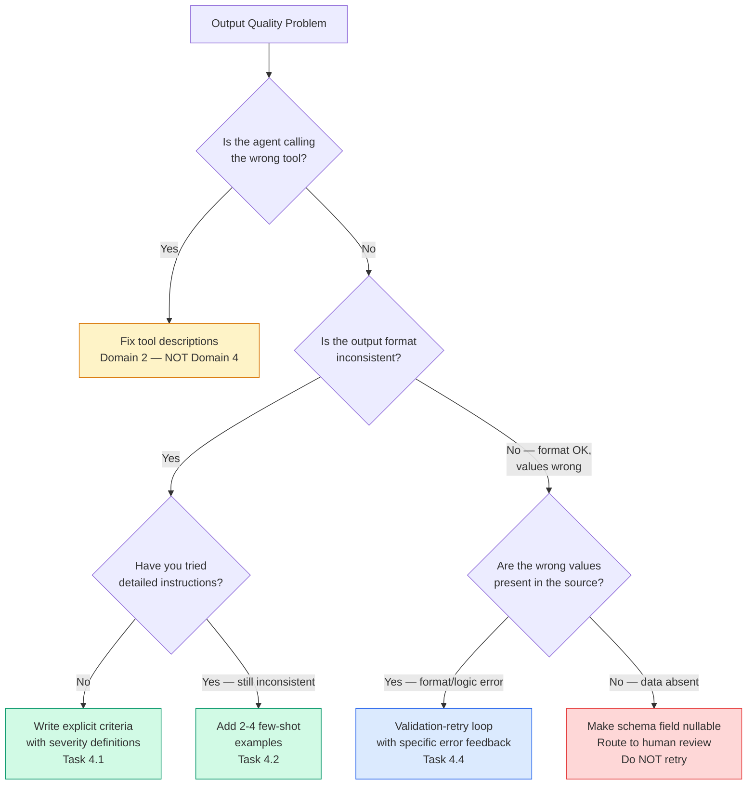

### Decision Tree: API Selection

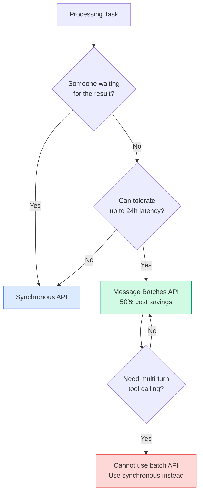

### Decision Tree: Review Architecture

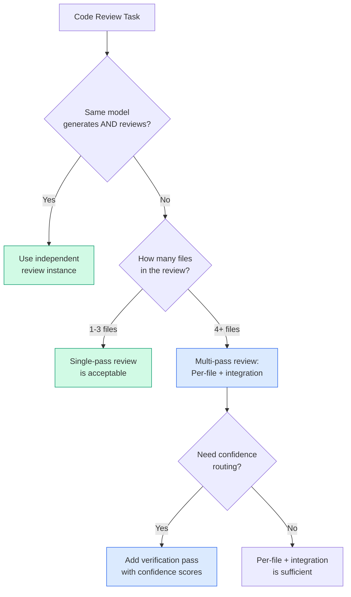

### Decision Tree: tool_choice Selection

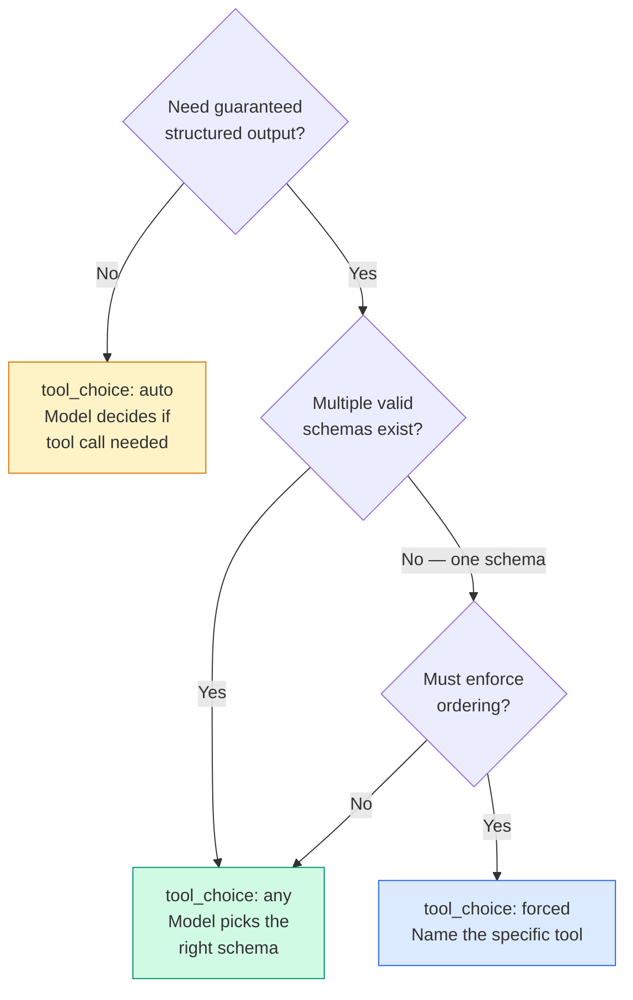

### Prompt Engineering Escalation Ladder

When output quality is insufficient, escalate through these techniques in order:

| Level | Technique | When to Use | Token Cost |
|-------|-----------|-------------|------------|
| 1 | Explicit criteria | Always start here — define what to flag and what to skip | Low |
| 2 | Severity definitions with code examples | When classification is inconsistent | Low |
| 3 | Few-shot examples (2-4) | When instructions alone produce inconsistent results | Medium |
| 4 | Structured output via tool_use | When format compliance is critical | Low |
| 5 | Validation-retry loops | When semantic correctness must be verified | Medium-High |
| 6 | Multi-pass review architecture | When single-pass produces attention dilution | High |
| 7 | Independent review instance | When self-review bias degrades quality | High |

**Do NOT skip levels.** The exam penalizes jumping to complex solutions (multi-instance review) when simpler ones (explicit criteria) haven't been tried.

---

## 10 Exam-Style Questions with Explanations

### Question 1 — Explicit Criteria vs Confidence Filtering

**Scenario:** Your CI/CD pipeline runs automated code reviews using Claude. Developers report that the system flags too many false positives, particularly around comment accuracy — it flags comments that are slightly imprecise but directionally correct. Developer trust is declining, and some teams are disabling the review tool entirely. You try adding "only report high-confidence findings" to the prompt, but false positive rates remain unchanged. What should you do?

A) Increase the confidence threshold and add "be extremely conservative — only flag issues you are 100% certain about."
B) Temporarily disable the comment accuracy category and replace the vague criteria with explicit rules defining exactly when to flag comments (e.g., "only when claimed behavior contradicts actual code behavior").
C) Add 10 few-shot examples showing acceptable comments that should not be flagged.
D) Switch to a more powerful model with better reasoning capabilities.

**Correct Answer: B**

**Explanation:**
- **B is correct** for two reasons. First, temporarily disabling the high-FP category stops the trust erosion immediately — developers re-learn that the system's findings are reliable. Second, replacing vague criteria ("check that comments are accurate") with explicit categorical criteria ("flag only when claimed behavior contradicts actual code behavior") gives the model a clear decision boundary. The exam guide explicitly identifies this as the correct approach for false positive reduction.
- **A is wrong** because adding "100% certain" is still a vague instruction. The model's self-reported confidence is poorly calibrated — it is already confident on the false positives. More emphatic confidence language does not improve precision.
- **C is wrong** because while few-shot examples can help, 10 examples is excessive (2-4 is optimal), and examples alone don't fix the root cause: undefined criteria. Also, few-shot examples are the escalation after explicit criteria have been defined (see Escalation Ladder).
- **D is wrong** because the problem is undefined criteria, not model capability. A more powerful model with vague criteria will still generate false positives.

---

### Question 2 — Few-Shot Prompting Application

**Scenario:** Your document extraction system processes research papers with varied formats. Some papers have inline citations, others use bibliographies. Some describe methodology in a dedicated section, others embed it in the results. Despite detailed extraction instructions, the system inconsistently handles these structural variations — sometimes extracting methodology correctly, sometimes returning null for papers where the methodology IS described but in an unexpected location. What is the most effective improvement?

A) Add format normalization as a preprocessing step that converts all papers to a standard structure before extraction.
B) Add 2-4 few-shot examples demonstrating correct extraction from papers with different structural formats (inline citations vs bibliographies, dedicated methodology sections vs embedded descriptions).
C) Increase the context window to ensure the model sees the entire paper without truncation.
D) Add a post-processing step that uses regex patterns to find methodology descriptions in the raw text.

**Correct Answer: B**

**Explanation:**
- **B is correct** because few-shot examples demonstrating extraction from structurally varied documents directly addresses the problem. The model needs to SEE how to handle inline citations vs bibliographies, how to find methodology described in unexpected locations, and how to extract from diverse formats. The exam guide specifically lists this as a key skill for Task Statement 4.2.
- **A is wrong** because format normalization of research papers is extremely difficult and error-prone. Academic papers have too much structural diversity to normalize reliably.
- **C is wrong** because the problem is not truncation — the model SEES the methodology but fails to extract it from unexpected structural positions. This is a judgment problem, not a visibility problem.
- **D is wrong** because regex-based extraction of methodology from research papers is brittle and cannot handle the natural language variability of academic writing.

---

### Question 3 — tool_choice Configuration

**Scenario:** You are building an extraction pipeline that processes three document types: invoices, receipts, and contracts. Each has a distinct schema. Documents arrive without type labels — the system must identify the type and extract accordingly. Currently, the system sometimes returns conversational text ("This appears to be an invoice for...") instead of structured extraction output. What configuration change fixes this?

A) Set `tool_choice: "auto"` and add system prompt instructions to "always use the extraction tools."
B) Set `tool_choice: {"type": "tool", "name": "extract_invoice"}` to force structured output.
C) Set `tool_choice: "any"` so the model must call one of the extraction tools but can choose which one.
D) Consolidate all three schemas into a single tool with a `document_type` field and force that tool.

**Correct Answer: C**

**Explanation:**
- **C is correct** because `tool_choice: "any"` guarantees the model calls one of the available tools (preventing text-only responses) while allowing it to choose which schema fits the document. This is exactly the use case `"any"` was designed for: multiple valid schemas, unknown document type, guaranteed structured output.
- **A is wrong** because `tool_choice: "auto"` explicitly allows the model to return text instead of calling a tool. Adding system prompt instructions about tool usage is probabilistic — it reduces but does not eliminate the text-only responses.
- **B is wrong** because forcing `extract_invoice` will apply the invoice schema to receipts and contracts, producing incorrect extractions. The document type is unknown — you need the model to pick the right schema.
- **D is wrong** because consolidating three distinct schemas into one creates an overloaded tool with complex conditional fields. The model will struggle with which fields apply to which document type. Three focused tools are more reliable (the Splitting Principle from Domain 2).

---

### Question 4 — Validation-Retry Loop Design

**Scenario:** Your extraction pipeline processes invoices and validates that line item totals sum to the stated total. For one batch of invoices, validation fails on 15 documents. Investigation reveals two categories: (1) 10 invoices where the model misread a handwritten digit, producing a line item total that doesn't match the sum, and (2) 5 invoices where the total includes a "service fee" line item that isn't listed as a separate line item in the document. How should you handle each category?

A) Retry all 15 with the validation error appended — the model will fix both categories on the second attempt.
B) Retry the 10 misread-digit cases with the specific error; for the 5 service-fee cases, return the extraction with `conflict_detected: true` and route to human review.
C) Route all 15 to human review — automated retries are unreliable for financial documents.
D) Increase the tolerance threshold to 5% so the service fee discrepancies pass validation.

**Correct Answer: B**

**Explanation:**
- **B is correct** because it distinguishes retryable from non-retryable errors. The 10 misread-digit cases are retryable — the correct digits ARE in the source document, and the retry with specific error feedback ("line item 3 total should sum to X but you extracted Y") gives the model a chance to re-examine the source. The 5 service-fee cases are NOT retryable — the service fee is included in the total but not listed as a line item. No amount of retrying will produce a line item that doesn't exist in the document. Flagging with `conflict_detected: true` and routing to human review is the correct handling.
- **A is wrong** because retrying the service-fee cases will fail repeatedly — the model cannot extract a line item that isn't listed.
- **C is wrong** because routing ALL 15 to human review wastes reviewer capacity on the 10 cases that the model can self-correct. Human review should be reserved for cases the model genuinely cannot resolve.
- **D is wrong** because loosening validation thresholds masks real errors. A 5% tolerance would also pass legitimate calculation errors, reducing pipeline accuracy.

---

### Question 5 — Batch Processing Strategy

**Scenario:** Your team runs two Claude-powered workflows: (1) a pre-merge code review that blocks developers from merging until it completes, and (2) a weekly technical debt analysis that produces a report for Monday morning review. Your manager suggests switching both to the Message Batches API for its 50% cost savings. How should you evaluate this proposal?

A) Use batch processing for the technical debt reports only; keep real-time synchronous calls for pre-merge checks.
B) Switch both workflows to batch processing with status polling to detect early completion.
C) Keep real-time calls for both workflows to avoid batch result ordering issues.
D) Switch both to batch processing with a timeout fallback to real-time if batches take too long.

**Correct Answer: A**

**Explanation:**
- **A is correct** because the Message Batches API has processing times up to 24 hours with no guaranteed latency SLA. Pre-merge checks are blocking — developers cannot merge until the check completes. A 24-hour wait is unacceptable. Weekly technical debt reports, however, are non-blocking and latency-tolerant — they just need to be ready by Monday morning. Using batch for the weekly report saves 50% on that workflow while keeping pre-merge checks responsive.
- **B is wrong** because "status polling for early completion" does not change the fundamental problem: batch processing has no guaranteed latency SLA. You cannot build a blocking developer workflow on a "usually faster" assumption.
- **C is wrong** because batch results CAN be correlated using `custom_id` fields — there is no ordering issue. This reflects a misconception about batch API capabilities.
- **D is wrong** because a timeout-fallback mechanism adds unnecessary complexity. The simpler, correct solution is to match each API to its use case: synchronous for blocking, batch for non-blocking.

---

### Question 6 — Multi-Instance Review

**Scenario:** Your team uses Claude Code to generate data migration scripts and then reviews them for correctness. Currently, the same Claude Code session generates the script and then reviews it when prompted with "Now review what you just wrote for bugs." Despite this review step, production deployments have revealed subtle bugs — off-by-one errors in pagination, null handling inconsistencies, and edge cases in date parsing. What architectural change would most effectively improve review quality?

A) Add extended thinking to the review step so the model reasons more deeply about potential issues.
B) Add a comprehensive test suite that the model must verify the script passes before approving it.
C) Use a separate, independent Claude instance to review the generated script without access to the generator's reasoning context.
D) Add more detailed review criteria specifying exactly which bug categories to check.

**Correct Answer: C**

**Explanation:**
- **C is correct** because the root cause is self-review bias. The generating session retains reasoning context from code generation — the model remembers WHY it made each decision and is less likely to question those decisions. An independent instance evaluates the code fresh, without the generator's reasoning context, and is more effective at catching subtle issues like off-by-one errors, null handling inconsistencies, and edge cases.
- **A is wrong** because extended thinking improves reasoning depth but does not eliminate self-review bias. The model still retains the generating context and is still less likely to question its own decisions, even with extended thinking.
- **B is wrong** because while testing is valuable, the model that generated the code also has blind spots about which test cases to check. It may write tests that pass its own code without testing the actual edge cases. An independent reviewer is more likely to identify untested scenarios.
- **D is wrong** because more detailed criteria help with consistency (Task 4.1) but don't address the fundamental self-review bias problem. The model will apply the criteria with the same blind spots it had during generation.

---

### Question 7 — Multi-Pass Review Architecture

**Scenario:** Your automated code review system analyzes pull requests. A recent PR modifying 12 files across the payment processing module received contradictory feedback: the review flagged a null-check pattern as "unnecessary defensive coding" in `payment-validator.ts` while simultaneously recommending adding the exact same null-check pattern in `payment-processor.ts`. Additionally, files 8-12 received notably less detailed feedback than files 1-4. What architectural change addresses both problems?

A) Split the review into per-file analysis passes for local issues, then run a separate cross-file integration pass for consistency and data flow analysis.
B) Run three independent review passes on the full PR and only surface findings that appear in at least two passes.
C) Increase the context window size to give the model more capacity for all 12 files.
D) Add explicit consistency rules to the prompt: "Apply the same standards to all files."

**Correct Answer: A**

**Explanation:**
- **A is correct** because both symptoms — contradictory feedback and declining quality for later files — are caused by attention dilution when processing many files simultaneously. Per-file passes ensure each file receives consistent, focused analysis. The separate cross-file integration pass specifically checks for consistency across files, catching exactly the pattern where a null-check is flagged in one file but recommended in another.
- **B is wrong** because running three full-PR passes wastes resources, and a majority-vote approach may filter out real issues that only one pass catches. The root cause is attention dilution per pass, not randomness across passes.
- **C is wrong** because attention dilution is not a context window size problem. A larger context window still processes 12 files in a single pass with the same attention limitations.
- **D is wrong** because "apply the same standards" is a vague instruction that doesn't change the fundamental attention dilution problem. The model isn't intentionally being inconsistent — it literally processes later files with less attention.

---

## 11 Memory Anchors

Quotable one-liners to burn into memory:

- **"Explicit criteria beat vague instructions. Every. Single. Time."**
- **"'Be conservative' is not a precision strategy — it's a wish."**
- **"High false positives in one category destroy trust in ALL categories."**
- **"Few-shot = the fix when instructions alone produce inconsistent output."**
- **"2-4 targeted examples > 10 generic examples."**
- **"Few-shot fixes output quality. Tool descriptions fix routing."**
- **"`tool_choice: auto` = maybe structured. `any` = guaranteed structured."**
- **"Nullable fields prevent hallucination. Required fields invite fabrication."**
- **"tool_use kills syntax errors. Semantic errors still need validation."**
- **"Can the data be found in the source? Yes → retry. No → stop retrying."**
- **"Retry with: original doc + failed output + specific error. Not just 'try again.'"**
- **"Blocking workflow → synchronous API. Non-blocking → batch API. No exceptions."**
- **"Batch API: 50% savings, up to 24h latency, no multi-turn tool calling."**
- **"Self-review is biased. Independent instances catch more. Period."**
- **"Attention dilution: per-file passes + integration pass. Not a bigger context window."**
- **"Prompt refinement on sample BEFORE batch processing large volumes."**
- **"`detected_pattern` enables systematic false positive analysis."**
- **"Schema: syntax guarantee. Validation: semantic guarantee. You need both."**
- **"Escalate techniques in order: criteria → examples → schemas → validation → multi-pass."**
- **"`custom_id` correlates batch request/response pairs. No ordering mystery."**

---

## 12 Rapid Revision Checklist

### Task 4.1 — Explicit Criteria

- Vague instructions ("be conservative") do NOT improve precision
- Define explicit categorical criteria: what to flag vs what to skip
- Each category needs concrete code examples for each severity level
- High false positive rate in one category erodes trust in ALL categories
- Temporarily disable high-FP categories while improving prompts for those categories
- Severity levels need explicit definitions, not subjective labels

### Task 4.2 — Few-Shot Prompting

- Most effective technique when instructions alone are inconsistent
- Use 2-4 targeted examples, NOT 8-10
- Target ambiguous cases specifically (not obvious cases)
- Show reasoning for WHY one action was chosen over alternatives
- Reduces hallucination in extraction by showing null-handling patterns
- Enables generalization to novel patterns (not just pattern matching)
- Does NOT fix tool misrouting — that's a tool description problem

### Task 4.3 — Structured Output via tool_use

- `tool_use` + JSON schema = guaranteed schema compliance
- `tool_choice: "auto"` = model may return text (NO guarantee)
- `tool_choice: "any"` = model MUST call a tool (model picks which)
- `tool_choice: forced` = model MUST call a specific named tool
- Schema eliminates syntax errors; semantic errors still possible
- Nullable/optional fields prevent the model from fabricating values
- Enum with "other" + detail string = extensible categorization
- "unclear" enum value = explicit ambiguity handling
- Forced selection for workflow ordering: first step only, then "auto"

### Task 4.4 — Validation-Retry Loops

- Retry-with-error-feedback: include original doc + failed extraction + specific error
- Retryable: format mismatches, structural errors, semantic calculation errors
- NOT retryable: information absent from source, data in external document
- `detected_pattern` field enables systematic false positive analysis
- Self-correction: extract both `stated_total` and `calculated_total`
- `conflict_detected` boolean flags data inconsistencies for human review
- Schema syntax errors should NOT occur with tool_use (already eliminated)

### Task 4.5 — Batch Processing

- Message Batches API: 50% cost savings, up to 24h processing, no SLA
- Blocking workflows → synchronous API (ALWAYS)
- Non-blocking, latency-tolerant → batch API
- `custom_id` correlates batch request/response pairs
- Batch API does NOT support multi-turn tool calling
- Refine prompts on sample set BEFORE batch-processing full volume
- Resubmit only failed documents (by `custom_id`) with modifications
- Calculate submission frequency from SLA constraints (SLA - 24h - overhead)

### Task 4.6 — Multi-Instance/Multi-Pass Review

- Self-review bias: model retains generating context, less likely to question own decisions
- Independent review instance (no shared context) catches more issues
- Attention dilution: too many files in one pass = inconsistent, contradictory findings
- Fix: per-file local analysis passes + separate cross-file integration pass
- Verification pass with confidence scores enables calibrated routing
- Incremental review: include prior findings, ask for only new/unaddressed issues
- Extended thinking does NOT fix self-review bias (still shared context)
- Larger context window does NOT fix attention dilution

---

## 13 Top 10 Exam Traps

1. **"Be conservative" or "only high-confidence findings" as a precision fix** → WRONG. These vague instructions have no measurable effect. Use explicit categorical criteria with code examples.

2. **"`tool_choice: auto` guarantees structured output"** → WRONG. `"auto"` allows the model to return text instead of calling a tool. Use `"any"` for guaranteed structured output.

3. **"Retry all validation failures"** → WRONG. Distinguish retryable errors (format/logic — data exists in source) from non-retryable (data absent from source). Don't waste retries on absent data.

4. **"Few-shot examples fix tool misrouting"** → WRONG. Tool selection is driven by tool descriptions (Domain 2). Few-shot examples fix output quality and consistency, not routing.

5. **"Use batch API for both pre-merge and overnight workflows"** → WRONG. Pre-merge checks are blocking — developers cannot wait up to 24 hours. Only non-blocking, latency-tolerant workflows use batch API.

6. **"Add self-review instructions to improve generated code quality"** → WRONG. Self-review retains the generator's reasoning context, creating blind spots. Use an independent review instance.

7. **"Larger context window fixes contradictory review findings across files"** → WRONG. Attention dilution is not a context window problem. Split into per-file passes + integration pass.

8. **"Make all schema fields required for completeness"** → WRONG. Required fields force the model to fabricate values when source documents lack the data. Use nullable/optional fields.

9. **"Process entire batch volume, then iterate on prompts"** → WRONG. Refine prompts on a small sample FIRST to maximize first-pass success rate, then batch-process the full volume.

10. **"Extended thinking eliminates self-review bias"** → WRONG. Extended thinking improves reasoning depth but does not eliminate the shared-context bias of self-review. An independent instance is the structural fix.

---

## 14 Appendix — Key Technology References

| Technology / Concept | Domain 4 Relevance |
|---------------------|-------------------|
| `tool_use` | Primary mechanism for enforcing structured output via JSON schemas |
| `tool_choice: "auto"` | Model may return text — no structured output guarantee |
| `tool_choice: "any"` | Model must call a tool — guaranteed structured output, model picks schema |
| `tool_choice: forced` | Model must call a specific tool — enforce workflow ordering |
| JSON Schema | Required vs optional fields, enum types, nullable fields, "other" + detail patterns |
| Pydantic | Python schema validation for semantic validation in extraction pipelines |
| Message Batches API | 50% cost savings, up to 24h processing, no SLA, no multi-turn tool calling |
| `custom_id` | Correlate batch request/response pairs; identify failed documents for resubmission |
| Few-shot prompting | 2-4 targeted examples for output consistency, ambiguity handling, hallucination reduction |
| Prompt chaining | Sequential task decomposition: per-file analysis → cross-file integration → synthesis |
| `detected_pattern` | Field in structured findings enabling systematic false positive analysis |
| `conflict_detected` | Boolean field flagging data inconsistencies between stated and calculated values |
| `--output-format json` | Claude Code CLI flag for machine-parseable structured output |
| `--json-schema` | Claude Code CLI flag for enforcing structured output matching a specific schema |
| `-p` / `--print` | Claude Code CLI flag for non-interactive mode in CI/CD pipelines |
| Confidence scoring | Field-level confidence for calibrated review routing (overlaps Domain 5) |
| Stratified sampling | Ongoing error rate measurement in high-confidence extractions (overlaps Domain 5) |

---

## 15 Appendix — Scenario Quick Reference

### Scenarios That Test Domain 4

| Exam Scenario | Domain 4 Topics Tested | Key Question Patterns |
|--------------|----------------------|----------------------|
| **Scenario 5: Claude Code for Continuous Integration** | Explicit review criteria (4.1), false positive reduction (4.1), multi-pass review (4.6), independent review instances (4.6), structured CI output (4.3), batch vs synchronous API (4.5), incremental review (4.6) | "Review produces too many false positives — what do you fix?" / "Same session generates and reviews code — how to improve?" / "Switch both workflows to batch — correct?" |
| **Scenario 6: Structured Data Extraction** | JSON schemas with nullable fields (4.3), tool_choice configuration (4.3), validation-retry loops (4.4), few-shot examples for varied formats (4.2), batch processing with custom_id (4.5), human review routing (overlaps Domain 5) | "Model fabricates values — how to fix?" / "Validation fails — retry or not?" / "Document type unknown — which tool_choice?" |
| **Scenario 1: Customer Support Agent** | Escalation criteria with few-shot examples (4.2, overlaps Domain 1), structured handoff output (4.3) | "Agent miscalibrates escalation — what do you try first?" |
| **Scenario 3: Multi-Agent Research System** | Structured subagent output schemas (4.3), provenance-preserving output design (overlaps Domain 5) | "How to structure subagent output for synthesis?" |

### Cross-Domain Overlaps

| Domain 4 Topic | Overlapping Domain | Connection |
|---------------|--------------------|------------|
| Explicit criteria for escalation | Domain 1 (Orchestration) | Escalation calibration uses the same explicit-criteria principle as review precision |
| tool_choice configuration | Domain 2 (Tool Design) | tool_choice interacts with tool distribution and allowedTools |
| Self-review limitations | Domain 3 (Claude Code) | Independent review instances in CI/CD pipelines |
| `-p`, `--output-format json`, `--json-schema` | Domain 3 (Claude Code) | CLI flags for structured CI output |
| Batch API for CI | Domain 3 (Claude Code) | Matching API approach to workflow latency requirements |
| Validation-retry loops | Domain 5 (Reliability) | Error classification and recovery strategies |
| Confidence scoring and human review routing | Domain 5 (Reliability) | Calibrated confidence thresholds, stratified sampling |
| Schema design (nullable fields) | Domain 5 (Reliability) | Preventing hallucination through schema architecture |
| Prompt chaining (multi-pass) | Domain 1 (Orchestration) | Task decomposition into sequential focused passes |

### What Is NOT Tested (Domain 4)

Do NOT spend study time on these topics:

- Creative writing prompting techniques
- Temperature, top-p, or sampling parameter tuning
- Prompt injection attacks (beyond knowing they exist)
- Embedding models or semantic similarity
- Fine-tuning or model customization
- RAG implementation details (beyond knowing retrieval augments context)
- Specific NLP terminology or linguistic theory
- Token counting algorithms or tokenizer specifics
- Prompt caching implementation details (beyond knowing it exists)
- Claude's internal architecture or training methodology

---

*End of Domain 4 Study Material — CCA-F Exam Preparation*
