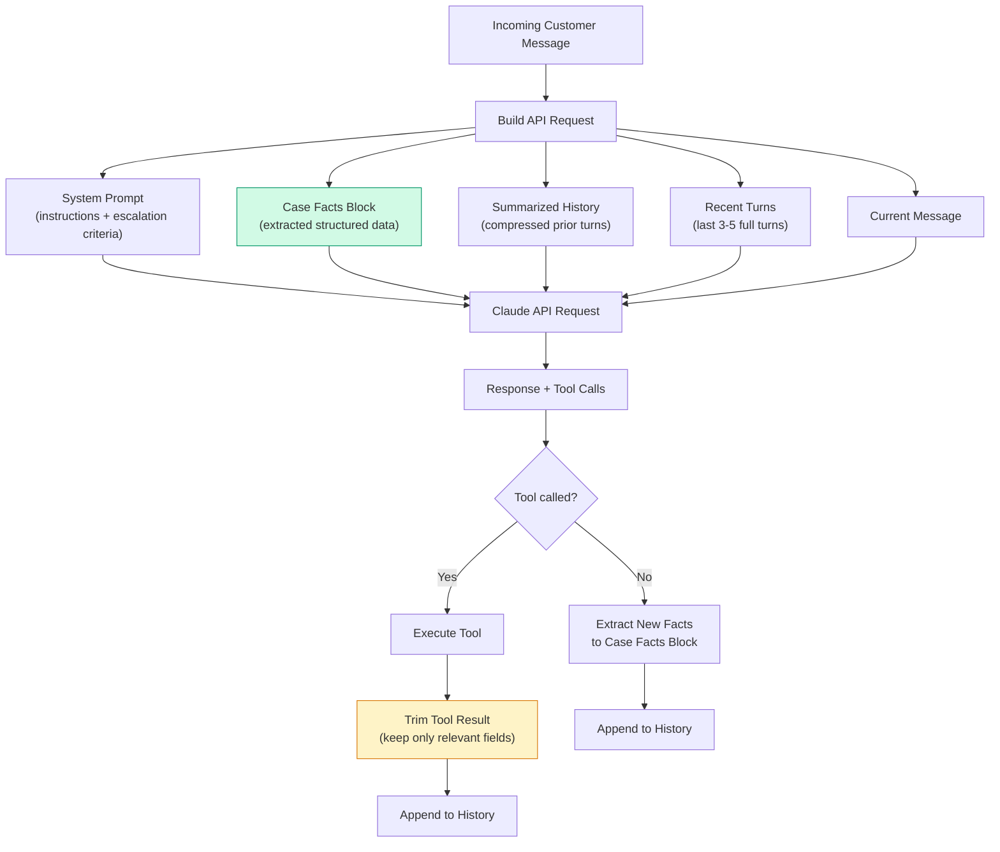
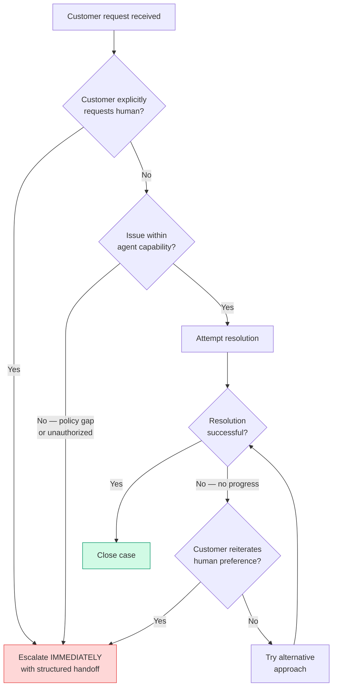
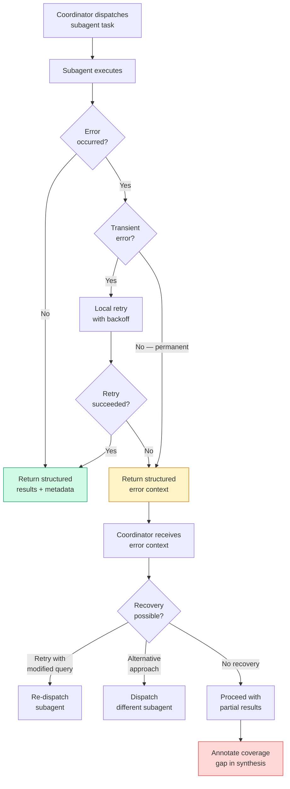
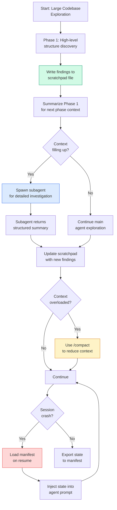
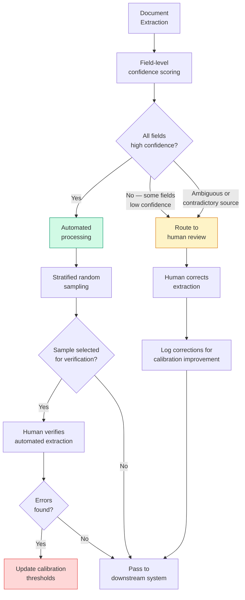
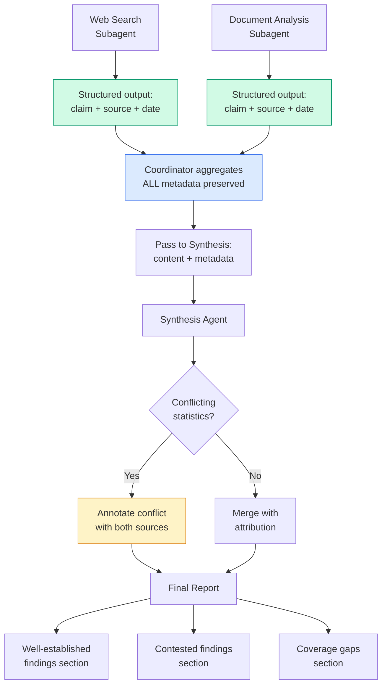
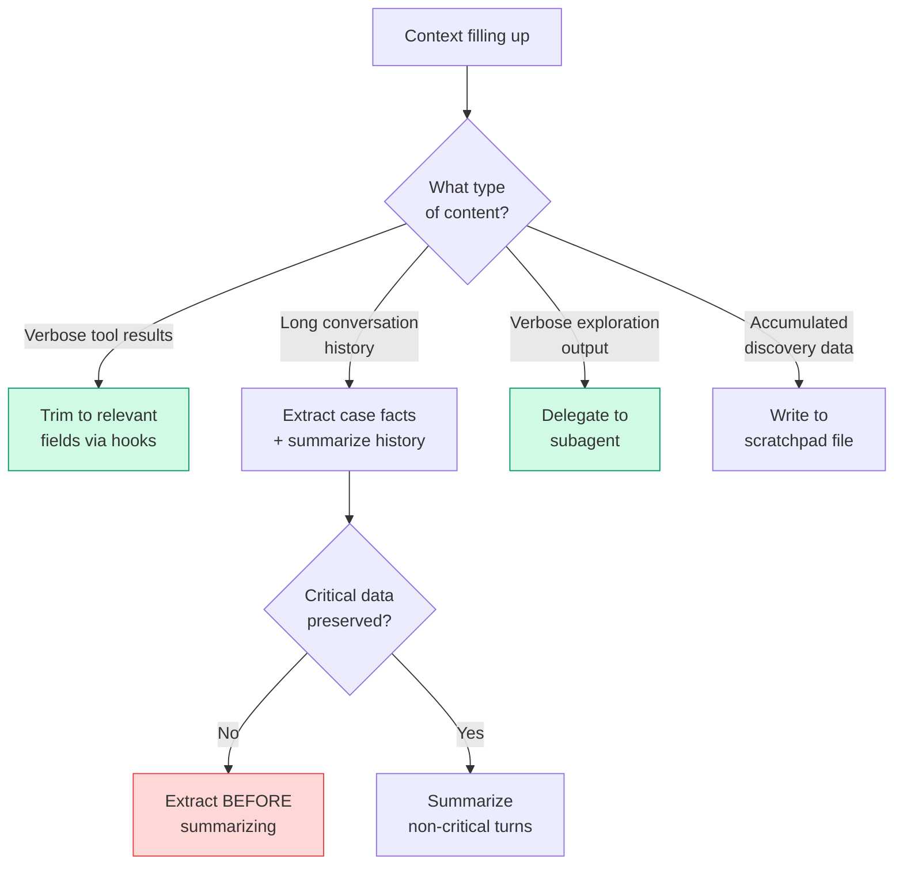
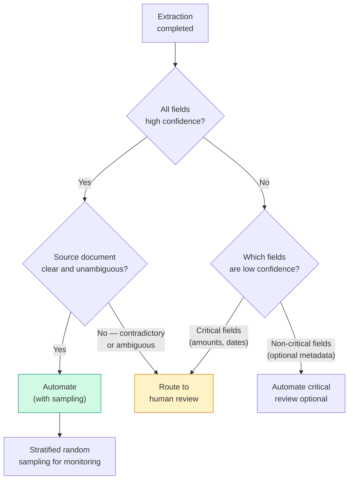
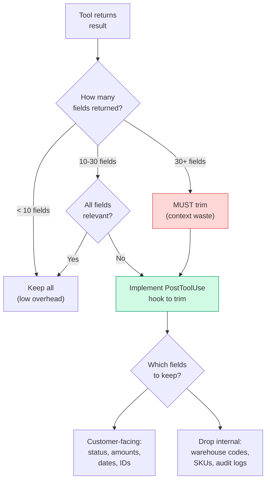

# Domain 5 — Context Management & Reliability (15% of Exam)

> **Exam Weight:** 15% of scored content (lowest weight, but cross-cuts every other domain)
> **Core Principle:** *"Context management is a systems engineering problem, not a prompting problem."*
> **Exam Style:** Scenario-heavy questions testing architectural judgment about context preservation, escalation design, error propagation, codebase exploration, confidence calibration, and information provenance.

---

## Table of Contents

- [[#1 Domain Overview and Exam Strategy]]
- [[#2 Task Statement 5.1 — Manage Conversation Context to Preserve Critical Information Across Long Interactions]]
- [[#3 Task Statement 5.2 — Design Effective Escalation and Ambiguity Resolution Patterns]]
- [[#4 Task Statement 5.3 — Implement Error Propagation Strategies Across Multi-Agent Systems]]
- [[#5 Task Statement 5.4 — Manage Context Effectively in Large Codebase Exploration]]
- [[#6 Task Statement 5.5 — Design Human Review Workflows and Confidence Calibration]]
- [[#7 Task Statement 5.6 — Preserve Information Provenance and Handle Uncertainty in Multi-Source Synthesis]]
- [[#8 Anti-Patterns Master Reference]]
- [[#9 Decision Frameworks and Heuristics]]
- [[#10 Exam-Style Questions With Explanations]]
- [[#11 Memory Anchors]]
- [[#12 Rapid Revision Checklist]]
- [[#13 Top 10 Exam Traps]]
- [[#14 Appendix — Key Technology References]]
- [[#15 Appendix — Scenario Quick Reference]]

---

## 1 Domain Overview and Exam Strategy

### What This Domain Tests

Domain 5 evaluates your ability to design systems that **preserve critical information, degrade gracefully under failures, escalate appropriately, and maintain reliability across complex multi-agent pipelines**. Despite its lower weight (15%), Domain 5 concepts appear as cross-cutting concerns in virtually every exam scenario. Context management failures silently corrupt every other domain's output. Escalation failures cause the most visible production incidents. Error propagation failures cascade across multi-agent systems.

This domain is the connective tissue of the entire exam. You cannot answer Domain 1 (orchestration) questions correctly without understanding error propagation (5.3) and context passing (5.1). You cannot answer Domain 4 (structured output) questions without understanding confidence calibration (5.5) and provenance (5.6). You cannot answer Domain 3 (Claude Code) questions without understanding context degradation (5.4) and session management.

### The Six Task Statements

| Task | Topic | What The Exam Tests |
|------|-------|---------------------|
| 5.1 | Context Preservation | Can you prevent critical data loss during long interactions and manage token budgets? |
| 5.2 | Escalation & Ambiguity | Can you design correct escalation triggers and handle ambiguous customer inputs? |
| 5.3 | Error Propagation | Can you propagate structured errors across multi-agent systems without losing context? |
| 5.4 | Codebase Exploration | Can you manage context degradation during extended code analysis sessions? |
| 5.5 | Human Review & Confidence | Can you calibrate confidence scores and design effective human review routing? |
| 5.6 | Provenance & Uncertainty | Can you preserve source attribution and handle conflicting data in multi-source synthesis? |

### How Domain 5 Connects to Other Domains

Domain 5 is never tested in isolation. It intersects with every other domain:

| Domain 5 Topic | Overlapping Domain | Connection |
|---------------|--------------------|------------|
| Context preservation (5.1) | Domain 1 (Orchestration) | Subagent context passing, coordinator context budgets |
| Escalation patterns (5.2) | Domain 1 (Orchestration) | Escalation triggers, handoff protocols, agent autonomy boundaries |
| Error propagation (5.3) | Domain 1 (Orchestration) | Coordinator error recovery, partial results handling |
| Error propagation (5.3) | Domain 2 (Tool Design) | `isError` flag, structured error responses from MCP tools |
| Codebase exploration (5.4) | Domain 3 (Claude Code) | `/compact`, `--resume`, `fork_session`, scratchpad files |
| Human review routing (5.5) | Domain 4 (Prompt Engineering) | Confidence scoring, validation-retry loops, schema design |
| Provenance preservation (5.6) | Domain 4 (Prompt Engineering) | Structured subagent output schemas, claim-source mappings |
| Context trimming (5.1) | Domain 2 (Tool Design) | PostToolUse hooks for tool output trimming |

### Relevant Exam Scenarios

| Exam Scenario | Domain 5 Topics Tested |
|--------------|----------------------|
| **Scenario 1: Customer Support Agent** | Context preservation (case facts), escalation triggers, ambiguity resolution, structured handoff |
| **Scenario 2: Code Generation with Claude Code** | Context degradation, session management, `/compact` |
| **Scenario 3: Multi-Agent Research System** | Error propagation, provenance tracking, coverage annotations, context passing |
| **Scenario 4: Developer Productivity** | Codebase exploration, scratchpad files, subagent delegation for verbose output |
| **Scenario 6: Structured Data Extraction** | Human review routing, confidence calibration, stratified sampling, field-level accuracy |

### The Cardinal Rule of Domain 5

> **Context management is infrastructure, not an afterthought. Every byte of context that enters the window either helps or hurts. Information that isn't explicitly preserved is silently lost. Errors that aren't structurally propagated become invisible failures.**

---

## 2 Task Statement 5.1 — Manage Conversation Context to Preserve Critical Information Across Long Interactions

### Concept Overview

LLMs process conversation context through a fixed-size context window. Every API request must include all the conversation history the model needs. The model has no persistent memory between requests — if information is not in the context window, it does not exist for the model.

This creates four critical challenges:

1. **Progressive summarization risks** — When conversations grow long, developers summarize prior history to save tokens. But summarization is lossy. Numerical values, percentages, dates, order numbers, and customer-stated expectations get condensed into vague summaries like "customer had a billing issue" when the actual data was "customer was overcharged $47.23 on order #98765 placed on March 14."

2. **The "lost in the middle" effect** — Models reliably process information at the beginning and end of long inputs but may omit or under-weight findings from middle sections. In a 50-page research report aggregated from multiple sources, findings in sections 15-35 receive less attention than those in sections 1-5 and 45-50.

3. **Tool result accumulation** — Tool results (from MCP tools or API calls) consume tokens disproportionate to their relevance. A `lookup_order` call might return 40+ fields per order when only 5 are relevant to the customer's return request. After 3-4 order lookups, tool results dominate the context window.

4. **Conversation history completeness** — Each API request must include the complete conversation history for conversational coherence. Dropping earlier turns causes the model to lose track of what was discussed, creating repetitive or contradictory responses.

### Why It Matters For The Exam

The exam tests this primarily through **Scenario 1 (Customer Support Agent)** and **Scenario 3 (Multi-Agent Research System)**. Common question patterns include:

- "The agent forgets the customer's original complaint after multiple tool calls" → Answer: Extract critical facts into a persistent "case facts" block
- "Research reports omit findings from middle sections" → Answer: Place key findings summaries at the beginning + explicit section headers
- "Context fills up with verbose tool output" → Answer: Trim tool results to relevant fields using PostToolUse hooks
- "Downstream agent produces a report without source details" → Answer: Upstream agents must return structured data (key facts, citations) instead of verbose content

**Tradeoff the exam evaluates:** Token efficiency vs. information completeness. The correct answer always preserves critical data while trimming irrelevant content — never sacrificing essential facts for token savings.

### Production Perspective

In production customer support systems, context management determines whether multi-issue sessions succeed or fail. A customer calls about three separate issues. By the time the agent resolves issue #2, the details of issue #1 have been summarized into oblivion. The customer asks "what about my first issue?" and the agent has no record of the specific amounts, dates, or promised actions.

The production fix is **structured fact extraction** — a separate context layer that persists transactional facts outside the summarized conversation history:

```json
{
  "case_facts": {
    "customer_id": "CUST-12345",
    "issues": [
      {
        "issue_id": 1,
        "order_id": "#98765",
        "type": "damaged_item_return",
        "amount": 149.99,
        "status": "pending_refund",
        "date_reported": "2025-03-14"
      },
      {
        "issue_id": 2,
        "order_id": "#98770",
        "type": "billing_dispute",
        "amount": 47.23,
        "status": "resolved",
        "date_reported": "2025-03-14"
      }
    ]
  }
}
```

This block is included in every prompt, outside the summarized conversation history. Even when conversation history is compressed, the hard facts remain accessible.

### Architecture Diagram — Context Layers



### Code Example — Tool Result Trimming with PostToolUse Hook

```python
# PostToolUse hook that trims verbose tool results
def trim_order_lookup(tool_name, tool_result):
    """Keep only return-relevant fields from order lookups."""
    if tool_name != "lookup_order":
        return tool_result
    
    # Original: 40+ fields including internal IDs, warehouse codes,
    # shipping carrier details, inventory SKUs, etc.
    # Trimmed: only fields relevant to customer-facing operations
    
    relevant_fields = [
        "order_id", "order_date", "status", "items",
        "total_amount", "payment_method", "shipping_address",
        "return_eligible", "return_window_end"
    ]
    
    trimmed = {k: v for k, v in tool_result.items() 
               if k in relevant_fields}
    return trimmed
```

### Code Example — Structured Context Extraction for Multi-Issue Sessions

```python
# After each agent turn, extract structured facts
def extract_case_facts(conversation_history, existing_facts):
    """
    Extract transactional facts into a persistent block.
    This block is included in every prompt OUTSIDE the
    summarized conversation history.
    """
    extraction_prompt = f"""
    Given this conversation, extract all transactional facts.
    
    <existing_facts>
    {json.dumps(existing_facts, indent=2)}
    </existing_facts>
    
    <latest_turn>
    {conversation_history[-1]}
    </latest_turn>
    
    Update the facts block with any new information.
    Preserve all existing facts. Add new issues, amounts,
    dates, order numbers, statuses. Never summarize — 
    keep exact values.
    """
    # Use tool_use to enforce structured output
    return call_claude_extraction(extraction_prompt, 
                                  case_facts_schema)
```

### Code Example — Mitigating Lost-in-the-Middle Effect

```text
# BAD — Key findings buried in the middle of a long report
<research_results>
  <!-- 500 lines of source 1 findings -->
  <!-- 500 lines of source 2 findings — KEY STATISTICS HERE -->
  <!-- 500 lines of source 3 findings -->
  <!-- 500 lines of source 4 findings -->
</research_results>

Synthesize the above findings into a comprehensive report.
```

```text
# GOOD — Key findings summary at the beginning, 
# detailed results organized with headers
<key_findings_summary>
  - Global AI market reached $196B in 2024 (Source 2, p.14)
  - Creative industries adoption grew 340% (Source 2, p.22)
  - Regulatory frameworks differ by region (Source 3, p.8)
</key_findings_summary>

<detailed_results>
  <source_1 title="McKinsey AI Report">
    <!-- Detailed content with section headers -->
  </source_1>
  <source_2 title="TechCrunch Market Analysis">
    <!-- Detailed content with section headers -->
  </source_2>
  <!-- etc. -->
</detailed_results>

Using the key findings summary AND detailed results above,
synthesize a comprehensive report. Verify all statistics 
against the detailed sections.
```

### Code Example — Upstream Agent Structured Output for Context Budget

```python
# BAD — Upstream agent returns verbose reasoning chain
upstream_output = """
I searched for information about AI in creative industries.
First, I found an article on TechCrunch about how AI tools
are being adopted. The article mentions several statistics.
Let me analyze these statistics in context. The first one...
[2000 tokens of reasoning]
In conclusion, the key finding is that AI art tools grew 340%.
"""

# GOOD — Upstream agent returns structured data
upstream_output = {
    "findings": [
        {
            "claim": "AI art tools grew 340% in 2024",
            "evidence": "Market report shows year-over-year growth",
            "source_url": "https://example.com/report",
            "source_name": "TechCrunch Market Analysis",
            "publication_date": "2024-12-15",
            "relevance_score": 0.95
        }
    ],
    "coverage": ["visual_arts", "graphic_design"],
    "gaps": ["music", "film", "gaming", "writing"]
}
# ~200 tokens vs 2000 tokens, with better structure
```

### Code Example — Multi-Issue Context Layer

When a customer session involves multiple distinct issues, a single flat "case facts" block becomes insufficient. The production pattern uses a structured issue tracker as a context layer:

```python
multi_issue_context = {
    "session_id": "sess-20250314-001",
    "customer_id": "CUST-12345",
    "issues": [
        {
            "issue_id": 1,
            "type": "return_request",
            "order_id": "#98765",
            "amount": 149.99,
            "status": "resolved",
            "resolution": "Full refund processed",
            "resolved_at": "2025-03-14T10:15:00Z"
        },
        {
            "issue_id": 2,
            "type": "billing_dispute",
            "order_id": "#98770",
            "amount": 47.23,
            "status": "in_progress",
            "investigation": "Overcharge confirmed, refund pending"
        },
        {
            "issue_id": 3,
            "type": "warranty_claim",
            "order_id": "#98760",
            "amount": 299.00,
            "status": "pending_investigation",
            "customer_expectation": "Replacement or full refund"
        }
    ]
}
```

This structure is injected into every API request. When conversation history is summarized, ALL issue details survive intact. The agent can answer "What about my first issue?" with precise amounts, order numbers, and resolution status.

### Code Example — Conversation History Token Budget Management

```python
def build_api_request(system_prompt, case_facts, 
                       conversation_history, current_message):
    """
    Build the API request with layered context management.
    
    Layer 1: System prompt (always included, full)
    Layer 2: Case facts (always included, structured)
    Layer 3: History (recent full, older summarized)
    Layer 4: Current message (always included, full)
    """
    total_budget = 100000  # example context limit
    reserved_for_response = 4096
    system_tokens = count_tokens(system_prompt)
    facts_tokens = count_tokens(json.dumps(case_facts))
    current_tokens = count_tokens(current_message)
    
    history_budget = (total_budget - reserved_for_response - 
                      system_tokens - facts_tokens - current_tokens)
    
    # Recent turns: keep full (last 3-5 turns)
    recent_turns = conversation_history[-5:]
    recent_tokens = count_tokens(format_turns(recent_turns))
    
    # Older turns: summarize if needed
    older_turns = conversation_history[:-5]
    if count_tokens(format_turns(older_turns)) > \
       (history_budget - recent_tokens):
        older_summary = summarize_history(
            older_turns, 
            budget=history_budget - recent_tokens
        )
    else:
        older_summary = format_turns(older_turns)
    
    return {
        "system": system_prompt,
        "messages": [
            {"role": "user", 
             "content": f"<case_facts>\n"
                        f"{json.dumps(case_facts, indent=2)}\n"
                        f"</case_facts>"},
            {"role": "assistant", 
             "content": "I have the case facts loaded."},
            # ... older summary ...
            # ... recent turns ...
            {"role": "user", "content": current_message}
        ]
    }
```

### Code Example — Upstream Agent Structured Output for Context Budget

When downstream agents have limited context budgets, upstream agents must return structured data instead of verbose content:

```python
# BAD — 2000+ tokens per finding
verbose_output = """
I searched for information about the AI market. I found
several interesting articles. The first article from 
McKinsey discussed market size extensively. After reading
through the methodology section, I determined that their
estimate of $196 billion is based on comprehensive 
industry surveys conducted across 47 countries...
[continues for 1500 more tokens of reasoning]
"""

# GOOD — ~200 tokens per finding  
structured_output = {
    "key_facts": [
        {
            "claim": "Global AI market: $196B in 2024",
            "source": "McKinsey Global AI Report",
            "date": "2025-01-15",
            "confidence": 0.92
        }
    ],
    "citations": [
        {"url": "https://example.com/report", 
         "title": "McKinsey AI"}
    ],
    "relevance_score": 0.95,
    "coverage": ["market_size", "regional_distribution"],
    "gaps": ["adoption_rates_by_industry"]
}
```

The 10x token savings per finding is critical when downstream agents have tight context budgets. For a report synthesizing 50 findings, this is the difference between exceeding context limits and operating within budget.

### Position-Aware Input Ordering — Detailed Strategy

The "lost in the middle" effect has been empirically observed across all LLMs. Information placement in the context window directly affects whether it's used. The mitigation strategy:

1. **Key findings summary at the TOP** — right after system prompt
2. **Detailed sections with explicit headers** — allows model to locate relevant detail
3. **Section headers include keywords** from likely queries — improves within-context retrieval
4. **Current instruction at the END** — benefits from recency bias

The exam tests this by describing scenarios where aggregated research results produce incomplete reports. The correct answer always involves restructuring input positioning, not increasing context window size.

### Common Exam Traps

| Trap | Why It's Wrong | Correct Approach |
|------|---------------|-----------------|
| "Increase context window size to fit everything" | Larger windows don't solve lost-in-the-middle or token waste | Trim irrelevant data, extract key facts, position strategically |
| "Summarize the entire conversation history" | Summarization loses numerical values, dates, amounts | Extract structured facts into a separate persistent block |
| "Pass the full tool result to maintain completeness" | 40-field tool results waste tokens on irrelevant data | Trim to only relevant fields via PostToolUse hooks |
| "Put key findings at the end of the input" | End-position helps, but beginning is most reliable | Place key findings summary at the BEGINNING |
| "Let the downstream agent re-derive facts from raw data" | Wastes the downstream agent's limited context budget | Upstream returns structured data (facts + citations + scores) |
| "Drop older conversation turns to save space" | Losing turns without extracting facts causes information loss | Extract structured facts BEFORE summarizing or dropping turns |
| "Use embedding search to find relevant context" | RAG details are out of scope; doesn't fix in-context management | Structure context with explicit headers and positioning |

---

## 3 Task Statement 5.2 — Design Effective Escalation and Ambiguity Resolution Patterns

### Concept Overview

Escalation is one of the most heavily tested concepts across the entire CCA-F exam. An escalation pattern determines when an AI agent should stop trying to handle a situation autonomously and transfer control to a human. The exam tests whether you can design escalation triggers that are reliable, explicit, and based on observable conditions rather than unreliable proxies.

The core insight is that escalation is a **feature**, not a failure. A well-designed escalation system increases overall system reliability by ensuring that cases outside the agent's capability are handled by humans rather than bungled by the AI.

There are three categories of escalation triggers the exam tests:

**Category 1 — Immediate escalation (no investigation):**
- Customer explicitly requests a human agent → escalate immediately, no questions asked
- This is non-negotiable. Do NOT attempt to "resolve first" when the customer says "give me a human."

**Category 2 — Escalation after assessment:**
- Policy is ambiguous or silent on the customer's request (e.g., competitor price matching when policy only covers own-site adjustments)
- Agent cannot make meaningful progress after reasonable investigation
- Action exceeds agent's authorized limits (dollar threshold, etc.)

**Category 3 — NOT valid escalation triggers:**
- Sentiment-based escalation ("customer sounds angry") → unreliable proxy
- Self-reported confidence scores ("my confidence is 3/10") → uncalibrated, inconsistent
- Case complexity alone ("this seems hard") → not a criterion

**Ambiguity Resolution:**
When tool results return multiple customer matches (e.g., two "John Smith" records), the agent must request additional identifiers (email, phone, address) rather than selecting one based on heuristics (most recent, highest order count, etc.).

### Why It Matters For The Exam

This is tested primarily through **Scenario 1 (Customer Support Agent)** with questions like:

- "Agent achieves 55% first-contact resolution, escalating straightforward cases while handling complex ones" → Answer: Add explicit escalation criteria with few-shot examples
- "Customer asks to match a competitor's price, but policy only covers own-site adjustments" → Answer: Escalate — policy is silent on this scenario
- "Agent returns two customer matches for 'John Smith'" → Answer: Ask for additional identifiers, don't pick one heuristically
- "Customer says 'I want a refund AND a replacement' — agent only addresses one" → Answer: Decompose multi-concern requests into separate tracked issues

**Key exam nuance:** When a customer is frustrated but the issue IS within the agent's capability, the correct behavior is to acknowledge frustration while offering resolution. Escalate ONLY if the customer reiterates their preference for a human after the agent offers to help.

### Production Perspective

In production, escalation miscalibration is the #1 cause of poor first-contact resolution rates. Over-escalation wastes human agent time. Under-escalation leads to customer complaints and incorrect actions.

The production fix is always **explicit escalation criteria with few-shot examples in the system prompt**, NOT sentiment analysis, NOT confidence scoring, NOT complexity heuristics.

### Architecture Diagram — Escalation Decision Flow



### Code Example — Structured Handoff Summary

When an agent escalates to a human, the human agent typically has NO access to the AI conversation transcript. The handoff must include a self-contained structured summary:

```json
{
  "handoff_summary": {
    "customer_id": "CUST-12345",
    "customer_name": "Jane Smith",
    "issue": "Refund request for damaged item",
    "order_id": "#98765",
    "order_date": "2025-03-01",
    "item": "Wireless Headphones (SKU: WH-500)",
    "amount": 149.99,
    "policy_status": "Within 30-day return window",
    "evidence": "Customer provided photo of damaged packaging",
    "investigation_completed": [
      "Verified order exists and is within return window",
      "Confirmed item is eligible for refund",
      "Photo evidence reviewed — damage is visible"
    ],
    "escalation_reason": "Refund amount ($149.99) exceeds agent auto-approval threshold ($100)",
    "recommended_action": "Approve full refund"
  }
}
```

### Code Example — Escalation Criteria in System Prompt

```text
<escalation_rules>
ESCALATE IMMEDIATELY when:
- Customer explicitly asks for a human agent
- Policy does not address the customer's specific request
  (e.g., competitor price matching, cross-account transfers)
- Action exceeds your authorized limits
  (refunds > $100, account modifications, subscription changes)

DO NOT ESCALATE when:
- The issue is a standard return/exchange within policy
- The customer is frustrated but the issue is resolvable
  (acknowledge frustration, offer resolution)
- The case involves multiple issues (decompose and handle each)

AMBIGUITY RESOLUTION:
- If tool results return multiple customer matches:
  ASK for additional identifiers (email, phone, last 4 of card)
  DO NOT select one match based on heuristics

<examples>
Customer: "I want to return my headphones."
Agent action: Check order → process return. DO NOT escalate.

Customer: "Can you match Amazon's price on this item?"
Agent action: ESCALATE — policy is silent on competitor matching.

Customer: "Let me talk to a real person."
Agent action: ESCALATE IMMEDIATELY with handoff summary.
  Do NOT say "Let me try to help first."

Customer: "This is ridiculous! I've been waiting forever!"
Agent action: Acknowledge frustration ("I understand this is
  frustrating"), then offer resolution. Only escalate if customer
  REITERATES preference for human after your offer.
</examples>
</escalation_rules>
```

### Code Example — Ambiguity Resolution for Multiple Matches

```python
# BAD — Heuristic selection from multiple matches
def handle_multiple_customers(matches):
    # Picks the most recent — could be wrong!
    return sorted(matches, key=lambda x: x["last_activity"], 
                  reverse=True)[0]

# GOOD — Request clarification
def handle_multiple_customers(matches):
    return {
        "action": "request_clarification",
        "message": "I found multiple accounts matching that name. "
                   "Could you provide your email address or the "
                   "last four digits of the card on file so I can "
                   "pull up the correct account?",
        "match_count": len(matches)
    }
```

### Common Exam Traps

| Trap | Why It's Wrong | Correct Approach |
|------|---------------|-----------------|
| "Use sentiment analysis to detect when to escalate" | Sentiment doesn't correlate with case complexity | Use explicit escalation criteria based on observable conditions |
| "Have the agent self-report confidence (1-10)" | Self-reported confidence is poorly calibrated | Define explicit rules for what to escalate vs. resolve |
| "Always attempt resolution before escalating" | Violates immediate escalation rule for explicit human requests | Honor explicit human requests immediately |
| "Escalate complex cases automatically" | Complexity alone isn't an escalation criterion | Escalate on policy gaps, unauthorized actions, inability to progress |
| "Pick the most likely match when multiple customers found" | Heuristic selection causes misidentified accounts | Always request additional identifiers for disambiguation |
| "Route frustrated customers to humans automatically" | Frustrated customers may have simple resolvable issues | Acknowledge frustration, offer resolution, escalate on reiteration |

### Multi-Concern Request Decomposition

A critical production pattern the exam tests: customers often present multiple issues in a single message. The agent must decompose these into individually tracked concerns:

```text
Customer: "I need to return the headphones from my last order, 
I was also overcharged on my February order, and my warranty 
claim from last month was never resolved."

AGENT DECOMPOSITION:
Issue 1: Return request — headphones (most recent order)
Issue 2: Billing dispute — overcharge (February order)
Issue 3: Warranty claim follow-up — (last month, unresolved)

AGENT PLAN:
1. Verify customer identity (get_customer)
2. Look up each order sequentially
3. Handle each issue independently
4. Synthesize a unified response covering all three
```

The anti-pattern is handling only the first or most prominent issue and ignoring the others. The exam tests this by describing a scenario where the agent resolves one issue but the customer is unsatisfied because the other issues were not addressed.

### Escalation vs Resolution — The Gray Zone

The exam specifically tests the gray zone between escalation and autonomous resolution. Here are the exact patterns from the exam guide:

| Customer Situation | Correct Action | Why |
|-------------------|---------------|-----|
| Standard return within policy, customer calm | Resolve autonomously | Straightforward, within capability |
| Standard return within policy, customer furious | Acknowledge frustration, offer resolution | Issue IS resolvable; anger alone is not an escalation trigger |
| Customer furious, says "I want a manager" | ESCALATE immediately | Explicit human request — no investigation |
| Competitor price matching request | ESCALATE | Policy is silent on this — policy gap |
| Refund exceeds agent dollar threshold | ESCALATE | Unauthorized action — programmatic limit |
| Complex multi-issue session, all within policy | Resolve with decomposition | Complex ≠ escalation. Decompose and handle |
| Customer asks about a promotion not in the system | ESCALATE | Policy gap — agent can't make promises about unknown promotions |

### Production Pattern — Programmatic Escalation Gates

For financial or compliance-critical escalation triggers, use programmatic hooks (from Domain 1) rather than prompt instructions:

```python
# PostToolUse hook for financial threshold enforcement
def check_refund_threshold(tool_name, tool_input):
    """
    Deterministic enforcement: refunds > $100 ALWAYS escalate.
    This cannot be left to prompt compliance (97% isn't 100%).
    """
    if tool_name == "process_refund":
        amount = tool_input.get("amount", 0)
        if amount > 100:
            return {
                "action": "block_and_escalate",
                "reason": f"Refund amount ${amount} exceeds "
                          f"auto-approval threshold ($100)",
                "redirect_to": "escalate_to_human",
                "handoff_data": {
                    "customer_id": tool_input["customer_id"],
                    "refund_amount": amount,
                    "order_id": tool_input["order_id"],
                    "recommended_action": "approve_refund"
                }
            }
    return None  # Allow execution
```

This pattern connects to Domain 1 (hooks = deterministic enforcement for critical rules) and Domain 2 (structured tool responses). The exam frequently tests the boundary between "use a hook" (100% enforcement required) and "use prompt instructions" (probabilistic compliance acceptable).

---

## 4 Task Statement 5.3 — Implement Error Propagation Strategies Across Multi-Agent Systems

### Concept Overview

In multi-agent systems, errors in one subagent must flow back to the coordinator with enough context for the coordinator to make intelligent recovery decisions. The coordinator needs to know:

1. **What type of failure occurred** (timeout, permission denied, invalid query, no results)
2. **What was attempted** (the specific query or operation that failed)
3. **What partial results exist** (anything recovered before the failure)
4. **What alternatives are possible** (retry with modified query, use different source, proceed without)

There are two critical distinctions the exam tests:

**Access failures vs. valid empty results:**
- **Access failure:** Web search timed out → the search didn't complete, retry may succeed
- **Valid empty result:** Search completed successfully but found no matches → don't retry, the data doesn't exist

These require completely different recovery strategies. A generic "search unavailable" status hides this crucial distinction from the coordinator.

**Two anti-patterns the exam specifically targets:**
1. **Silent error suppression:** Catching an error and returning empty results marked as successful. This prevents any recovery and risks incomplete outputs that appear complete.
2. **Workflow termination on single failure:** Propagating an exception to a top-level handler that kills the entire research pipeline. This wastes successful work from other subagents.

### Why It Matters For The Exam

This is tested primarily through **Scenario 3 (Multi-Agent Research System)** with the exact sample question from the exam guide:

> "The web search subagent times out while researching a complex topic. How should failure information flow back to the coordinator?"

The correct answer is always: **Return structured error context** including failure type, attempted query, partial results, and alternative approaches. This gives the coordinator everything it needs to decide: retry with a modified query, try an alternative approach, or proceed with partial results while annotating the coverage gap.

### Production Perspective

In production multi-agent research systems, the coordinator must proceed with partial results when subagents fail. The key is that the final output must annotate coverage gaps so the consumer knows which sections are well-supported vs. which have missing sources.

The pattern is:
1. Subagent attempts local recovery for transient failures (retry with backoff)
2. Subagent only propagates errors it cannot resolve
3. Propagated errors include structured context (type, query, partial results)
4. Coordinator decides: retry, alternative approach, or proceed with gap annotation
5. Final synthesis output includes coverage annotations

### Architecture Diagram — Error Propagation Flow



### Code Example — Structured Error Response

```json
{
  "status": "error",
  "error": {
    "type": "timeout",
    "retryable": true,
    "attempted_query": "AI impact on music industry 2024 statistics",
    "partial_results": [
      {
        "claim": "Streaming platforms using AI for recommendations",
        "source": "MusicTech Magazine",
        "confidence": 0.7
      }
    ],
    "alternatives": [
      "Retry with narrower query: 'AI music composition tools 2024'",
      "Try alternative source: academic databases instead of web"
    ],
    "duration_ms": 30000
  }
}
```

Compare this to the anti-patterns:

```json
// ANTI-PATTERN 1: Silent suppression
{
  "status": "success",
  "results": []  // Looks like "no data exists" — actually search failed
}

// ANTI-PATTERN 2: Generic error
{
  "status": "error",
  "message": "search unavailable"  
  // Coordinator can't decide: retry? modify query? skip?
}
```

### Code Example — Coordinator Recovery Logic

```python
def handle_subagent_result(result, task):
    if result["status"] == "success":
        return result["findings"]
    
    error = result["error"]
    
    if error["retryable"] and task.retry_count < 3:
        # Modify query and retry
        modified_query = narrow_query(error["attempted_query"])
        task.retry_count += 1
        return dispatch_subagent(task, query=modified_query)
    
    if error.get("partial_results"):
        # Proceed with partial results + annotate gap
        return {
            "findings": error["partial_results"],
            "coverage_gap": {
                "topic": task.topic,
                "reason": f"Subagent {error['type']}: "
                         f"{error['attempted_query']}",
                "confidence": "low — partial results only"
            }
        }
    
    # No results at all — annotate the gap
    return {
        "findings": [],
        "coverage_gap": {
            "topic": task.topic,
            "reason": f"No data available: {error['type']}",
            "confidence": "none"
        }
    }
```

### Code Example — Synthesis Output with Coverage Annotations

```json
{
  "report": {
    "title": "AI Impact on Creative Industries",
    "sections": [
      {
        "topic": "Visual Arts",
        "coverage": "well-supported",
        "sources": 5,
        "findings": ["..."]
      },
      {
        "topic": "Music",
        "coverage": "partial — web search timed out",
        "sources": 1,
        "findings": ["Limited: only streaming recommendations data"],
        "gap_note": "Statistics on AI music composition unavailable"
      },
      {
        "topic": "Film",
        "coverage": "unavailable",
        "sources": 0,
        "findings": [],
        "gap_note": "Research subagent failed; no film industry data"
      }
    ]
  }
}
```

### Common Exam Traps

| Trap | Why It's Wrong | Correct Approach |
|------|---------------|-----------------|
| "Return generic 'search unavailable' status" | Hides failure type, query context, and partial results from coordinator | Return structured error context with all recovery-relevant information |
| "Catch errors and return empty results as success" | Prevents recovery; makes incomplete output look complete | Always flag errors explicitly with `isError` or structured error type |
| "Terminate entire workflow on single subagent failure" | Wastes successful work from other subagents | Coordinator proceeds with partial results and annotates coverage gaps |
| "Let subagent retry indefinitely" | Unbounded retries can hang the entire pipeline | Local retry with bounded attempts; then propagate to coordinator |
| "Treat timeout the same as empty results" | Timeout is retryable; empty results means data doesn't exist | Distinguish access failures from valid empty results |
| "Use a try/catch that logs and continues silently" | Logging without propagating prevents coordinator from making decisions | Always propagate error context to the coordinator |

### Error Type Taxonomy — What the Exam Tests

The exam requires you to distinguish between error categories because each requires a different recovery strategy:

| Error Type | Example | Retryable? | Correct Recovery |
|-----------|---------|-----------|-----------------|
| **Transient** | Timeout, rate limit, temporary outage | Yes | Retry with exponential backoff |
| **Permission** | 403 Forbidden, invalid credentials | Sometimes | Coordinator may need different credentials or alternative approach |
| **Validation** | Malformed query, invalid parameters | Yes (with modification) | Fix the query and retry |
| **Business** | "Order not found", "Customer not eligible" | No | Communicate to user, don't retry |
| **Data absence** | Search completed, no matches | No | Accept null, annotate gap, do NOT retry |
| **Partial success** | 3 of 5 sources returned | Partially | Use available results, retry failed sources, annotate gaps |

The critical distinction the exam tests repeatedly: a **timeout** (transient — the search never completed) vs. **no results found** (data absence — the search completed but found nothing). The recovery strategy is completely different. Retrying a "no results" query wastes resources because the data genuinely doesn't exist.

### Production Pattern — Error Context for Coordinator Decision

```python
# Complete structured error response template
error_response = {
    "status": "error",
    "error": {
        # What type of failure — determines recovery strategy
        "type": "timeout",  # timeout|permission|validation|business|data_absence
        
        # Can the coordinator retry this?
        "retryable": True,
        
        # What exactly was attempted?
        "attempted_query": "AI impact on music industry 2024 statistics",
        "attempted_source": "web_search",
        "duration_ms": 30000,
        
        # Did we get ANYTHING before failure?
        "partial_results": [
            {
                "claim": "Streaming AI recommendations used by Spotify",
                "source": "MusicTech Magazine",
                "confidence": 0.7
            }
        ],
        
        # What could the coordinator try instead?
        "alternatives": [
            "Retry with narrower query: 'AI music composition tools'",
            "Try academic database instead of web search",
            "Try news archive for industry reports"
        ],
        
        # For coordinator logging and observability
        "agent_id": "web_search_agent",
        "retry_count": 2,
        "max_retries": 3
    }
}
```

### Production Pattern — Coordinator Aggregation with Coverage Tracking

```python
def aggregate_subagent_results(results):
    """
    Aggregate results from multiple subagents.
    Track coverage gaps for synthesis output annotation.
    """
    successful_findings = []
    coverage_map = {}
    gaps = []
    
    for topic, result in results.items():
        if result["status"] == "success":
            successful_findings.extend(result["findings"])
            coverage_map[topic] = {
                "status": "well-supported",
                "source_count": len(result["findings"]),
                "confidence": "high"
            }
        elif result.get("error", {}).get("partial_results"):
            successful_findings.extend(
                result["error"]["partial_results"]
            )
            coverage_map[topic] = {
                "status": "partial",
                "source_count": len(result["error"]["partial_results"]),
                "confidence": "low",
                "gap_reason": result["error"]["type"]
            }
            gaps.append({
                "topic": topic,
                "reason": result["error"]["type"],
                "impact": "Findings may be incomplete"
            })
        else:
            coverage_map[topic] = {
                "status": "unavailable",
                "source_count": 0,
                "confidence": "none",
                "gap_reason": result["error"]["type"]
            }
            gaps.append({
                "topic": topic,
                "reason": result["error"]["type"],
                "impact": "No data available for this section"
            })
    
    return {
        "findings": successful_findings,
        "coverage_map": coverage_map,
        "gaps": gaps,
        "total_sources": len(successful_findings),
        "topics_fully_covered": sum(
            1 for c in coverage_map.values() 
            if c["status"] == "well-supported"
        ),
        "topics_with_gaps": len(gaps)
    }
```

---

## 5 Task Statement 5.4 — Manage Context Effectively in Large Codebase Exploration

### Concept Overview

When using Claude Code (or Claude-based agents) to analyze large codebases, extended sessions create a specific failure mode: **context degradation**. As the session progresses and the context window fills with discovery output, the model starts giving inconsistent answers and referencing "typical patterns" rather than specific classes and methods it discovered earlier.

This happens because:
1. Earlier findings get pushed to the middle of the context where they receive less attention (lost-in-the-middle effect)
2. Verbose exploration output (file listings, dependency trees, full source code) consumes context budget rapidly
3. The model's effective recall of specific details degrades as context fills

The exam tests four strategies for managing this:

**Strategy 1 — Scratchpad files:** Write key findings to disk as the exploration progresses. Reference these files for subsequent questions instead of relying on in-context memory.

**Strategy 2 — Subagent delegation:** Spawn subagents to investigate specific questions (e.g., "find all test files," "trace refund flow dependencies") while the main agent preserves high-level coordination. The subagent's verbose output stays in its isolated context; only the summary returns.

**Strategy 3 — Phase-based summarization:** Summarize key findings from one exploration phase before starting the next. Inject summaries into the initial context of the new phase.

**Strategy 4 — `/compact` for context reduction:** When context fills with verbose discovery output during extended sessions, use `/compact` to reduce context usage. This is a remediation strategy — prevention (subagent isolation) is preferred.

**Crash recovery** is also tested: Each agent exports its state to a known location, and the coordinator loads a manifest on resume and injects it into agent prompts. This enables recovery from crashes without losing analysis progress.

### Why It Matters For The Exam

This is tested through **Scenario 2 (Code Generation)** and **Scenario 4 (Developer Productivity)**. Key question patterns:

- "After two hours of codebase analysis, Claude starts referencing 'typical patterns' instead of specific classes" → Answer: Use scratchpad files to persist findings across context boundaries
- "Codebase exploration fills context with verbose file listings" → Answer: Use `context: fork` skills or subagent delegation to isolate verbose output
- "Analysis session crashes — how to recover progress?" → Answer: Structured state exports (manifests) that the coordinator loads on resume
- "Extended session context is full of verbose output" → Answer: Use `/compact` to reduce context, but prevention via subagents is better

### Production Perspective

In production codebase analysis:

- Engineers use named sessions (`--resume analysis-v1`) to continue work across days
- `fork_session` creates parallel exploration branches (e.g., comparing two refactoring approaches)
- Scratchpad files (`/tmp/analysis-notes.md`) persist findings that transcend context boundaries
- Subagents handle verbose discovery (listing all files, reading source) while the main agent coordinates high-level understanding

### Architecture Diagram — Context-Managed Codebase Exploration



### Code Example — Scratchpad File for Persistent Findings

```markdown
# Codebase Analysis — Scratchpad
## Updated: 2025-03-14 14:30

### Module Structure (15 modules identified)
- auth/ — Authentication (OAuth2, JWT)
- payments/ — Payment processing (Stripe integration)
- orders/ — Order management (state machine: draft→submitted→approved)
- inventory/ — Stock tracking (event-sourced)

### Key Dependencies
- auth → payments (auth required for payment processing)
- orders → inventory (stock check before order submission)
- orders → payments (payment triggered on order approval)

### Critical Findings
- payments/refund.ts has NO unit tests
- auth/jwt.ts uses deprecated jsonwebtoken v8 (CVE-2022-23529)
- orders/state-machine.ts has race condition on concurrent approvals
```

### Code Example — Crash Recovery via State Manifest

```json
{
  "manifest": {
    "session_id": "analysis-v1",
    "timestamp": "2025-03-14T14:30:00Z",
    "completed_phases": [
      "structure_discovery",
      "dependency_mapping"
    ],
    "current_phase": "security_audit",
    "modules_analyzed": ["auth", "payments", "orders"],
    "modules_remaining": ["inventory", "notifications", "reports"],
    "key_findings_file": "/tmp/analysis-notes.md",
    "critical_issues": [
      "auth/jwt.ts: deprecated library CVE-2022-23529",
      "payments/refund.ts: missing test coverage"
    ]
  }
}
```

```python
# On resume, load manifest and inject into agent prompt
manifest = load_manifest("analysis-v1")
resume_prompt = f"""
You are resuming a codebase analysis session.

<session_state>
Completed phases: {manifest["completed_phases"]}
Current phase: {manifest["current_phase"]}
Modules analyzed: {manifest["modules_analyzed"]}
Modules remaining: {manifest["modules_remaining"]}

Key findings from prior work:
{read_file(manifest["key_findings_file"])}

Critical issues found so far:
{format_issues(manifest["critical_issues"])}
</session_state>

Continue the {manifest["current_phase"]} phase, starting
with module: {manifest["modules_remaining"][0]}
"""
```

### Common Exam Traps

| Trap | Why It's Wrong | Correct Approach |
|------|---------------|-----------------|
| "Increase the context window" | Context degradation is about attention quality, not capacity | Use scratchpad files and subagent delegation |
| "Use `/compact` from the start" | `/compact` is remediation; prevention is better | Use subagents to isolate verbose output from the start |
| "Start fresh each session" | Loses all prior analysis, wastes time re-discovering | Use `--resume` or load from state manifests |
| "Keep all discovery output in main context" | Verbose output fills context and causes degradation | Delegate verbose work to subagents; keep only summaries |
| "Resume session when prior tool results are stale" | Stale context leads to incorrect assumptions | Fresh session + structured summary when many files changed |
| "Store findings only in context, not on disk" | Context is volatile; findings lost on degradation | Write findings to scratchpad files on disk for persistence |

### Session Management Decision Matrix

The exam tests whether you can select the correct session strategy based on conditions:

| Condition | Strategy | Rationale |
|-----------|----------|-----------|
| Prior analysis valid, minor file changes | `--resume <name>` + inform about specific changes | Preserves valid context; targeted re-analysis saves time |
| Many files changed overnight, results stale | Fresh session + structured summary of prior findings | Stale context causes incorrect dependency analysis |
| Want to compare two refactoring approaches | `fork_session` from shared baseline | Parallel exploration branches from common starting point |
| Session crashed mid-analysis | Load state manifest → inject into new session prompt | Manifest records completed phases, key findings, remaining work |
| Context full of verbose file listings | `/compact` to reduce context usage | Remediation — but prevention (subagent isolation) is preferred |
| Codebase analysis skill produces verbose output | Add `context: fork` to SKILL.md frontmatter | Skill runs in isolated sub-agent context; only summary returns |

### Code Example — Skill Isolation with context: fork

When a codebase analysis skill produces verbose output that would pollute the main context, use the `context: fork` frontmatter option:

```markdown
# .claude/skills/analyze-codebase/SKILL.md
---
context: fork
allowed-tools:
  - Read
  - Grep
  - Glob
  - Bash
argument-hint: "Path to analyze (e.g., src/auth/)"
---

Analyze the specified directory and produce a structured 
summary of:
- Module structure and responsibilities
- Key classes and their relationships
- Dependency chains
- Test coverage gaps
- Security concerns

Output a JSON summary with these sections.
Do NOT include full file contents in the summary.
```

With `context: fork`, the skill runs in an isolated sub-agent context. The verbose Grep, Glob, and Read outputs stay in the sub-agent's context. Only the structured JSON summary returns to the main conversation, preserving context budget for subsequent work.

Without `context: fork`, the same skill would dump 50+ file listings and source code excerpts into the main context, consuming most of the context budget and causing degradation for subsequent implementation tasks.

### Code Example — Phase-Based Exploration with Summarization

```python
# Phase 1: High-level structure discovery
phase_1_prompt = """
Explore the codebase at /src and produce:
1. List of top-level modules with brief descriptions
2. Major dependency relationships between modules
3. Entry points and main execution paths

Write your findings to /tmp/phase1-findings.md
"""

# After Phase 1 completes, summarize for Phase 2
phase_2_prompt = """
<prior_findings>
{read_file("/tmp/phase1-findings.md")}
</prior_findings>

Based on the module structure identified above, 
investigate the authentication module specifically:
1. Trace the auth flow from login to token validation
2. Identify all security-relevant code paths
3. Check for known vulnerability patterns

Write your findings to /tmp/phase2-auth-findings.md
"""

# Phase 3: Cross-cutting analysis using both phases
phase_3_prompt = """
<module_structure>
{read_file("/tmp/phase1-findings.md")}
</module_structure>

<auth_analysis>
{read_file("/tmp/phase2-auth-findings.md")}
</auth_analysis>

Now analyze how authentication integrates with the 
payment and order modules. Focus on:
1. Which payment operations require authentication
2. Whether token validation is consistent across modules
3. Race conditions in concurrent auth/payment flows
"""
```

Each phase builds on prior findings via scratchpad files rather than relying on in-context memory. This pattern is critical for multi-day analysis efforts.

---

## 6 Task Statement 5.5 — Design Human Review Workflows and Confidence Calibration

### Concept Overview

Not all AI outputs should be trusted equally. In extraction and classification systems, some outputs are high-confidence (clear source document, unambiguous data) and others are low-confidence (ambiguous source, contradictory data, novel document format). A well-designed system routes low-confidence outputs to human review while automating high-confidence ones.

The exam tests four critical concepts:

**Concept 1 — Aggregate accuracy masks segment failures:**
A system might show 97% overall accuracy but have 60% accuracy on medical invoices and 40% accuracy on handwritten receipts. Aggregate metrics hide these failures. You must validate accuracy **by document type AND by field** before automating any segment.

**Concept 2 — Field-level confidence scoring:**
Rather than a single confidence score per extraction, each field gets its own score. A confident extraction of "vendor_name" (clearly printed at the top) coexists with an uncertain "invoice_date" (handwritten, partially obscured). This enables field-level routing: most fields auto-processed, uncertain fields sent to human review.

**Concept 3 — Calibration with labeled validation sets:**
Raw model confidence scores are not calibrated — a model saying "0.9 confidence" doesn't mean 90% accuracy. You calibrate by running the model against documents with known-correct answers (labeled validation sets) and adjusting thresholds until the declared confidence matches actual accuracy.

**Concept 4 — Stratified random sampling:**
Even after calibration, you must monitor ongoing accuracy in high-confidence extractions. Stratified random sampling selects a representative sample across document types and fields for human verification. This detects novel error patterns that calibration didn't anticipate.

### Why It Matters For The Exam

This is tested through **Scenario 6 (Structured Data Extraction)** with patterns like:

- "System shows 97% accuracy but clients report errors in medical invoices" → Answer: Analyze accuracy by document type and field segment
- "How to determine when to reduce human review" → Answer: Validate consistent performance across ALL segments using stratified sampling
- "Model reports high confidence but extractions contain errors" → Answer: Calibrate confidence thresholds using labeled validation sets
- "Limited reviewer capacity — how to prioritize?" → Answer: Route low-confidence + ambiguous source documents to human review

### Production Perspective

In production extraction pipelines:

1. All extractions initially go through human review (full review phase)
2. Field-level confidence scores are captured and compared against human corrections
3. Calibration adjusts thresholds until model confidence = actual accuracy
4. Segments are progressively automated ONLY when accuracy is validated for that specific segment
5. Stratified sampling continues to monitor automated segments for novel error patterns
6. Any segment that drops below threshold returns to full human review

### Architecture Diagram — Confidence-Based Review Routing



### Code Example — Field-Level Confidence Scoring

```json
{
  "extraction": {
    "vendor_name": {
      "value": "Acme Corporation",
      "confidence": 0.95,
      "source_location": "Header, top-left"
    },
    "invoice_date": {
      "value": "2025-03-14",
      "confidence": 0.45,
      "source_location": "Handwritten, partially obscured",
      "review_flag": true
    },
    "total_amount": {
      "value": 1250.00,
      "confidence": 0.88,
      "source_location": "Bottom-right, printed"
    },
    "line_items": {
      "value": [{"description": "Widget A", "qty": 10, "price": 125.00}],
      "confidence": 0.92,
      "source_location": "Table, rows 3-5"
    }
  },
  "overall_confidence": 0.72,
  "review_required": true,
  "review_reason": "Low confidence on invoice_date field"
}
```

### Code Example — Stratified Sampling Implementation

```python
def select_for_review(extractions, sample_rate=0.05):
    """
    Stratified random sampling: select a representative sample
    across document types and fields for human verification.
    
    This catches errors in high-confidence extractions that 
    calibration didn't anticipate.
    """
    strata = {}
    for ext in extractions:
        doc_type = ext["document_type"]
        if doc_type not in strata:
            strata[doc_type] = []
        strata[doc_type].append(ext)
    
    selected = []
    for doc_type, docs in strata.items():
        # Sample at least 1 from each stratum
        n_samples = max(1, int(len(docs) * sample_rate))
        selected.extend(random.sample(docs, n_samples))
    
    return selected

def analyze_accuracy_by_segment(verified_samples):
    """
    CRITICAL: Analyze accuracy by document type AND field,
    not just aggregate. 97% overall may hide 40% accuracy
    on handwritten receipts.
    """
    accuracy = {}
    for sample in verified_samples:
        doc_type = sample["document_type"]
        if doc_type not in accuracy:
            accuracy[doc_type] = {"fields": {}, "total": 0, 
                                  "correct": 0}
        
        accuracy[doc_type]["total"] += 1
        all_correct = True
        
        for field, data in sample["extraction"].items():
            if field not in accuracy[doc_type]["fields"]:
                accuracy[doc_type]["fields"][field] = {
                    "total": 0, "correct": 0
                }
            accuracy[doc_type]["fields"][field]["total"] += 1
            
            if data["value"] == sample["ground_truth"][field]:
                accuracy[doc_type]["fields"][field]["correct"] += 1
            else:
                all_correct = False
        
        if all_correct:
            accuracy[doc_type]["correct"] += 1
    
    return accuracy
```

### Common Exam Traps

| Trap | Why It's Wrong | Correct Approach |
|------|---------------|-----------------|
| "97% overall accuracy means we can automate" | Aggregate metrics mask poor performance on specific segments | Validate accuracy by document type AND field before automating |
| "Model says 0.9 confidence, so it's 90% accurate" | Raw model confidence is uncalibrated | Calibrate thresholds using labeled validation sets |
| "Automate all high-confidence extractions immediately" | Novel error patterns can emerge in any segment | Continue stratified sampling even after automation |
| "Route ALL extractions to human review for safety" | Wastes limited reviewer capacity on confident extractions | Route only low-confidence + ambiguous cases to humans |
| "Use a single confidence threshold for all document types" | Different document types have different error profiles | Calibrate thresholds per document type and field |
| "Stop sampling once calibration is complete" | New document formats and edge cases emerge over time | Ongoing stratified sampling detects novel error patterns |

### Progressive Automation Workflow

The exam tests whether you understand the correct sequence for reducing human review. The sequence is always:

```
Phase 1: Full Human Review
├── All extractions reviewed by humans
├── Collect: ground truth labels for every extraction
├── Output: labeled validation set for calibration
│
Phase 2: Calibration
├── Run model on labeled validation set
├── Compare model confidence scores to actual accuracy
├── Adjust thresholds until declared confidence ≈ actual accuracy
├── Analyze accuracy by document type AND by field
│
Phase 3: Segment-by-Segment Automation
├── For each document type × field combination:
│   ├── Is accuracy ≥ threshold for ALL segments? → Automate
│   └── Is accuracy < threshold for ANY segment? → Keep in review
├── Never automate an entire pipeline at once
├── Automate the MOST confident segments first
│
Phase 4: Ongoing Monitoring
├── Stratified random sampling of automated extractions
├── Sample rate: ~5% across ALL segments
├── Compare sample accuracy to calibrated expectations
├── If accuracy drops → return segment to human review
├── If novel document format appears → human review first
```

### Code Example — Calibration Against Labeled Validation Set

```python
def calibrate_confidence_thresholds(model, labeled_docs):
    """
    Run the model on documents with known correct answers.
    Find the threshold where model confidence = actual accuracy.
    
    Example: If model says confidence=0.85, we want 85% of
    those extractions to actually be correct.
    """
    predictions = []
    for doc in labeled_docs:
        extraction = model.extract(doc["content"])
        for field_name, field_data in extraction.items():
            predictions.append({
                "doc_type": doc["type"],
                "field": field_name,
                "confidence": field_data["confidence"],
                "correct": field_data["value"] == \
                    doc["ground_truth"][field_name]
            })
    
    # Group by document type and field
    segments = {}
    for pred in predictions:
        key = (pred["doc_type"], pred["field"])
        if key not in segments:
            segments[key] = []
        segments[key].append(pred)
    
    # Find threshold per segment where confidence ≈ accuracy
    thresholds = {}
    for (doc_type, field), preds in segments.items():
        # Sort by confidence and find the cutoff
        preds.sort(key=lambda x: x["confidence"], reverse=True)
        
        # Binary search for threshold where accuracy ≥ 95%
        best_threshold = 1.0
        for threshold in [0.9, 0.85, 0.8, 0.75, 0.7]:
            above = [p for p in preds if p["confidence"] >= threshold]
            if above:
                accuracy = sum(p["correct"] for p in above) / len(above)
                if accuracy >= 0.95:
                    best_threshold = threshold
        
        thresholds[(doc_type, field)] = {
            "threshold": best_threshold,
            "sample_accuracy": accuracy,
            "sample_size": len(preds)
        }
    
    return thresholds
```

### The 97% Trap — Detailed Example

This is one of the most commonly tested patterns in the exam. Here's the full scenario:

| Document Type | Count | Accuracy | Impact |
|--------------|-------|----------|--------|
| Standard invoices | 7,000 | 99.1% | Low error rate — safe to automate |
| Purchase orders | 2,000 | 98.0% | Acceptable — consider automation |
| Medical invoices | 500 | 72.0% | DANGEROUS — must remain in review |
| Handwritten receipts | 300 | 41.0% | CRITICAL — do not automate |
| Legal contracts | 200 | 95.0% | Borderline — needs field-level analysis |

**Aggregate accuracy: 97.0%** (7000×0.991 + 2000×0.98 + 500×0.72 + 300×0.41 + 200×0.95) / 10000 ≈ 0.97

The 97% headline hides catastrophic failures on medical invoices and handwritten receipts. Automating the entire pipeline would propagate errors in 28% of medical invoices and 59% of handwritten receipts to downstream systems.

The correct approach: automate standard invoices and purchase orders (high accuracy). Keep medical invoices, handwritten receipts, and legal contracts in human review until those specific segments achieve acceptable accuracy.

---

## 7 Task Statement 5.6 — Preserve Information Provenance and Handle Uncertainty in Multi-Source Synthesis

### Concept Overview

When multiple subagents gather information from different sources and a synthesis agent combines them into a report, **provenance** — the chain of attribution from claim to source — is routinely lost. This happens because summarization steps compress findings without preserving claim-source mappings.

The exam tests four specific provenance challenges:

**Challenge 1 — Attribution loss during summarization:**
A web search subagent finds "AI market reached $196B in 2024 (McKinsey Report)" and a document analysis subagent finds "AI market projected at $210B (Gartner Forecast)." During synthesis, both get merged into "AI market is approximately $200B" with no source attribution and no indication that two different sources gave different numbers.

**Challenge 2 — Conflicting statistics from credible sources:**
Two credible sources report different statistics for the same metric. The correct approach is to **annotate the conflict with source attribution**, NOT arbitrarily select one value. The report should present both with their sources and let the reader evaluate.

**Challenge 3 — Temporal data misinterpretation:**
One source reports 2023 data and another reports 2024 data. Without publication dates in the structured output, the synthesis agent may interpret a legitimate year-over-year change as a "contradiction" between sources.

**Challenge 4 — Content type rendering:**
Financial data should be rendered as tables, news as prose, technical findings as structured lists. Converting everything to a uniform format loses information and readability.

### Why It Matters For The Exam

This is tested through **Scenario 3 (Multi-Agent Research System)** with patterns like:

- "Synthesis report lacks source citations despite subagents finding sources" → Answer: Subagents must output structured claim-source mappings; coordinator must pass metadata to synthesis
- "Report arbitrarily picks one statistic when sources conflict" → Answer: Annotate conflicts with source attribution, present both values
- "Synthesis treats 2023 data as contradicting 2024 data" → Answer: Require publication dates in subagent output for temporal disambiguation
- "Report shows well-established findings mixed with contested ones" → Answer: Structure reports with explicit sections for well-established vs. contested findings

**Critical exam insight:** The root cause of missing citations in synthesis output is almost always that **the coordinator is not passing source metadata to the synthesis subagent** — only the content findings. Remember: subagents have isolated context. If the coordinator strips URLs, dates, and source names when passing data, the synthesis agent literally cannot cite sources it never received.

### Production Perspective

In production research systems:

1. Subagents output structured claim-source mappings (claim, evidence, source URL, source name, publication date)
2. The coordinator preserves ALL metadata when passing to synthesis
3. The synthesis agent is explicitly instructed to preserve claim-source mappings
4. Conflicting data is annotated, not resolved — resolution is a human judgment call
5. Reports distinguish well-established findings from contested ones
6. Coverage gaps are explicitly annotated

### Architecture Diagram — Provenance Preservation Flow



### Code Example — Subagent Structured Claim-Source Mapping

```json
{
  "findings": [
    {
      "claim": "Global AI market reached $196B in 2024",
      "evidence": "Annual market report, section 3.2: 'The global artificial intelligence market size was valued at $196.0 billion in 2024'",
      "source_url": "https://example.com/mckinsey-report",
      "source_name": "McKinsey Global AI Report",
      "publication_date": "2025-01-15",
      "data_collection_date": "2024-12-31",
      "methodology": "Market size estimation from industry surveys",
      "confidence": 0.92
    },
    {
      "claim": "AI market projected to reach $210B by end of 2024",
      "evidence": "Forecast report, exhibit 5: 'We project $210B market size'",
      "source_url": "https://example.com/gartner-forecast",
      "source_name": "Gartner AI Forecast Q3",
      "publication_date": "2024-07-20",
      "data_collection_date": "2024-06-30",
      "methodology": "Forecast model based on Q2 2024 data",
      "confidence": 0.85
    }
  ]
}
```

### Code Example — Synthesis Agent Handling Conflicting Data

```text
# Synthesis agent instructions
<synthesis_rules>
When combining findings from multiple sources:

1. PRESERVE all source attribution through synthesis.
   Every claim must cite its source.

2. When sources CONFLICT on the same metric:
   - Present BOTH values with source attribution
   - Note the temporal context (publication dates)
   - Do NOT arbitrarily select one value
   - Let the reader evaluate

3. When temporal context explains differences:
   - Annotate that the difference may reflect different
     measurement periods, not contradictions

4. Structure the report:
   - "Well-Established Findings" — consistent across sources
   - "Contested or Varying Findings" — sources disagree
   - "Coverage Gaps" — topics not adequately covered

5. Render content types appropriately:
   - Financial data → tables
   - News/events → prose
   - Technical findings → structured lists
</synthesis_rules>
```

### Code Example — Conflict Annotation in Report Output

```markdown
## AI Market Size (Contested)

Market size estimates for 2024 vary by source and methodology:

| Source | Estimate | Publication Date | Methodology |
|--------|----------|-----------------|-------------|
| McKinsey Global AI Report | $196B | Jan 2025 | Industry survey (actual) |
| Gartner AI Forecast | $210B | Jul 2024 | Forecast model (projected) |

**Note:** The difference likely reflects methodology — McKinsey
reports actual market data through 2024, while Gartner's figure
was a mid-year projection that may not have materialized. Both
sources are credible; the McKinsey figure has a more recent 
data collection date.
```

### Common Exam Traps

| Trap | Why It's Wrong | Correct Approach |
|------|---------------|-----------------|
| "Synthesis agent can't cite sources — add citation instructions" | The prompt instruction is unactionable if metadata was stripped | Ensure coordinator passes ALL source metadata to synthesis agent |
| "Pick the more recent source when statistics conflict" | Arbitrary selection loses valuable information | Annotate conflicts with both values and sources |
| "Two sources disagree — one must be wrong" | Differences may reflect different time periods or methodologies | Include temporal context to distinguish updates from contradictions |
| "Standardize all content to prose format" | Financial data loses readability as prose | Render content types appropriately: tables, prose, lists |
| "Summarize findings to save context" | Summarization without claim-source mapping loses provenance | Compress content but preserve claim-source mappings |
| "Merge similar statistics into an average" | Averaging fabricates a number neither source reported | Present both values with attribution and context |

### Content Type Rendering — Detailed Guidance

The exam guide explicitly requires that synthesis outputs render different content types in appropriate formats:

| Content Type | Correct Rendering | Wrong Rendering |
|-------------|------------------|-----------------|
| Financial data | Tables with columns, rows, precise numbers | Prose with numbers buried in paragraphs |
| News and events | Narrative prose with chronological flow | Bullet lists or structured tables |
| Technical findings | Structured lists with specifications | Flowery prose descriptions |
| Statistical comparisons | Side-by-side tables with source attribution | Inline prose mixing numbers from different sources |
| Conflicting data | Explicit comparison table with sources and dates | Single merged statement |

### Code Example — Complete Provenance-Preserving Pipeline

```python
# Step 1: Subagent outputs structured claim-source mappings
web_search_output = {
    "findings": [
        {
            "claim": "AI market reached $196B in 2024",
            "evidence_excerpt": "The global AI market was valued at $196B...",
            "source_url": "https://example.com/mckinsey",
            "source_name": "McKinsey Global AI Report",
            "publication_date": "2025-01-15",
            "data_collection_date": "2024-12-31",
            "methodology_note": "Industry surveys, 47 countries"
        }
    ]
}

# Step 2: Coordinator passes ALL metadata to synthesis
synthesis_input = f"""
<research_findings>
{json.dumps(web_search_output, indent=2)}
</research_findings>

<document_analysis_findings>
{json.dumps(doc_analysis_output, indent=2)}
</document_analysis_findings>

Synthesize a report from these findings.
RULES:
- PRESERVE all source attribution (URLs, names, dates)
- When sources conflict, present BOTH with attribution
- Note temporal context for statistical differences
- Flag coverage gaps for topics with no or partial data
- Render financial data as tables, news as prose
"""

# Step 3: Synthesis output preserves provenance
synthesis_output = {
    "report": {
        "well_established": [
            {
                "finding": "AI market grew significantly in 2024",
                "sources": ["McKinsey", "Gartner"],
                "confidence": "high"
            }
        ],
        "contested": [
            {
                "finding": "Exact market size varies by source",
                "values": [
                    {"source": "McKinsey", "value": "$196B", 
                     "date": "2025-01-15", "type": "actual"},
                    {"source": "Gartner", "value": "$210B", 
                     "date": "2024-07-20", "type": "projection"}
                ],
                "note": "Difference likely reflects actual vs projected"
            }
        ],
        "coverage_gaps": [
            {"topic": "AI in film industry", 
             "reason": "Web search timeout, no data available"}
        ]
    }
}
```

### Production Pattern — Subagent Document Analysis with Conflict Annotation

```python
# Document analysis subagent finds conflicting data
# within a single document — must annotate, not resolve

doc_analysis_output = {
    "findings": [
        {
            "claim": "Revenue reported as $2.3M in executive summary",
            "source_location": "Executive Summary, page 2, paragraph 1",
            "document_name": "Q4_Financial_Report.pdf"
        },
        {
            "claim": "Revenue calculated as $2.1M from line items",
            "source_location": "Detailed financials, Appendix B, row 47",
            "document_name": "Q4_Financial_Report.pdf"
        }
    ],
    "conflicts": [
        {
            "field": "quarterly_revenue",
            "stated_value": 2300000,
            "calculated_value": 2100000,
            "discrepancy": 200000,
            "note": "Executive summary figure differs from "
                    "sum of line items by $200K"
        }
    ],
    "resolution_recommendation": "Flag for human review — "
        "let coordinator decide how to reconcile before synthesis"
}
```

The key principle: **subagents annotate conflicts, coordinators decide how to reconcile, synthesis agents preserve both values with attribution.** No single agent arbitrarily resolves data conflicts.

---

## 8 Anti-Patterns Master Reference

This table is the single most important reference for Domain 5. Every anti-pattern listed here has appeared in exam questions as a distractor option. Memorize the "Why It Fails" column — it's the reasoning you need to eliminate wrong answers.

| Anti-Pattern | Why It Fails | Correct Approach |
|-------------|-------------|-----------------|
| Summarizing numerical values in conversation history | Loses exact amounts, dates, order numbers — can't resolve issues | Extract structured "case facts" block with exact values |
| Passing full tool results (40+ fields) | Wastes context tokens on irrelevant data | Trim to relevant fields via PostToolUse hooks |
| Using sentiment analysis for escalation | Sentiment doesn't correlate with case complexity | Explicit escalation criteria based on observable conditions |
| Self-reported confidence scores (1-10) | Uncalibrated, inconsistent across cases | Explicit rule-based escalation with few-shot examples |
| Heuristic selection from multiple matches | Picks wrong customer, leads to incorrect actions | Request additional identifiers for disambiguation |
| Suppressing errors as empty successes | Hides failures, produces incomplete output that appears complete | Return structured error with type, query, partial results |
| Generic "search unavailable" error status | Coordinator can't distinguish retryable from permanent failure | Include failure type, attempted query, alternatives |
| Terminating workflow on single subagent failure | Wastes successful work from other subagents | Proceed with partial results, annotate coverage gaps |
| Relying on in-context memory for long sessions | Context degradation makes model reference "typical patterns" | Use scratchpad files to persist findings across context boundaries |
| Using `/compact` as primary context strategy | Remediation loses important details | Prevention via subagent delegation for verbose output |
| Trusting aggregate accuracy metrics (97%) | Masks poor performance on specific document types/fields | Validate accuracy by document type AND field segment |
| Using raw model confidence without calibration | Model confidence != actual accuracy | Calibrate with labeled validation sets |
| Arbitrarily selecting one value when sources conflict | Loses valuable information about uncertainty | Annotate conflicts with source attribution and temporal context |
| Summarizing without claim-source mappings | Provenance is silently lost; synthesis can't cite | Preserve structured claim-source mappings through every step |
| Converting all content to uniform format | Financial tables, news prose, technical lists all need different rendering | Render each content type in its appropriate format |
| Pushing investigation before honoring explicit human request | Violates customer autonomy; erodes trust | Escalate immediately when customer says "give me a human" |
| Averaging conflicting statistics from different sources | Fabricates a number neither source reported | Present both values with full source attribution |
| Stripping metadata when passing findings between agents | Downstream agent cannot cite sources it never received | Coordinator passes ALL metadata: URLs, dates, names, excerpts |
| Using context window size as the fix for attention problems | Bigger window ≠ better attention on each token | Structural fixes: positioning, trimming, subagent isolation |
| Logging errors without propagating to coordinator | Observability is important, but coordinator needs error context to decide | Log AND propagate — logging alone doesn't enable recovery |

### Anti-Pattern Severity Ranking

Not all anti-patterns are equally dangerous. This ranking helps prioritize which ones to watch for most carefully:

| Severity | Anti-Pattern | Impact |
|----------|-------------|--------|
| **CRITICAL** | Suppressing errors as empty successes | Silent data corruption — no recovery possible |
| **CRITICAL** | Heuristic customer selection from multiple matches | Wrong customer → wrong actions → financial/legal consequences |
| **CRITICAL** | Automating based on aggregate accuracy alone | Catastrophic failures on underperforming segments go undetected |
| **HIGH** | Stripping metadata from inter-agent data passing | Provenance lost permanently — cannot be recovered downstream |
| **HIGH** | Terminating workflow on single failure | Wastes all successful subagent work |
| **HIGH** | Pushing investigation when customer requests human | Damages customer trust and violates escalation protocol |
| **MEDIUM** | Passing verbose tool results without trimming | Context waste → degraded responses over time |
| **MEDIUM** | Using sentiment for escalation decisions | Miscalibrated escalation → over/under-escalation |
| **MEDIUM** | Relying on in-context memory in long sessions | Gradual degradation — model appears to work then suddenly fails |
| **LOW** | Using `/compact` as primary strategy | Works but loses some information — prevention is preferred |

---

## 9 Decision Frameworks and Heuristics

### 9.1 Context Management Strategy Selection



### 9.2 Escalation Decision Framework

```
Is the customer explicitly requesting a human?
├── Yes → ESCALATE IMMEDIATELY. No investigation. No "let me try first."
└── No →
    Is the issue within the agent's policy and capability?
    ├── No → Policy gap or unauthorized action → ESCALATE
    └── Yes →
        Can the agent make progress on the issue?
        ├── No → ESCALATE after reasonable attempt
        └── Yes →
            Is the customer frustrated?
            ├── Yes → Acknowledge frustration, offer resolution
            │   └── Customer reiterates human preference?
            │       ├── Yes → ESCALATE
            │       └── No → Continue resolution
            └── No → Continue resolution
```

### 9.3 Error Recovery Decision Framework

```
Subagent returned an error. What type?
├── Transient (timeout, service down)
│   ├── Retries remaining? → Retry with backoff
│   └── Retries exhausted → Propagate with partial results to coordinator
├── Permission denied
│   └── Propagate → Coordinator may need different credentials or approach
├── Valid empty result (search found nothing)
│   └── Do NOT retry → Accept that data doesn't exist, annotate gap
└── Validation error (bad input)
    └── Propagate → Coordinator should modify the query
```

### 9.4 Human Review Routing Decision



### 9.5 Session Management Decision (Cross-Domain with Domain 3)

```
Need to continue prior work?
├── Prior tool results still valid, minor changes
│   └── --resume + inform about specific changes
├── Many files changed, results are stale
│   └── Fresh session + structured summary of prior findings
├── Want to compare two approaches
│   └── fork_session from shared baseline
├── Session crashed mid-task
│   └── Load state manifest, inject into new session
└── Context full of verbose output
    └── Use /compact (remediation) or subagent isolation (prevention)
```

### 9.6 Provenance Preservation Checklist

```
Before passing findings to synthesis:
├── Does each finding include source URL/name? → Required
├── Does each finding include publication date? → Required
├── Does each finding include evidence excerpt? → Required
├── Are conflicting values BOTH preserved? → Required
├── Are coverage gaps explicitly annotated? → Required
└── Is the metadata complete enough for citation? → Required
    └── If not → Fix upstream agent output schema
```

### 9.7 Tool Result Trimming Decision



### 9.8 Context Layer Architecture Decision

When building a multi-turn conversational agent, determine which context layers are needed:

| Layer | Always Include? | Content | Token Strategy |
|-------|----------------|---------|---------------|
| System prompt | Yes | Instructions, escalation criteria, tool guidance | Fixed cost, optimize once |
| Case facts block | Yes (if transactional) | Extracted structured data: IDs, amounts, dates, statuses | Grows per issue, compact structure |
| Recent turns (last 3-5) | Yes | Full verbatim conversation | Rolling window, fixed cost |
| Older turns (summarized) | When relevant | Compressed prior conversation | Progressive compression |
| Tool result cache | Only if multi-lookup | Trimmed results from prior tool calls | Trim to relevant fields |
| Scratchpad reference | Only in exploration sessions | Pointer to disk-stored findings | Low cost (just filename) |

### 9.9 "When Should I Use Structured vs Unstructured Context?"

```
Is the data transactional (amounts, IDs, dates, statuses)?
├── Yes → Structured JSON in a case_facts block
│   Reason: Must survive summarization without data loss
│
Is the data analytical (findings, interpretations, assessments)?
├── Yes → Structured with claim-source mappings
│   Reason: Provenance must be preserved through pipeline
│
Is the data conversational (customer statements, preferences)?
├── Yes → Keep in conversation history (recent turns full)
│   Reason: Tone and nuance are important for response quality
│
Is the data exploratory (file listings, dependency trees)?
├── Yes → Write to scratchpad file on disk
│   Reason: Too verbose for in-context, needs persistence
```

### 9.10 Cross-Domain Decision Integration

Many exam questions require combining Domain 5 concepts with other domain knowledge. The key integration patterns:

| Exam Question Pattern | Domain 5 Concept | Other Domain Concept | Combined Answer |
|----------------------|------------------|---------------------|-----------------|
| "Agent skips mandatory step 12% of the time" | Escalation / enforcement | Domain 1: Hooks vs prompts | Programmatic hook (deterministic), not prompt (probabilistic) |
| "Research report lacks citations" | Provenance preservation | Domain 1: Subagent context passing | Coordinator must pass ALL metadata, not just content |
| "Model fabricates values for missing fields" | Confidence / schema design | Domain 4: Nullable schema fields | Make fields nullable to prevent hallucination |
| "Review system produces inconsistent results on 12-file PR" | Context degradation / attention | Domain 4: Multi-pass review | Split into per-file passes + integration pass |
| "Verbose skill output fills context" | Context management | Domain 3: context: fork | Use isolated sub-agent context for verbose skills |
| "CI review hangs waiting for input" | Operational reliability | Domain 3: -p flag | Non-interactive mode for CI pipelines |
| "Tool returns 40 fields, only 5 needed" | Tool result trimming | Domain 2: PostToolUse hooks | Hook trims before results enter context |
| "Batch processing needed but has SLA" | Reliability engineering | Domain 4: Batch vs synchronous | Batch for non-blocking; synchronous for SLA-bound |

---

## 10 Exam-Style Questions With Explanations

### Question 1 — Progressive Summarization Risk

**Scenario:** Your customer support agent handles multi-issue sessions. A customer calls about three separate orders: a $47.23 overcharge on order #12345, a missing delivery for order #12350, and a warranty claim for order #12360. After resolving the first two issues, the agent's conversation history has been summarized to save context. The customer asks "What about my overcharge?" and the agent responds "I see you had a billing concern earlier — let me look into that." The customer is frustrated because the agent seems to have forgotten the specific amount and order number. What architectural change would prevent this?

A) Increase the context window size to avoid needing summarization.
B) Extract transactional facts (amounts, order numbers, statuses) into a persistent "case facts" block that is included in every prompt, outside the summarized history.
C) Store the full conversation history without any summarization.
D) Add instructions to the system prompt telling the agent to remember important details.

**Correct Answer: B**

**Explanation:**
- **B is correct** because extracting structured facts into a separate persistent block ensures that exact amounts, order numbers, and statuses survive summarization. The case facts block is included in every API request regardless of how aggressively the conversation history is summarized. This directly addresses the root cause.
- **A is wrong** because context window size is a model parameter, and even very large windows eventually fill up in long multi-issue sessions. Larger windows delay the problem but don't solve it.
- **C is wrong** because in long sessions with multiple tool calls, full conversation history exceeds context limits. Some form of compression is inevitable; the question is how to do it safely.
- **D is wrong** because instructions to "remember important details" are probabilistic and vague. The model will interpret "important" differently each time. Structural extraction is the reliable solution.

---

### Question 2 — Escalation Calibration

**Scenario:** Your agent achieves 55% first-contact resolution, well below the 80% target. Logs show it escalates straightforward cases (standard damage replacements with photo evidence) while attempting to autonomously handle complex situations requiring policy exceptions. What's the most effective way to improve escalation calibration?

A) Add explicit escalation criteria to your system prompt with few-shot examples demonstrating when to escalate versus resolve autonomously.
B) Have the agent self-report a confidence score (1-10) before each response and automatically route requests to humans when confidence falls below a threshold.
C) Deploy a separate classifier model trained on historical tickets to predict which requests need escalation before the main agent begins processing.
D) Implement sentiment analysis to detect customer frustration levels and automatically escalate when negative sentiment exceeds a threshold.

**Correct Answer: A**

**Explanation:**
- **A is correct** because explicit escalation criteria with few-shot examples directly address the root cause: unclear decision boundaries. The agent doesn't know what constitutes a "straightforward" case. Few-shot examples show concrete scenarios of when to resolve (standard returns with evidence) and when to escalate (policy gaps, unauthorized actions). This is the proportionate first response before adding infrastructure.
- **B is wrong** because LLM self-reported confidence is poorly calibrated. The agent is already incorrectly confident on hard cases and uncertain on easy ones. A confidence threshold would codify the existing miscalibration.
- **C is wrong** because it requires building and maintaining a separate ML model — this is over-engineered when prompt optimization hasn't been tried yet. The exam always penalizes jumping to complex solutions when simpler ones (explicit criteria) haven't been attempted.
- **D is wrong** because sentiment doesn't correlate with case complexity. A customer can be calm about a genuinely complex policy exception and furious about a simple return. Sentiment-based escalation solves a different problem.

---

### Question 3 — Error Propagation Design

**Scenario:** Your multi-agent research system's web search subagent times out while researching a complex topic. You need to design how this failure information flows back to the coordinator. Which error propagation approach best enables intelligent recovery?

A) Return structured error context to the coordinator including the failure type, the attempted query, any partial results, and potential alternative approaches.
B) Implement automatic retry logic with exponential backoff within the subagent, returning a generic "search unavailable" status only after all retries are exhausted.
C) Catch the timeout within the subagent and return an empty result set marked as successful.
D) Propagate the timeout exception directly to a top-level handler that terminates the entire research workflow.

**Correct Answer: A**

**Explanation:**
- **A is correct** because structured error context gives the coordinator everything it needs to make an intelligent recovery decision — retry with a modified query, try an alternative approach, or proceed with partial results while annotating the coverage gap. This is the exam guide's official sample answer.
- **B is wrong** because the generic "search unavailable" status hides valuable context. The coordinator doesn't know: was the query too broad? Were there partial results? Could a modified query succeed? The retry logic itself is fine, but the generic status on exhaustion prevents informed coordinator decisions.
- **C is wrong** because this is the worst anti-pattern — silently suppressing errors. An empty result set marked as successful tells the coordinator "we searched and found nothing," when the truth is "we never completed the search." The coordinator can't recover from a failure it doesn't know about.
- **D is wrong** because terminating the entire workflow wastes all successful work from other subagents. If the document analysis subagent found 20 useful sources, killing the whole pipeline because web search timed out destroys that value.

---

### Question 4 — Context Degradation in Codebase Exploration

**Scenario:** Your team is using Claude Code to analyze a large legacy codebase with 200+ files. After two hours of exploration, the engineer notices that Claude starts giving inconsistent answers — referencing "typical patterns in Spring Boot applications" rather than the specific `UserAuthService` class and its 7 dependencies it had correctly identified earlier. What is the most effective approach to address this?

A) Start a fresh session and repeat the entire analysis from scratch.
B) Have the agent maintain scratchpad files recording key findings, and reference these files for subsequent questions instead of relying on in-context memory.
C) Use a model with a larger context window to accommodate the full exploration history.
D) Add instructions to the system prompt telling the agent to always reference specific class names from prior analysis.

**Correct Answer: B**

**Explanation:**
- **B is correct** because scratchpad files persist key findings across context boundaries. When the agent writes "UserAuthService depends on: TokenManager, SessionStore, PermissionChecker..." to a scratchpad file, this information survives context degradation. The agent can read the file for subsequent questions, counteracting the lost-in-the-middle effect.
- **A is wrong** because starting fresh loses two hours of analysis and requires re-discovering everything. The previous analysis IS correct — the problem is how it's stored, not what was found.
- **C is wrong** because context degradation is about attention quality, not context capacity. A larger window with the same verbose discovery output will still exhibit lost-in-the-middle effects. The model will still start referencing "typical patterns" as attention spreads thin.
- **D is wrong** because instructions in the system prompt can't force the model to recall details that have been pushed to low-attention positions in the context. The instruction "always reference specific class names" is unactionable when the model can no longer reliably access those names.

---

### Question 5 — Aggregate Accuracy Masking Segment Failures

**Scenario:** Your document extraction pipeline shows 97% overall accuracy across 10,000 documents. Your team wants to reduce human review from 100% to 20%, routing only low-confidence extractions to reviewers. Before making this change, what analysis must you perform?

A) Verify that the model's confidence scores correlate with actual accuracy by running a calibration check against a labeled validation set.
B) Analyze accuracy by document type AND by field to verify consistent performance across all segments before reducing review.
C) Both A and B — calibrate confidence scores AND validate accuracy by segment.
D) Neither — 97% accuracy is sufficient to justify reducing human review to 20%.

**Correct Answer: C**

**Explanation:**
- **C is correct** because both steps are necessary. Calibration (A) ensures that the confidence scores you're routing on actually predict accuracy. Segmented analysis (B) ensures that the 97% overall doesn't mask a 60% accuracy rate on medical invoices or a 40% accuracy on handwritten receipts. Either analysis alone is insufficient — you need both calibrated routing AND validated segment performance.
- **A alone is insufficient** because even perfectly calibrated confidence scores don't tell you about segment-level failures. A calibrated model might be routing most medical invoices to human review (good), but you won't know without segment analysis.
- **B alone is insufficient** because knowing segment accuracy doesn't help if your confidence-based routing thresholds are uncalibrated. You might automate high-confidence extractions that are actually error-prone.
- **D is wrong** because 97% aggregate can mask 40% accuracy on specific segments. Automating those segments without validation propagates errors downstream.

---

### Question 6 — Provenance Loss in Synthesis

**Scenario:** Your multi-agent research pipeline has a web search subagent, a document analysis subagent, and a synthesis subagent. The synthesis subagent consistently produces reports without source citations, even though the web search subagent correctly identifies source URLs and the document analysis subagent correctly extracts publication dates. What is the most likely cause?

A) The synthesis subagent's system prompt doesn't explicitly require source citations.
B) The coordinator is not passing the source metadata (URLs, dates) to the synthesis subagent's prompt — only the content findings.
C) The synthesis subagent's allowed tools don't include a citation formatting tool.
D) The web search subagent and document analysis subagent are using different output formats, confusing the synthesis subagent.

**Correct Answer: B**

**Explanation:**
- **B is correct** because subagents have isolated context. If the coordinator strips metadata (URLs, publication dates, source names) when passing findings to the synthesis subagent, the synthesis agent literally cannot include information it never received. This is the most common provenance failure in multi-agent systems.
- **A is wrong** because even with explicit citation requirements in the prompt, the synthesis agent cannot cite sources it doesn't have access to. An instruction to "include citations" is unactionable without the citation data.
- **C is wrong** because citation formatting is a text generation task, not a tool use task. The synthesis agent doesn't need a special tool to write "According to McKinsey (2025)..."
- **D is wrong** because format inconsistency would cause confusion or misinterpretation, not complete absence of citations. Different output formats might result in garbled citations, but the root cause of ZERO citations is missing data, not format mismatches.

---

### Question 7 — Conflicting Source Data

**Scenario:** Your research system's web search subagent finds that "the global AI market reached $196B in 2024" (McKinsey, published January 2025), while the document analysis subagent finds "AI market projected at $210B by end of 2024" (Gartner, published July 2024). How should the synthesis agent handle this discrepancy?

A) Use the more recent source (McKinsey, January 2025) since it has later data.
B) Average the two figures ($203B) for the most balanced estimate.
C) Present both values with source attribution and note the temporal context — McKinsey reports actual 2024 data while Gartner's was a mid-year projection.
D) Flag the discrepancy as an error and exclude both figures from the report until manually verified.

**Correct Answer: C**

**Explanation:**
- **C is correct** because it preserves both values with full attribution and provides the temporal context needed for the reader to understand WHY the numbers differ. The difference isn't a contradiction — it's a forecast vs. actual measurement from different time periods. Annotating conflicts with source attribution rather than arbitrarily selecting one value is the exam guide's explicit guidance.
- **A is wrong** because arbitrarily selecting the more recent source discards valuable information. The Gartner forecast provides context about market expectations vs. reality.
- **B is wrong** because averaging removes meaningful information about the range and introduces a fabricated number that neither source reported. This is worse than presenting both.
- **D is wrong** because excluding both figures removes valuable information from the report. The synthesis agent's job is to present findings with appropriate context, not to resolve statistical disagreements. That's a judgment call for human analysts.

---

### Question 8 — Tool Result Accumulation

**Scenario:** Your customer support agent looks up orders using a `lookup_order` tool that returns 40+ fields per order (internal warehouse codes, shipping carrier IDs, inventory SKUs, audit timestamps, etc.). After 4 order lookups in a single session, tool results consume 60% of the context window. The agent starts giving degraded responses — missing details from earlier in the conversation. What is the most effective fix?

A) Increase the max_tokens parameter to give more room for responses.
B) Implement a PostToolUse hook that trims tool results to only the fields relevant to customer-facing operations before they accumulate in context.
C) Summarize the conversation history more aggressively to make room for tool results.
D) Reduce the number of tools available to the agent to prevent excessive lookups.

**Correct Answer: B**

**Explanation:**
- **B is correct** because a PostToolUse hook trims verbose tool results at the source — before they accumulate in context. If only 5 of 40 fields are relevant to customer-facing operations (order_id, status, total_amount, return_eligible, shipping_address), trimming removes 87.5% of the context overhead from each lookup while preserving all actionable information.
- **A is wrong** because max_tokens controls response length, not context capacity. The problem is input context being consumed by verbose tool results, not output being truncated.
- **C is wrong** because summarizing conversation history more aggressively risks losing critical customer data (amounts, dates, promised actions). The correct approach is to trim the source of bloat (tool results), not sacrifice conversation quality.
- **D is wrong** because reducing tool access prevents the agent from helping customers. The problem isn't too many lookups — it's too much irrelevant data per lookup.

---

### Question 9 — Session Resumption vs Fresh Start

**Scenario:** Your team is using Claude Code to analyze a large codebase. An engineer completed a thorough analysis yesterday, identifying 15 modules and their dependency relationships. Overnight, another engineer refactored the authentication module, splitting `auth.ts` into `auth-core.ts` and `auth-utils.ts`. The original engineer wants to continue the analysis today. What is the most reliable approach?

A) Resume the session with `--resume` and ask Claude to re-analyze the entire codebase from scratch.
B) Resume the session with `--resume` and inform Claude about the specific auth module changes for targeted re-analysis.
C) Start a completely new session with no context from yesterday's work.
D) Resume the session with `--resume` and continue as if nothing changed.

**Correct Answer: B**

**Explanation:**
- **B is correct** because the prior analysis is mostly valid (14 of 15 modules unchanged). Resuming preserves that context, and informing about specific changes enables targeted re-analysis without wasting time re-discovering unchanged modules. This is the exam guide's recommended pattern for "minor changes."
- **A is wrong** because re-analyzing the entire codebase from scratch wastes the prior analysis of 14 unchanged modules. The valuable context from yesterday is still valid for those modules.
- **C is wrong** because starting completely fresh loses all of yesterday's analysis, requiring full re-discovery. The engineer spent hours identifying modules and dependencies — throwing that away is wasteful.
- **D is wrong** because continuing without informing about changes means Claude operates on stale assumptions about the auth module. It thinks `auth.ts` still exists as a single file, potentially producing incorrect dependency analysis that references a file that no longer exists.

---

### Question 10 — Synthesis Agent Verification Pattern

**Scenario:** During testing, you observe that the synthesis agent frequently needs to verify specific claims while combining findings. Currently, when verification is needed, the synthesis agent returns control to the coordinator, which invokes the web search agent, then re-invokes synthesis with results. This adds 2-3 round trips per task and increases latency by 40%. Your evaluation shows that 85% of these verifications are simple fact-checks (dates, names, statistics) while 15% require deeper investigation. What's the most effective approach to reduce overhead while maintaining system reliability?

A) Give the synthesis agent a scoped `verify_fact` tool for simple lookups, while complex verifications continue delegating to the web search agent through the coordinator.
B) Have the synthesis agent accumulate all verification needs and return them as a batch to the coordinator at the end of its pass, which then sends them all to the web search agent at once.
C) Give the synthesis agent access to all web search tools so it can handle any verification need directly without round-trips through the coordinator.
D) Have the web search agent proactively cache extra context around each source during initial research, anticipating what the synthesis agent might need to verify.

**Correct Answer: A**

**Explanation:**
- **A is correct** because it applies the principle of least privilege — giving the synthesis agent only what it needs for the 85% common case (simple fact verification) while preserving the existing coordination pattern for complex cases (15%). This eliminates most round-trips without over-provisioning the synthesis agent. The scoped `verify_fact` tool is much narrower than full web search capability.
- **B is wrong** because batching creates blocking dependencies — later synthesis steps may depend on earlier verified facts. Accumulating all needs until the end means the synthesis agent can't use verified facts during synthesis, potentially producing a less coherent report.
- **C is wrong** because giving the synthesis agent full web search access violates separation of concerns. The synthesis agent's job is combining and presenting findings, not conducting research. Over-provisioning tools leads to scope creep and makes the system harder to debug.
- **D is wrong** because the web search agent can't reliably predict what the synthesis agent will need to verify. Speculative caching wastes resources on data that may never be needed and still misses the actual verification queries.

---

## 11 Memory Anchors

**Context Preservation:**
- **"Case facts survive summarization. Conversation history doesn't."**
- **"40 fields per lookup × 4 lookups = 160 fields. You need 20. Trim the other 140."**
- **"Beginning and end get attention. Middle gets lost."**

**Escalation:**
- **"Customer says 'give me a human' → escalate. No investigation. No 'let me try first.'"**
- **"Sentiment-based escalation is a trap answer. Always wrong."**
- **"Self-reported confidence is uncalibrated. Always wrong."**
- **"Policy gap = escalate. Complex but within policy = resolve."**

**Error Propagation:**
- **"Empty results as success is the WORST anti-pattern — it kills all recovery."**
- **"Generic 'search unavailable' prevents intelligent recovery."**
- **"Don't kill the workflow because one subagent failed."**
- **"Access failure ≠ empty results. One is retryable. One isn't."**

**Codebase Exploration:**
- **"'Typical patterns' = context degradation. Scratchpad files = the fix."**
- **"/compact is remediation. Subagent isolation is prevention."**
- **"Manifest on crash. Resume from structured state."**

**Confidence Calibration:**
- **"97% overall can hide 40% on handwritten receipts."**
- **"Raw confidence ≠ actual accuracy. Calibrate with labeled data."**
- **"Stratified sampling catches what calibration misses."**

**Provenance:**
- **"Missing citations? Check if coordinator passed metadata to synthesis."**
- **"Conflicting sources? Present both with attribution. Don't pick one."**
- **"Temporal context prevents false contradictions."**

---

## 12 Rapid Revision Checklist

### Context Preservation (5.1)
- Extract structured "case facts" into persistent block outside summarized history
- Case facts include: order IDs, amounts, dates, statuses, customer expectations
- Trim tool results to relevant fields via PostToolUse hooks
- Place key findings summaries at the BEGINNING of aggregated inputs
- Organize detailed results with explicit section headers
- Upstream agents return structured data (facts + citations + scores), not verbose reasoning
- Downstream agents with limited context budgets receive only key facts
- Pass complete conversation history in API requests for coherence

### Escalation & Ambiguity (5.2)
- Customer says "give me a human" → IMMEDIATE escalation, no investigation
- Policy gap or ambiguity → escalate
- Cannot make meaningful progress → escalate
- Customer frustrated but issue resolvable → acknowledge + attempt, escalate on reiteration
- NEVER use sentiment-based escalation
- NEVER use self-reported confidence scores
- Multiple customer matches → request additional identifiers, NEVER select heuristically
- Handoff summary must be self-contained (human has NO transcript access)

### Error Propagation (5.3)
- Structured error context: type, attempted query, partial results, alternatives
- Distinguish access failures (retryable) from valid empty results (not retryable)
- Subagents implement local recovery for transient failures
- Only propagate errors subagent cannot resolve
- Coordinator proceeds with partial results + annotates coverage gaps
- NEVER suppress errors as empty successes
- NEVER terminate entire workflow on single subagent failure
- NEVER return generic "search unavailable" without context

### Codebase Exploration (5.4)
- Context degradation = model references "typical patterns" instead of specifics
- Scratchpad files persist key findings across context boundaries
- Subagent delegation isolates verbose exploration output
- Phase-based summarization: summarize Phase N before starting Phase N+1
- `/compact` reduces context but is remediation, not prevention
- Crash recovery via structured state manifests
- `--resume` for valid prior context; fresh session + summary for stale context
- `fork_session` for parallel exploration branches

### Human Review & Confidence (5.5)
- Aggregate accuracy (97%) can mask segment failures (40% on handwritten receipts)
- Validate accuracy by document type AND by field before automating
- Field-level confidence scores, not document-level
- Calibrate thresholds using labeled validation sets
- Stratified random sampling for ongoing monitoring of automated segments
- Route low-confidence + ambiguous/contradictory sources to human review
- Prioritize limited reviewer capacity on highest-risk extractions

### Provenance & Uncertainty (5.6)
- Subagents output structured claim-source mappings
- Claim-source mapping includes: URL, document name, excerpt, publication date
- Coordinator preserves ALL metadata when passing to synthesis
- Conflicting statistics: annotate with both values + source attribution
- Temporal data: require publication dates to prevent false contradiction interpretation
- Reports distinguish well-established vs. contested findings
- Coverage gaps explicitly annotated in final output
- Content types rendered appropriately (tables, prose, lists)

---

## 13 Top 10 Exam Traps

1. **"Increase context window size to solve lost-in-the-middle"** → WRONG. Attention quality, not capacity, is the problem. Trim irrelevant data and position key findings at the beginning.

2. **"Use sentiment analysis to detect when to escalate"** → WRONG. Sentiment doesn't correlate with case complexity. A calm customer may have a genuinely complex issue; an angry customer may have a simple return. Use explicit criteria.

3. **"Agent self-reports confidence (1-10) for escalation routing"** → WRONG. LLM self-reported confidence is poorly calibrated. The agent that miscalibrates escalation will also miscalibrate its confidence scores.

4. **"Catch timeout and return empty results as success"** → WRONG. This is the worst error handling anti-pattern. It prevents recovery and makes incomplete output appear complete. Always flag errors explicitly.

5. **"Return generic 'search unavailable' when subagent fails"** → WRONG. This hides failure type, attempted query, and partial results from the coordinator, preventing intelligent recovery decisions.

6. **"97% overall accuracy means ready to automate"** → WRONG. Aggregate metrics mask segment failures. You MUST validate accuracy by document type AND by field before automating.

7. **"Arbitrarily pick the more recent source when statistics conflict"** → WRONG. Both values and sources should be preserved with attribution. The reader (or human analyst) decides, not the AI.

8. **"Start fresh session when prior analysis is mostly valid"** → WRONG. Use `--resume` + inform about specific changes. Starting fresh wastes valid prior analysis. But DO start fresh when prior results are stale.

9. **"Use /compact as the primary context management strategy"** → WRONG. `/compact` is remediation after context fills. Prevention via subagent delegation (isolating verbose output) is the correct first strategy.

10. **"Synthesis agent can't cite sources — add stronger citation instructions"** → WRONG. The problem is almost always that the coordinator stripped source metadata when passing findings. Prompt instructions can't cite data that doesn't exist in the context.

### Bonus Trap Patterns Specific to Domain 5

**Trap 11:** "Summary says 'customer had a billing issue' — this preserves the information." → WRONG. Critical details lost: which order, what amount, what date, what the customer expected. Use structured fact extraction.

**Trap 12:** "Downstream agent should re-derive facts from raw data for accuracy." → WRONG. This wastes the downstream agent's context budget on re-reading verbose data that the upstream agent already processed. Upstream returns structured output; downstream trusts it.

**Trap 13:** "Multiple 'John Smith' records — pick the one with the most recent activity." → WRONG. Heuristic selection causes misidentified accounts. Always request additional identifiers (email, phone, last 4 of card).

**Trap 14:** "The coordinator should resolve conflicting data before passing to synthesis." → PARTIALLY WRONG. The coordinator should annotate conflicts but should NOT arbitrarily resolve statistical disagreements. Resolution is a human judgment call for ambiguous data. Coordinator CAN resolve clear errors (e.g., outdated vs. current data).

**Trap 15:** "Extended thinking eliminates context degradation." → WRONG. Extended thinking improves per-query reasoning depth but does not prevent attention degradation across a filled context window. Scratchpad files and subagent delegation are structural fixes.

---

## 13.5 Preparation Exercises — Hands-On Practice

The exam guide includes specific preparation exercises for Domain 5 skills. Complete these to build practical familiarity:

### Exercise 1: Build a Multi-Tool Agent with Context Management

**Objective:** Practice structured fact extraction and tool result trimming.

**Steps:**
1. Define 3-4 MCP tools where at least one returns verbose output (20+ fields). Implement a PostToolUse hook that trims to only customer-facing fields.
2. Build a case facts extraction layer that persists order IDs, amounts, dates, and statuses across multiple tool calls.
3. Simulate a multi-issue session (3 customer issues) and verify that case facts survive conversation summarization.
4. Test that the agent correctly references specific amounts and order numbers from earlier in the conversation after the middle turns have been summarized.

### Exercise 2: Design Escalation Criteria and Test Boundary Cases

**Objective:** Practice escalation calibration with few-shot examples.

**Steps:**
1. Write a system prompt with explicit escalation criteria covering: explicit human requests, policy gaps, unauthorized actions, and resolvable-but-frustrated customers.
2. Include 4-6 few-shot examples covering the gray zone between escalation and autonomous resolution.
3. Test with 10 boundary-case inputs and verify the agent correctly distinguishes escalation from resolution.
4. Test the specific case: customer is frustrated AND the issue is within policy. Verify the agent acknowledges frustration and offers resolution rather than escalating immediately.

### Exercise 3: Implement Error Propagation in a Multi-Agent Pipeline

**Objective:** Practice structured error responses and coordinator recovery.

**Steps:**
1. Build a coordinator with 2+ subagents. Simulate a timeout in one subagent.
2. Implement structured error context: type, attempted query, partial results, alternatives.
3. Verify the coordinator receives the error and decides: retry, alternative, or proceed with gap.
4. Test that the final synthesis output correctly annotates coverage gaps where subagents failed.
5. Verify the distinction: a timeout (retryable) produces different coordinator behavior than "no results found" (not retryable).

### Exercise 4: Design a Provenance-Preserving Research Pipeline

**Objective:** Practice claim-source mappings and conflict annotation.

**Steps:**
1. Build subagents that output structured claim-source mappings with source URLs, dates, and evidence.
2. Introduce conflicting statistics from two credible sources.
3. Verify the synthesis output preserves BOTH values with attribution rather than selecting one.
4. Test temporal context: verify that a 2023 statistic and a 2024 statistic for the same metric are annotated as different time periods, not flagged as contradictions.
5. Structure the report with explicit sections for well-established vs. contested findings.

---

## 14 Appendix — Key Technology References

| Technology / Concept | Domain 5 Relevance |
|---------------------|-------------------|
| Case facts block | Persistent structured context layer outside summarized history |
| PostToolUse hooks | Trim verbose tool results to relevant fields before context accumulation |
| Lost-in-the-middle effect | Position key findings at beginning of aggregated inputs |
| `stop_reason` | Drives agentic loop termination (cross-domain with Domain 1) |
| Structured error context | `{type, retryable, partial_results, alternatives}` for coordinator recovery |
| `isError` flag | MCP tool error reporting (cross-domain with Domain 2) |
| Scratchpad files | Persist key findings across context boundaries in codebase exploration |
| `/compact` | Reduce context usage during extended sessions (remediation) |
| `--resume` | Continue named session when prior context is valid |
| `fork_session` | Create parallel exploration branches from shared baseline |
| State manifests | Structured agent state exports for crash recovery |
| `context: fork` | SKILL.md frontmatter to run skills in isolated sub-agent context |
| Field-level confidence | Per-field confidence scores for routing review attention |
| Labeled validation sets | Ground truth data for calibrating confidence thresholds |
| Stratified random sampling | Representative sampling across document types for ongoing monitoring |
| Claim-source mappings | Structured provenance linking claims to source URLs, names, dates |
| Coverage annotations | Explicit flags in synthesis output for well-supported vs. gap areas |
| Escalation criteria | Explicit rules in system prompt with few-shot examples |
| Handoff summary | Self-contained structured summary for human agents (no transcript access) |
| Pydantic | Schema validation for extraction quality (cross-domain with Domain 4) |
| `tool_choice` | Enforce structured output for extraction (cross-domain with Domain 4) |
| Message Batches API | 50% cost savings for non-blocking extraction (cross-domain with Domain 4) |
| `custom_id` | Correlate batch request/response for failed document resubmission |

---

## 15 Appendix — Scenario Quick Reference

### Scenarios That Test Domain 5

| Exam Scenario | Domain 5 Topics Tested | Key Question Patterns |
|--------------|----------------------|----------------------|
| **Scenario 1: Customer Support Agent** | Case facts extraction (5.1), tool result trimming (5.1), escalation triggers (5.2), ambiguity resolution (5.2), handoff protocols (5.2) | "Agent forgets earlier details" / "Agent miscalibrates escalation" / "Multiple customer matches" |
| **Scenario 2: Code Generation with Claude Code** | Context degradation (5.4), session management (5.4), `/compact` (5.4) | "Claude references 'typical patterns' after long session" / "How to continue yesterday's analysis" |
| **Scenario 3: Multi-Agent Research System** | Error propagation (5.3), coverage annotations (5.3), provenance tracking (5.6), conflict handling (5.6), context passing (5.1) | "Subagent times out — how to handle?" / "Report lacks citations" / "Sources disagree on statistics" |
| **Scenario 4: Developer Productivity** | Codebase exploration (5.4), scratchpad files (5.4), subagent delegation (5.4), crash recovery (5.4) | "Session degradation after extended analysis" / "Verbose output fills context" |
| **Scenario 6: Structured Data Extraction** | Confidence calibration (5.5), stratified sampling (5.5), human review routing (5.5), field-level accuracy (5.5) | "97% accuracy but clients report errors" / "How to reduce human review safely" |

### Cross-Domain Overlaps

| Domain 5 Topic | Overlapping Domain | Connection |
|---------------|--------------------|------------|
| Case facts extraction | Domain 1 (Orchestration) | Multi-turn agent context management |
| Tool result trimming | Domain 2 (Tool Design) | PostToolUse hooks for data normalization |
| Escalation triggers | Domain 1 (Orchestration) | Escalation logic in agentic loops |
| Escalation criteria | Domain 4 (Prompt Engineering) | Few-shot examples for escalation calibration |
| Error propagation | Domain 1 (Orchestration) | Coordinator error recovery decisions |
| Error responses | Domain 2 (Tool Design) | `isError` flag, structured MCP error responses |
| Scratchpad files | Domain 3 (Claude Code) | `/compact`, `context: fork`, session management |
| Session management | Domain 3 (Claude Code) | `--resume`, `fork_session`, named sessions |
| Confidence calibration | Domain 4 (Prompt Engineering) | Validation-retry loops, schema design |
| Provenance tracking | Domain 4 (Prompt Engineering) | Structured subagent output schemas |

### What Is NOT Tested (Domain 5)

Do NOT spend study time on these topics:

- Vector database implementation or RAG architecture details
- Embedding model selection or semantic similarity algorithms
- Context window token counting algorithms or tokenizer internals
- Memory management at the infrastructure level (caching, storage)
- Claude's internal attention mechanism or transformer architecture
- Prompt caching implementation details (beyond knowing it exists)
- API rate limiting, quotas, or pricing
- Authentication protocols for tool access (OAuth, API keys)
- Streaming API implementation or server-sent events
- Fine-tuning or model customization

### Study Priority Guide for Domain 5

Given this domain's 15% weight but cross-cutting nature, prioritize study as follows:

| Priority | Topic | Time Allocation | Reason |
|----------|-------|----------------|--------|
| **HIGHEST** | Escalation patterns (5.2) | 25% | Appears in Scenario 1 sample questions, heavily tested |
| **HIGH** | Error propagation (5.3) | 20% | Exact sample question in exam guide, connects to Domain 1 |
| **HIGH** | Provenance preservation (5.6) | 20% | Tested in Scenario 3, connects to Domain 1 context passing |
| **MEDIUM** | Context preservation (5.1) | 15% | Foundational concept, tested indirectly across scenarios |
| **MEDIUM** | Confidence calibration (5.5) | 10% | Tested in Scenario 6, connects to Domain 4 |
| **LOWER** | Codebase exploration (5.4) | 10% | Tested in Scenarios 2/4, connects to Domain 3 |

### Domain 5 Integration — The Architecture Mindset

The ultimate test of Domain 5 mastery is whether you can recognize that context management is not a localized concern — it's architectural infrastructure that affects every other domain:

**When you see a Domain 1 question about subagent failures** → Think error propagation (5.3)
**When you see a Domain 1 question about missing citations** → Think provenance (5.6) and context passing (5.1)
**When you see a Domain 2 question about verbose tool output** → Think tool result trimming (5.1)
**When you see a Domain 3 question about session degradation** → Think scratchpad files (5.4) and `/compact`
**When you see a Domain 4 question about extraction accuracy** → Think confidence calibration (5.5) and stratified sampling
**When you see ANY question about agent miscalibration** → Think explicit criteria (5.2), not sentiment or confidence scores

### The Seven Laws of Domain 5

These seven principles, if internalized, will help you answer virtually any Domain 5 question:

1. **Information not explicitly preserved is silently lost.** Summarization destroys data. Extraction preserves it.
2. **Errors not structurally propagated become invisible.** The coordinator can only recover from failures it knows about.
3. **Escalation is a feature, not a failure.** Well-designed systems know their boundaries.
4. **Context management is systems engineering.** It requires the same rigor as database design or network architecture.
5. **Aggregate metrics lie.** Always validate by segment before trusting system-wide numbers.
6. **Provenance cannot be recovered downstream.** If source attribution is lost at any pipeline stage, it's gone forever.
7. **Reliability beats sophistication.** A simple system that preserves data correctly outperforms a complex system that loses information elegantly.

The core philosophy: **Context management is systems engineering. Information not explicitly preserved is silently lost. Errors not structurally propagated become invisible failures. Reliability beats sophistication.**

---

*End of Domain 5 Study Material — CCA-F Exam Preparation*
